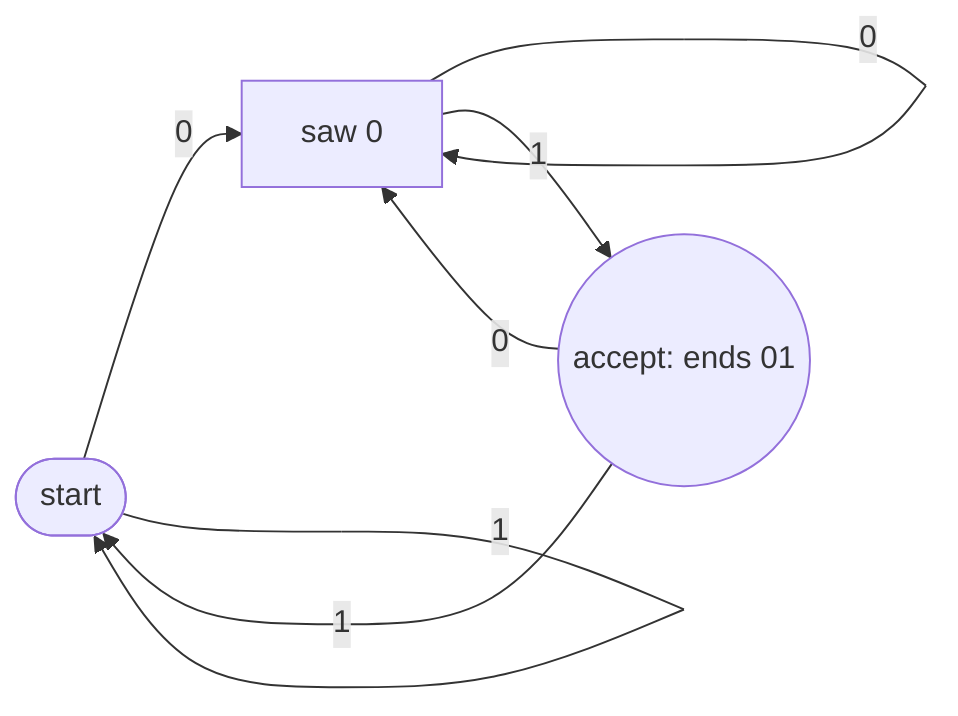
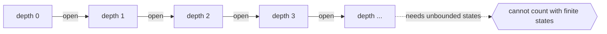

# Finite-State Machine (FSM)

## Overview

A finite-state machine is the simplest model of computation. It has a fixed, finite set of states and moves between them in response to input symbols. At any moment the machine is in exactly one state, and reading an input symbol causes a transition to another state defined by its transition function. Crucially, an FSM has no memory beyond its current state. Everything it knows about the past is compressed into which state it currently occupies. This makes it easy to reason about and cheap to run.

FSMs come in two main flavors. A deterministic finite automaton, or DFA, has exactly one transition per state and input symbol. A nondeterministic finite automaton, or NFA, may have several, but any NFA can be converted to an equivalent DFA. FSMs recognize exactly the regular languages, the same class captured by regular expressions. Their power is limited precisely because they cannot count or remember arbitrary amounts of input. This limitation is the whole reason richer models like pushdown automata and Turing machines exist.

### Quick Takeaways

- An FSM has finitely many states and no memory beyond the state it is currently in
- It recognizes exactly the regular languages, the same class as regular expressions
- Deterministic and nondeterministic FSMs are equally powerful and interconvertible

## Definition

- **State** is one of the finitely many configurations the machine can occupy at a time.
- **Alphabet** is the finite set of input symbols the machine can read.
- **Transition function** maps a current state and input symbol to the next state.
- **Start state** is the state the machine begins in before reading any input.
- **Accepting state** is a state that signals the input is accepted if the machine ends there.
- **Regular language** is the class of languages an FSM can recognize, equivalent to regular expressions.

## The Analogy

Think of a turnstile at a subway. It has two states, locked and unlocked. Inserting a coin moves it from locked to unlocked. Pushing through moves it back to locked. It does not remember how many people passed yesterday or how many coins it took last week. It only knows its current state and reacts to the next event. That memoryless, event-driven behavior with a handful of states is exactly a finite-state machine.

## When You See It

- Regular expression engines matching text against patterns
- Lexical analyzers in compilers splitting source code into tokens
- Protocol and connection state such as a TCP handshake moving between states
- UI and game logic modeling modes like idle, running, paused, and stopped
- Vending machines and traffic lights driven by simple state transitions
- Input validation for fixed formats like phone numbers or identifiers

## Examples

**Good:** Using an FSM to validate binary strings that end in "01". A few states track the last symbols seen, and the machine accepts exactly the right strings with no memory overhead.

**Bad:** Trying to use an FSM to check that parentheses are balanced. Matching arbitrary nesting requires counting, and a finite number of states cannot count without bound.

**Good:** Modeling a traffic light cycle with states green, yellow, and red and timed transitions. The finite states map directly onto the real modes of the system.

**Bad:** Attempting to recognize the language of strings with equal numbers of a's and b's. That needs unbounded counting, which is beyond any finite-state machine.

## Important Points

- The defining limit is no memory beyond the current state, so an FSM cannot count arbitrarily
- DFAs have one transition per symbol, NFAs allow several, but both recognize the same languages
- Any NFA can be converted to an equivalent DFA via the subset construction
- FSMs recognize exactly the regular languages, matching the power of regular expressions
- The pumping lemma proves certain languages, like balanced parentheses, are not regular
- Minimization produces the unique smallest DFA equivalent to a given one
- Mealy and Moore machines extend FSMs with outputs on transitions or states

## Summary

- A finite-state machine has finitely many states and transitions driven by input symbols.
- It has no memory beyond its current state, which both simplifies and limits it.
- It recognizes exactly the regular languages, the same class as regular expressions.
- Deterministic and nondeterministic variants are equally powerful and interconvertible.
- Its inability to count is the reason pushdown automata and Turing machines exist.
- _It only knows the state it is standing in, and forgets every step that brought it there._
