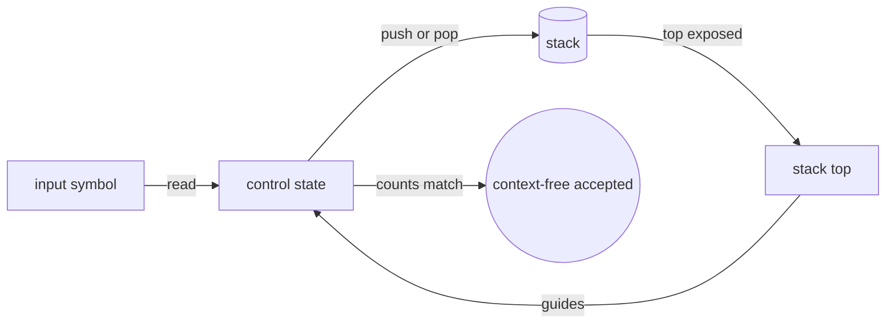
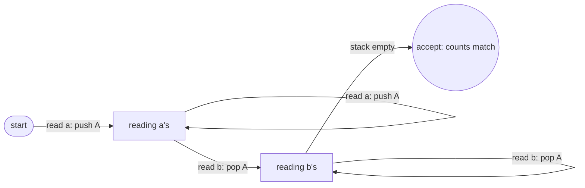
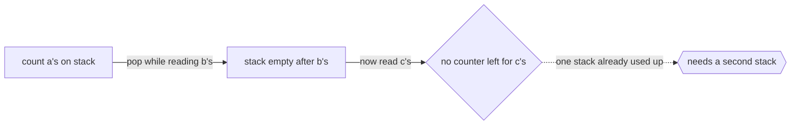

# Pushdown Automaton

## Overview

A pushdown automaton, or PDA, is a finite-state machine with one extra piece of memory: a stack. At each step the machine reads an input symbol, looks at its current state and the symbol on top of the stack, and then transitions to a new state while pushing or popping the stack. The stack gives the PDA something an FSM lacks entirely, an unbounded but disciplined memory. Because a stack is last-in first-out, the PDA can remember nested structure and match it back in reverse order.

This single addition lifts the PDA from recognizing regular languages up to recognizing context-free languages. That is exactly the class needed to describe balanced parentheses, nested blocks, and the grammar of most programming languages. A PDA can push a marker when it sees an opening symbol and pop it when it sees a matching closing symbol, so counting and nesting finally become possible. The catch is that the stack only exposes its top. The PDA cannot freely inspect the middle of its memory, which keeps it below the full power of a Turing machine.

### Quick Takeaways

- A PDA is a finite-state machine plus a stack for unbounded, last-in first-out memory
- The stack lets it recognize context-free languages like balanced parentheses and nested blocks
- It can only see the top of the stack, which keeps it weaker than a Turing machine

## Definition

- **State** is one of the finitely many control states, as in a finite-state machine.
- **Stack** is the unbounded last-in first-out memory the automaton reads from and writes to.
- **Input symbol** is the current symbol being read from the input string.
- **Stack symbol** is the symbol currently on top of the stack, which guides transitions.
- **Transition** maps a state, input symbol, and top stack symbol to a new state and a stack operation.
- **Context-free language** is the class of languages a PDA recognizes, generated by context-free grammars.

## The Analogy

Think of a stack of plates while reading a nested to-do list. Each time you open a sub-task, you set a plate on the stack to remember it. When you finish that sub-task and close it, you take the top plate back off. You can only touch the top plate, never one buried in the middle, but that is enough to track how deeply nested you are. A pushdown automaton works the same way: the plates are the stack, and pushing and popping track nesting exactly.

## When You See It

- Parsing programming languages whose grammars are context-free
- Checking balanced and correctly nested brackets, parentheses, and tags
- Compiler front ends building syntax trees from token streams
- Validating nested data formats like well-formed XML or JSON structure
- Evaluating arithmetic expressions with nested precedence
- Any recognition task requiring bounded-depth memory of nesting

## Examples

**Good:** Using a PDA to recognize strings of the form n a's followed by n b's. It pushes for each a and pops for each b, accepting only when the counts match through the stack.

**Bad:** Trying to use a PDA to recognize n a's, then n b's, then n c's. Matching three counts at once needs more than a single stack, which pushes beyond context-free power.

**Good:** Parsing balanced parentheses of arbitrary depth by pushing on every open and popping on every close. The stack directly mirrors the nesting structure.

**Bad:** Expecting a PDA to compare two halves of a string that require inspecting buried memory. With only the top of the stack visible, it cannot do arbitrary random-access checks.

## Important Points

- The stack is the one addition over an FSM, and it provides unbounded ordered memory
- A PDA recognizes exactly the context-free languages, the class generated by context-free grammars
- Only the top of the stack is visible, which limits it below Turing-machine power
- Nondeterministic PDAs are strictly more powerful than deterministic ones, unlike with FSMs
- The last-in first-out discipline is what makes nested structure natural to track
- Context-free grammars and PDAs are two equivalent views of the same language class
- Some context-free languages need nondeterminism, which is why parser design cares about grammar form

## Summary

- A pushdown automaton is a finite-state machine augmented with a single stack.
- The stack gives it unbounded last-in first-out memory to track nesting and counting.
- It recognizes exactly the context-free languages, the basis of programming grammars.
- Seeing only the stack top keeps it strictly weaker than a Turing machine.
- Nondeterministic PDAs are more powerful than deterministic ones, unlike finite automata.
- _One stack of plates is enough to remember how deep you went, so long as you unwind in order._
