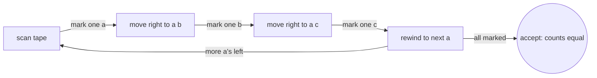
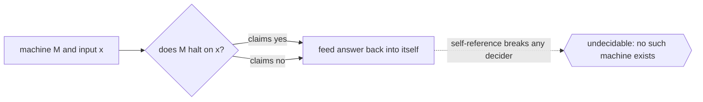

# Turing Machine

## Overview

A Turing machine is the most powerful model in the classical automata hierarchy. It has a finite set of control states, like an FSM, but its memory is an unbounded tape divided into cells, each holding a symbol. A head sits over one cell and can read it, write to it, and move left or right one step at a time. Unlike a pushdown automaton's stack, the tape allows the machine to revisit and rewrite any cell it has seen. This freedom to read and write anywhere, without bound, is what gives the Turing machine its full computational power.

The Turing machine matters because it defines what "computable" means. The Church-Turing thesis holds that anything effectively computable by any procedure can be computed by a Turing machine. A universal Turing machine can simulate any other Turing machine given its description, which is the theoretical seed of the stored-program computer. The model also draws the sharpest line in computation: the halting problem, deciding whether a given machine stops on a given input, is provably undecidable. So the Turing machine both marks the ceiling of computability and shows that ceiling has holes no machine can fill.

### Quick Takeaways

- A Turing machine has finite control plus an unbounded read-write tape it can revisit freely
- It defines the limits of computation, formalized by the Church-Turing thesis
- The halting problem is undecidable, so some questions no Turing machine can ever answer

## Definition

- **State** is one of the finitely many control states of the machine.
- **Tape** is the unbounded sequence of cells serving as read-write memory.
- **Head** is the pointer over the current tape cell that reads, writes, and moves.
- **Transition function** maps a state and read symbol to a new state, a symbol to write, and a move direction.
- **Halting** is the machine reaching a state where no further transition applies, ending the computation.
- **Universal Turing machine** is a machine that can simulate any other Turing machine from its description.

## The Analogy

Imagine a person working an endless roll of graph paper with a pencil and eraser. They follow a small rulebook that says, based on the symbol in the current square and their current mood, what to write, whether to move left or right, and what mood to switch to. They can scroll the paper as far as needed in either direction and rewrite any square they revisit. With just this endless paper, a pencil, and a finite rulebook, they can carry out any computation that can be carried out at all. That worker is a Turing machine.

## When You See It

- Defining computability and the theoretical limits of algorithms
- Proving problems undecidable, such as the halting problem, via reduction
- Establishing complexity classes like P and NP on a formal machine model
- Reasoning about what any programming language can and cannot compute
- Demonstrating Turing completeness of languages, systems, and even games
- Serving as the reference model behind the stored-program computer

## Examples

**Good:** Using a Turing machine to recognize the language of n a's, then n b's, then n c's. It can mark and cross off symbols across the tape, something a single-stack PDA cannot do.

**Bad:** Expecting a Turing machine to decide the halting problem for all machines. This is provably impossible, no matter how the machine is designed.

**Good:** Describing a universal Turing machine that reads another machine's description plus its input and simulates it faithfully. This captures the idea of a programmable computer.

**Bad:** Treating the Turing machine as a practical computing device. It is a model for reasoning about computability, not an efficient way to actually run programs.

## Important Points

- The unbounded read-write tape is the key upgrade, allowing free revisiting and rewriting of memory
- The Church-Turing thesis equates Turing-computable with the intuitive notion of computable
- A universal Turing machine can simulate any other, the theoretical basis of general computers
- The halting problem is undecidable, marking a hard limit on what any machine can decide
- Turing machines recognize recursively enumerable languages, the top of the classical hierarchy
- Many variants, multi-tape or nondeterministic, are all equivalent in computational power
- Turing completeness means a system can simulate a Turing machine, hence compute anything computable

## Summary

- A Turing machine is finite control plus an unbounded read-write tape it can revisit freely.
- That tape gives it full computational power, above both FSMs and pushdown automata.
- It formalizes computability through the Church-Turing thesis and universal simulation.
- The undecidable halting problem shows firm limits on what any machine can decide.
- It is a model for reasoning about computation, not a practical computing device.
- _An endless sheet of paper and a small rulebook are enough to compute anything that can be computed._
