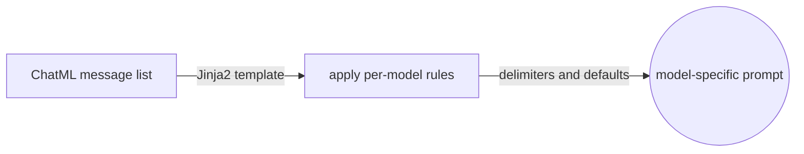
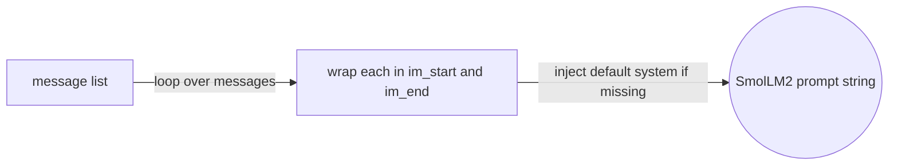
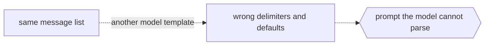

# Chat Templates

## Overview

Because each instruct model uses its own conversation format and special tokens, a chat template is what guarantees the prompt is built the way that model expects. In the transformers library, a chat template is a piece of Jinja2 code that describes how to transform the ChatML list of messages into the textual prompt, covering the system instructions, the user messages, and the assistant responses, which keeps interactions consistent and makes the model respond appropriately to different inputs.

The key insight is that the same message list can produce very different prompt strings, since the template encodes the delimiters and defaults of one specific model.



### Quick Takeaways

- A chat template is Jinja2 code that renders messages into a prompt
- The template encodes each model special tokens and formatting rules
- The same message list renders differently across models

## Definition

- **A chat template** is the model-specific logic that converts a ChatML message list into a single prompt string.
- **Jinja2** is the templating language used inside transformers to write that logic, with loops and conditionals over the messages.
- **A default system message** can be injected by the template when the first message is not a system message.

## The Analogy

The chat template is like a translator with a fixed rulebook, where you hand it the same story told as a list of labeled lines, and it retells that story in the exact dialect of one model, adding the greetings and sign-offs that dialect requires. Give the same story to a different translator with a different rulebook, and the retelling looks different even though the story is identical.

## When You See It

- Rendering a conversation for a specific instruct model
- Reading a model template to understand its special tokens and defaults
- Debugging why two models produce different prompts from the same messages

## Examples

**A simplified SmolLM2 template written in Jinja2:**

```jinja2


<|im_start|>system
You are a helpful AI assistant named SmolLM, trained by Hugging Face
<|im_end|>

<|im_start|>{{ message['role'] }}
{{ message['content'] }}<|im_end|>

```



**The prompt it produces from a message list:**

```text
<|im_start|>system
You are a helpful assistant focused on technical topics.<|im_end|>
<|im_start|>user
Can you explain what a chat template is?<|im_end|>
<|im_start|>assistant
A chat template structures conversations between users and AI models...<|im_end|>
<|im_start|>user
How do I use it ?<|im_end|>
```



## Important Points

- The template loops over messages and wraps each one in the model delimiters
- It can inject a default system message when none is provided
- The transformers tokenizer applies the template as part of tokenization
- You only need to structure the messages, and the tokenizer handles the rest

## Common Mistakes

- Using one model template to format a prompt for a different model
- Hand-writing delimiters instead of letting the template render them
- Assuming the rendered prompt is identical across models

## Summary

- A chat template is Jinja2 logic that renders messages into a model-specific prompt.
- The same message list yields different prompts depending on the template.
- _You write the messages, and the template speaks the dialect of the chosen model._
