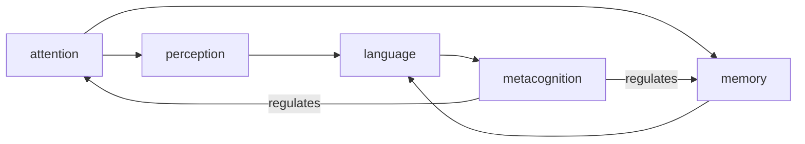

# Cognitive Processes

_From attention through memory systems to perception, language, and metacognition._

## Contents

| File                                         | Topic            | One-line                                                                               |
| -------------------------------------------- | ---------------- | -------------------------------------------------------------------------------------- |
| [attention.md](./attention.md)               | Attention        | Selective focus on relevant stimuli while filtering out the rest                       |
| [memory.md](./memory.md)                     | Memory           | Encoding, storing, and retrieving information across time scales                       |
| [working-memory.md](./working-memory.md)     | Working Memory   | Temporary holding and manipulation of information for active cognition                 |
| [long-term-memory.md](./long-term-memory.md) | Long-Term Memory | Durable storage of knowledge and experiences over extended periods                     |
| [perception.md](./perception.md)             | Perception       | Interpretation of sensory input into meaningful internal representations               |
| [language.md](./language.md)                 | Language         | Structured symbolic system for encoding, transmitting, and reasoning about information |
| [metacognition.md](./metacognition.md)       | Metacognition    | Awareness and regulation of one's own cognitive processes                              |
