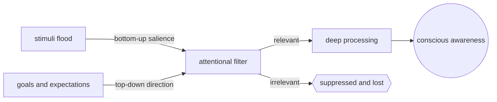
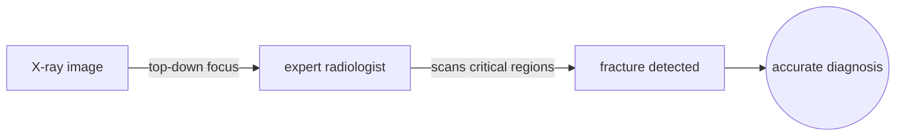
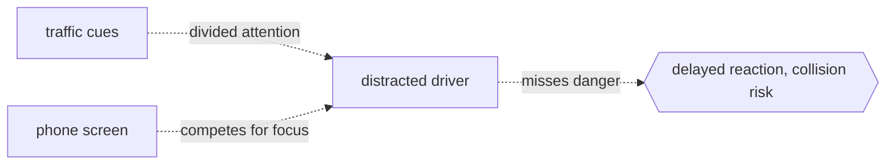

# Attention

## Overview

Attention is the cognitive process of selectively concentrating on a specific stimulus while ignoring others. It is the brain's answer to a bandwidth problem: the sensory world delivers far more information than any system can fully process, so a filter must decide what gets through. Attention acts as that filter, boosting relevant signals and suppressing irrelevant ones.

Attention can be bottom-up, captured automatically by salient stimuli like a loud noise or a flash, or top-down, directed voluntarily by goals and expectations. It operates across modalities (visual, auditory, tactile) and can be divided, sustained, or shifted. Without attention, perception is shallow and memory encoding fails. It is the gatekeeper of conscious experience.

### Quick Takeaways

- Attention solves the information bottleneck by selecting what to process deeply
- Bottom-up attention is stimulus-driven and automatic, top-down is goal-driven and voluntary
- Without attention, stimuli are registered loosely and forgotten within seconds

## Definition

- **Selective attention** is the ability to focus on one specific stimulus while filtering out competing ones.
- **Divided attention** is the capacity to distribute focus across multiple concurrent tasks or inputs.
- **Sustained attention** is the ability to maintain focus on a single task over an extended period.
- **Bottom-up attention** is an automatic orienting response triggered by salient or novel stimuli.
- **Top-down attention** is voluntary direction of focus based on current goals, expectations, and prior knowledge.
- **Attentional blink** is a brief window after detecting one target during which a second target is often missed.

## The Analogy

Picture a crowded party. Dozens of conversations hum at once, but you tune into one voice and follow it clearly while the rest becomes a blur. Then someone across the room says your name and your attention snaps there instantly. That is top-down selection, of the voice you chose, and bottom-up capture, of the name that grabbed you. Your brain is the listener, attention is the spotlight, and everything outside the beam is noise.

## When You See It

- A driver focusing on the road while ignoring billboards, the radio, and passenger chatter
- A student studying with headphones on to block ambient noise in a busy library
- A gamer tracking multiple enemies, cooldowns, and objectives all at once
- A developer debugging code while ignoring Slack notifications and email pings
- An air traffic controller monitoring many planes on radar while prioritizing the closest ones
- Transformer self-attention in LLMs, where each token "attends" selectively to others in the sequence

## Examples

**Good:** A radiologist scanning an X-ray for a fracture. Top-down attention, shaped by training, guides the eyes to critical regions while suppressing irrelevant anatomical detail. The fracture is detected quickly and accurately.

**Bad:** A novice driver texting while navigating a busy intersection. Divided attention splits resources between the screen and the road. Reaction time doubles and critical cues like brake lights or pedestrians go unregistered.

**Good:** A pianist performing a piece by memory. Years of practice automate the motor patterns, freeing attention to focus on expression, dynamics, and audience connection.

**Bad:** Trying to follow two spoken conversations at once. Speech processing demands serial attention; switching back and forth loses content from both streams.

## Important Points

- Attention is a limited resource: dividing it degrades performance on all concurrent tasks
- Practice and automaticity reduce the attentional load of a task, freeing resources for others
- The cocktail party effect shows that unattended stimuli are still processed at some level, especially personally-relevant ones like your name
- Multitasking is largely a myth: what feels like parallel attention is actually rapid task-switching, which carries a switching cost
- In LLMs, self-attention weights are a learned analogue: each token distributes a fixed sum of attention across context tokens
- Fatigue, stress, and cognitive load shrink the attentional budget significantly

## Summary

- Attention is the selective allocation of limited processing resources to relevant stimuli.
- Bottom-up capture is fast and automatic, top-down direction is slow and goal-driven.
- Divided attention always carries a cost; sustained attention always has a limit.
- What we attend to is what we encode, learn, and become aware of.
- _Attention is the flashlight in a dark room: whatever it illuminates becomes your reality, and everything outside it might as well not exist._
