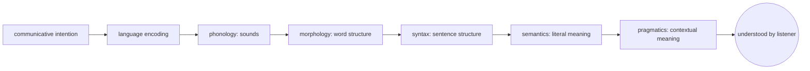
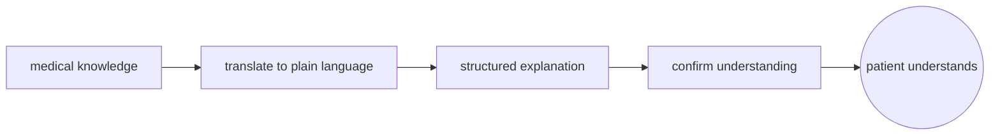
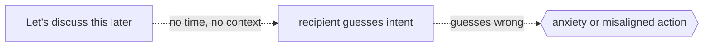

# Language

## Overview

Language is a symbolic communication system built from a finite vocabulary and a finite set of combinatorial rules that together generate an infinite set of expressions. It is the most powerful tool humans possess for transmitting knowledge across minds and across generations. Unlike most animal communication systems, human language is compositional, hierarchical, and recursive: smaller units combine into larger ones according to systematic rules, and meaning emerges from the structure of the combination, not just from the individual parts.

Language operates at multiple levels. Phonology governs sounds, morphology governs how words are built from meaningful subparts, syntax governs how words combine into sentences, semantics governs meaning, and pragmatics governs how context shapes interpretation beyond literal meaning. These levels interact seamlessly in fluent communication and can break independently in aphasia and other language disorders.

### Quick Takeaways

- Language is compositional: meaning is built from parts and the rules that combine them
- Human language is uniquely productive: a finite vocabulary generates an infinite set of possible expressions
- Context (pragmatics) can completely override literal meaning without violating the rules of the system

## Definition

- **Phonology** is the system of sounds (or signs) a language uses and the rules governing their combination.
- **Morphology** is the study of how words are built from smaller meaningful units called morphemes.
- **Syntax** is the set of rules governing how words combine into phrases and sentences.
- **Semantics** is the study of meaning at the word, phrase, and sentence level.
- **Pragmatics** is the study of how context, intention, and world knowledge shape interpretation beyond literal meaning.
- **Compositionality** is the principle that the meaning of a complex expression is determined by the meanings of its parts and the rules used to combine them.

## The Analogy

Language is like LEGO. Individual bricks are words. The studs and tubes that constrain how bricks snap together are syntax. What the assembled model represents is semantics. And knowing that a LEGO police station placed next to a LEGO criminal represents a chase, not a friendly visit, is pragmatics. You can build anything that the brick types and snapping rules allow. You cannot build what the system was never designed to represent.

## When You See It

- A child acquiring grammar without explicit instruction, picking up rules from exposure alone
- A sarcastic comment like "great job" meaning the opposite, decoded instantly from tone and context
- A programmer writing a function: vocabulary is the language syntax, structure is the grammar, correct behavior is the semantics
- A poem conveying layered meaning through meter, sound, and ambiguity beyond literal paraphrase
- A legal contract where every word is chosen to eliminate pragmatic ambiguity and pin down one interpretation
- An LLM generating fluent text by predicting tokens from distributional statistics, without grounding in embodied experience

## Examples

**Good:** A doctor explaining a diagnosis to a patient in plain language. Technical vocabulary is translated into accessible terms. The structure is simple. The meaning is checked through questions. Communication succeeds because the speaker adapts to the listener's knowledge and context.

**Bad:** A manager writing an ambiguous email: "Let's discuss this later." No time, no reason, no framing. The recipient cannot parse intent: is it positive, negative, urgent, or casual? Missing pragmatics leaves the listener guessing, and guessing wrong triggers anxiety or misaligned action.

**Good:** Using the active voice in technical documentation: "The function returns a promise." The agent is explicit, the action is direct, and the reader processes it faster than the passive equivalent.

**Bad:** A legal document written in dense passive constructions with nested clauses spanning multiple lines. The syntax is technically valid but exceeds working memory, and the meaning is lost before the reader reaches the verb.

## Important Points

- Language is a uniquely productive system: finite means produce infinite expressions through recursion and composition
- Syntax and semantics are separable: a sentence can be grammatical but meaningless (Chomsky's "colorless green ideas sleep furiously")
- Pragmatics fills gaps that literal semantics leaves open: it is where tone, context, and intention live
- The Sapir-Whorf hypothesis (linguistic relativity) proposes that language shapes thought; the strong version (linguistic determinism) is largely rejected, but weaker influences on perception and categorization are supported
- Language acquisition in children follows a robust developmental trajectory largely independent of explicit teaching
- LLMs model distributional patterns of language without embodiment, grounding, or communicative intent, which is why they can be fluent without being truthful

## Summary

- Language is a hierarchical, compositional system that maps finite vocabulary and rules to infinite expression.
- Levels from phonology to pragmatics interact seamlessly in fluent communication and break independently in pathology.
- Meaning lives not only in words and rules but in the shared context between speaker and listener.
- _Words are the bricks, grammar is the snapping rules, but understanding is knowing what the builder meant to build._
