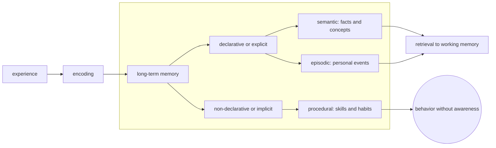
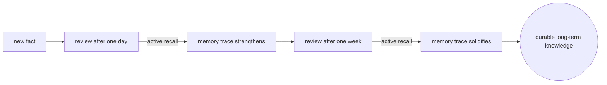

# Long-Term Memory

## Overview

Long-term memory (LTM) is the brain's durable storage system. It holds everything from facts and concepts to skills and personal experiences, with retention ranging from minutes to decades. Unlike working memory, LTM has a functionally unlimited capacity and is not an active workspace: information must be retrieved back into working memory to be used.

LTM splits into two broad categories. Declarative (explicit) memory covers facts and events that can be consciously recalled: semantic memory for general knowledge like "Paris is the capital of France" and episodic memory for personal experiences like "what I ate for breakfast." Non-declarative (implicit) memory covers skills, habits, and conditioning that influence behavior without conscious awareness, like riding a bicycle or flinching at a sound paired with a shock. Encoding, storage, and retrieval are the three core processes, and each can fail independently.

### Quick Takeaways

- Long-term memory is functionally unlimited in capacity and duration, unlike working memory
- Declarative memory is conscious and verbalizable; non-declarative memory influences behavior silently
- Retrieval depends on cues and context: memory is reconstructive, not a perfect playback

## Definition

- **Encoding** is the process of converting sensory input and attended information into a memory trace that can be stored.
- **Consolidation** is the gradual stabilization of a memory trace, often during sleep, making it resistant to interference.
- **Storage** is the long-term maintenance of encoded information distributed across cortical networks.
- **Retrieval** is the process of reactivating a stored memory trace, often triggered by cues related to the original encoding context.
- **Semantic memory** holds general world knowledge, concepts, word meanings, and facts independent of personal experience.
- **Episodic memory** holds personally experienced events tied to a specific time and place.
- **Procedural memory** holds motor skills, habits, and learned routines executed without conscious deliberation.

## The Analogy

Imagine a vast library. Encoding is a librarian cataloguing a new book and placing it on the right shelf. Storage is the book sitting there for years. Retrieval is walking back, finding the shelf, and pulling the book down. If the librarian misfiled it (encoding failure), the shelf collapsed (storage failure), or you cannot recall the call number (retrieval failure), the book is effectively lost even if it still exists somewhere.

## When You See It

- A musician playing a piece from memory, fingers moving without conscious direction (procedural)
- A student recalling a historical date on a closed-book exam (semantic)
- Someone describing their first day at a new job in vivid detail (episodic)
- A chess grandmaster recognizing thousands of board patterns instantly (semantic chunks from extensive practice)
- A trauma survivor flinching at a sound resembling the original event (implicit conditioning)
- An LLM generating text from patterns compressed into its weights during training, analogous to semantic memory retrieval

## Examples

**Good:** Spaced repetition with active recall. Retrieving a fact from memory across increasing intervals strengthens the trace and builds durable semantic knowledge. Each retrieval attempt acts as a mini-test that consolidates the memory.

**Bad:** Cramming the night before an exam by passively rereading notes. Shallow encoding plus sleep deprivation blocks consolidation. The information passes the test but vanishes within days, never truly entering long-term storage.

**Good:** Learning a second language through immersion: hearing, speaking, reading, and writing daily. Multiple encoding pathways and emotional engagement build rich, durable traces.

**Bad:** Memorizing vocabulary via rote translation alone. Isolated associations without context produce weak cues and retrieval failures during actual conversation.

## Important Points

- Sleep, especially slow-wave and REM sleep, is critical for memory consolidation
- Memory is reconstructive, not reproductive: each retrieval can subtly alter the stored trace
- Encoding specificity means retrieval works best when the context matches the original learning context
- Interference, both proactive (old learning blocks new) and retroactive (new learning overwrites old), is a major source of forgetting
- Emotionally charged events are encoded more deeply due to amygdala modulation of the hippocampus
- Testing yourself (active recall) produces far stronger retention than re-studying the same material

## Summary

- Long-term memory stores everything we know and can do, from facts to skills to personal history.
- Encoding, storage, and retrieval are three independent processes and any or all of them can fail.
- Spaced active recall is the most reliable evidence-based method for building durable declarative memory.
- Procedural memory builds through repetition and feedback, independent of conscious verbalization.
- _You do not remember what you were told; you remember what you retrieved, again and again, until it becomes part of you._
