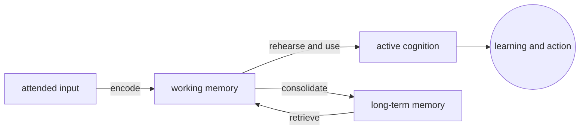
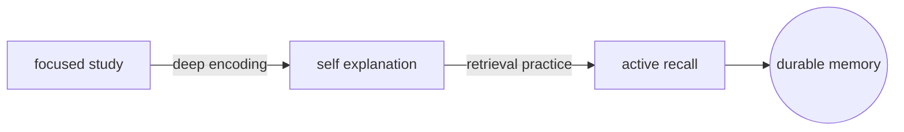

# Memory

## Overview

Memory is the cognitive process that lets information persist beyond the moment it is perceived. It starts with encoding, keeps information through storage, and brings it back through retrieval. Without memory, attention would select information but nothing would accumulate into knowledge, skill, identity, or expectation.

Memory is not one box. Working memory keeps a small amount of information active for immediate use, while long-term memory stores knowledge, experiences, and skills over longer periods. The two systems cooperate constantly: working memory uses long-term knowledge to interpret the present, and repeated use can consolidate active information into durable memory.

### Quick Takeaways

- Memory covers encoding, storage, and retrieval.
- Working memory is active and limited, long-term memory is durable and broad.
- Retrieval is reconstructive, not a perfect replay.

## Definition

- **Encoding** is the transformation of perceived information into a memory trace.
- **Storage** is the maintenance of encoded information over time.
- **Retrieval** is the process of bringing stored information back into active use.
- **Working memory** is the limited workspace for information currently being used.
- **Long-term memory** is the durable store for facts, events, procedures, and associations.
- **Consolidation** is the process that stabilizes memory after initial encoding.

## The Analogy

Think of memory as a desk and an archive. The desk is working memory: small, immediate, and useful for the task in front of you. The archive is long-term memory: large, organized, and slower to search. Good thinking needs both. You work on the desk, but you keep returning to the archive for prior knowledge.

## When You See It

- Remembering a phone number long enough to type it.
- Learning a concept by connecting it to prior knowledge.
- Recalling an event from childhood.
- Practicing a skill until it becomes automatic.
- Debugging by holding the current state while retrieving similar past bugs.
- Reading a sentence by keeping earlier words active until the meaning resolves.

## Examples

**Good:** A student studies a concept, explains it in their own words, tests recall the next day, and connects it to earlier material. Encoding is deep, retrieval is practiced, and the memory becomes stable.

**Bad:** A student rereads a chapter passively, recognizes the words, and assumes recognition means learning. The memory trace stays shallow, and later retrieval fails.

**Good:** A developer writes a small note after solving a production bug. The next similar bug is easier because the prior pattern can be retrieved.

**Bad:** Switching contexts every few minutes. Working memory is cleared repeatedly, so little information stabilizes into long-term memory.

## Important Points

- Attention controls what enters memory, but retrieval controls what becomes useful later.
- Working memory and long-term memory are different systems with different limits.
- Retrieval strengthens memory more reliably than passive review.
- Memory is reconstructive, so confidence does not guarantee accuracy.
- Sleep, spacing, and repeated recall support consolidation.
- External notes extend memory by making retrieval easier and less fragile.

## Summary

- Memory lets information survive beyond the immediate present.
- It depends on encoding, storage, retrieval, and consolidation.
- Working memory handles active use, while long-term memory stores durable knowledge.
- Strong memory comes from attention, meaning, spacing, and retrieval practice.
- _Memory is not a warehouse of perfect recordings; it is a living system for carrying useful traces forward._
