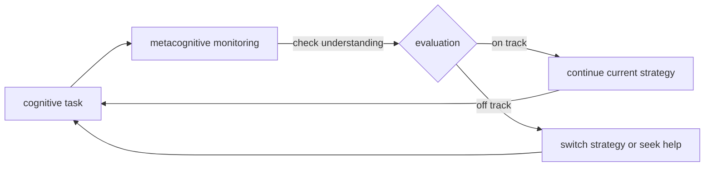
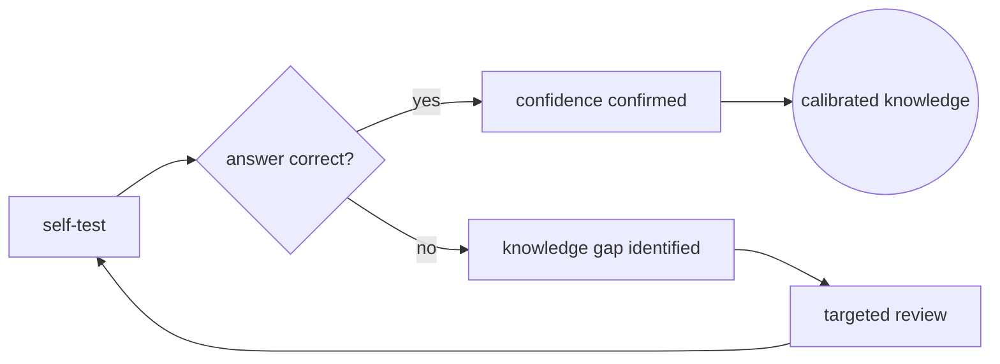
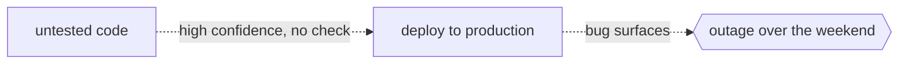

# Metacognition

## Overview

Metacognition is cognition about cognition. It is the capacity to monitor, evaluate, and regulate one's own thinking processes. Where first-order cognition solves problems in the world, metacognition asks: "Do I understand this? Am I on the right track? Is my confidence justified?" It is the internal supervisor that tracks whether learning is happening, whether reasoning is sound, and whether a decision should be revisited.

Flavell (1979) divided metacognition into two components: metacognitive knowledge, what you know about your own cognitive strengths and weaknesses, and metacognitive regulation, the strategies you use to control and adjust your thinking in real time. Calibration is the match between confidence and accuracy: good metacognition means you are confident when you are right and uncertain when you are wrong. Poor metacognition means confidence and accuracy are uncorrelated, a dangerous state where you act decisively on wrong information.

### Quick Takeaways

- Metacognition is the internal supervisor that monitors and regulates first-order cognitive processes
- Good metacognition means confidence tracks accuracy; poor metacognition means they are uncorrelated
- Metacognitive skills can be taught and improved, and they are among the strongest predictors of effective learning

## Definition

- **Metacognitive knowledge** is declarative knowledge about one's own cognitive abilities, task demands, and effective strategies.
- **Metacognitive regulation** is the active control of cognitive processes through planning, monitoring, and evaluating.
- **Calibration** is the alignment between subjective confidence and objective accuracy on a given task.
- **Feeling of knowing** is the subjective sense that information is available in memory even if it cannot be retrieved right now.
- **Judgment of learning** is a prediction about how well newly learned material will be remembered later.
- **Dunning-Kruger effect** is the finding that individuals with low competence in a domain tend to overestimate their ability, reflecting poor metacognitive calibration in that domain.

## The Analogy

A ship has a navigation crew (first-order cognition) and a captain (metacognition). The crew operates the wheel, reads instruments, and adjusts the sails. The captain watches the chart, asks whether the heading is correct, and orders a course correction when the ship drifts. A ship without a captain still moves, but it will not reach its destination. A captain who misreads the chart (poor calibration) steers the ship confidently onto rocks.

## When You See It

- A student studying for an exam and realizing they do not actually understand a section, so they go back rather than move forward
- A developer writing code and pausing to ask: "Is this really the right abstraction, or am I overcomplicating it?"
- A debater catching themselves getting emotional and recalibrating their tone to stay persuasive
- A researcher rereading their own argument and spotting a logical leap they had not noticed during writing
- An experienced decision-maker knowing when to delay a choice because the confidence-to-accuracy ratio is too low
- An LLM lacking all of this: it does not know what it knows, cannot calibrate confidence, and cannot decide to ask for help

## Examples

**Good:** A medical student using self-testing and then reviewing only the questions they got wrong. They monitor their own knowledge gaps and direct effort where it is needed. Calibration improves with each cycle of testing and feedback.

**Bad:** A junior developer deploying code to production on a Friday afternoon, convinced it is bug-free despite no tests and no review. Confidence is high, accuracy is unknown. The absence of metacognitive doubt allows an avoidable incident.

**Good:** A writer setting aside a draft for a day, then rereading it with fresh eyes. Distance enables metacognitive evaluation: "This paragraph does not actually support the argument" is a judgment that was unavailable during writing.

**Bad:** Arguing a point confidently in a domain you have barely studied. Without metacognitive awareness of ignorance, you assert falsehoods with conviction and damage your credibility.

## Important Points

- Metacognition is trainable: explicitly asking "How sure am I?" and checking against reality improves calibration over time
- The Dunning-Kruger effect describes a systematic failure of metacognition: the least competent are the least aware of their incompetence
- Experts tend to have better metacognitive calibration within their domain, not necessarily outside it
- Metacognition is metabolically expensive: it requires pausing automatic processing and engaging executive control
- Reflection and review are metacognitive practices that convert experience into learning
- LLMs lack metacognition entirely: they produce tokens with confidence scores that may not reflect factual accuracy

## Summary

- Metacognition is thinking about thinking: monitoring, evaluating, and regulating your own cognitive processes.
- Good metacognition means your confidence tracks your accuracy; poor metacognition means they are disconnected.
- It is a trainable skill that strongly predicts effective learning and good decision-making.
- _The smartest person in the room is not the one who knows the most, but the one who knows what they do not know._
