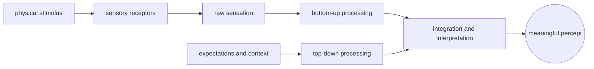
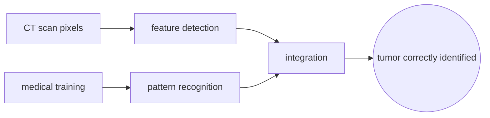
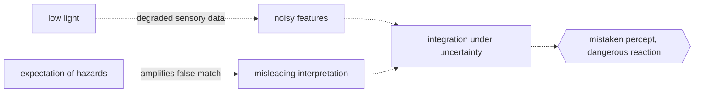

# Perception

## Overview

Perception is the process by which sensory input is organized, identified, and interpreted into a coherent internal representation of the external world. It is not a passive recording of reality but an active construction shaped by sensory data, prior experience, expectations, and context.

The distinction between sensation and perception is fundamental. Sensation is the raw detection of physical energy by sensory receptors: light on the retina, sound waves on the cochlea, pressure on the skin. Perception is the brain's interpretation of those signals into meaningful units like objects, voices, textures, and motion. Perception fills gaps, resolves ambiguities, and sometimes gets it wrong, producing illusions. It operates bottom-up from sensory data and top-down from expectations, and the two streams constantly negotiate.

### Quick Takeaways

- Perception is active construction, not passive recording: the brain builds a model of reality from noisy input
- Sensation detects physical energy; perception assigns meaning to it
- Top-down expectations and bottom-up data interact continuously, and mismatches produce illusions

## Definition

- **Sensation** is the detection and transduction of physical energy by sensory receptors into neural signals.
- **Perception** is the higher-order process of organizing and interpreting those signals into a meaningful experience.
- **Bottom-up processing** builds a percept from sensory details with no prior influence.
- **Top-down processing** uses expectations, context, and past experience to shape and interpret incoming sensory data.
- **Perceptual constancy** is the ability to perceive objects as stable in size, shape, color, and brightness despite changes in sensory input.
- **Illusion** is a perceptual experience that differs from physical reality, revealing the constructive nature of perception.

## The Analogy

Perception is like a detective arriving at a crime scene. The detective gathers clues (sensation) but does not just take photos. They form a theory of what happened based on clues plus prior cases (top-down). New evidence might confirm or revise the theory. Sometimes the detective's expectations lead them to misinterpret a clue entirely, creating a perceptual illusion. The final report is the percept: not raw data, but the best interpretation the detective can construct.

## When You See It

- Reading a sentence with missing letters and still understanding it because context fills the gaps
- Hearing your name spoken in a noisy room while the surrounding chatter stays undifferentiated
- A designer perceiving deep and shallow depth on a flat screen from shading and occlusion cues
- A driver braking automatically for a shadow that looked like an obstacle
- Recognizing a familiar face instantly even with changed hairstyle, lighting, and angle
- An LLM embedding layer mapping discrete token IDs into high-dimensional vectors that capture distributional similarity, the machine analogue of feature extraction from raw input

## Examples

**Good:** A radiologist detecting a tiny tumor on a scan. Bottom-up data from the image combines with top-down training and pattern recognition. The tumor is seen and correctly identified, not because the pixels alone are unambiguous, but because the expert brain constructs the right interpretation from ambiguous input.

**Bad:** A tired driver mistaking a plastic bag blowing across the road for an animal. Low light reduces bottom-up fidelity, and the expectation of roadside hazards amplifies a false match. The percept is vivid but wrong, and the resulting swerve creates a real danger.

**Good:** A musician tuning an instrument by ear, comparing the pitch to an internal reference. Iterative bottom-up input and top-down matching converges on correct tuning.

**Bad:** Believing a ventriloquist's dummy is speaking. Visual input (the dummy's mouth moving) overrides auditory spatial cues (the performer's voice), creating a compelling but false multisensory illusion.

## Important Points

- Perception is probabilistic: the brain infers the most likely cause of sensory input, not the true cause
- Multisensory integration combines signals across modalities, and vision usually dominates when senses conflict
- Attention gates perception: unattended stimuli are processed shallowly and often fail to reach awareness
- Perceptual learning shows that perception itself can be trained, not just the decisions that follow it
- Illusions are not failures of perception but windows into how it works: they reveal the assumptions the system makes
- The binding problem is the open question of how separate features like color, motion, and shape are combined into a single coherent object percept

## Summary

- Perception constructs a meaningful world from raw sensation using both data from the senses and models from the mind.
- Bottom-up and top-down streams negotiate continuously, and their mismatch produces illusions.
- What you perceive is not what is out there, but your brain's best guess about what is out there.
- _You do not see the world as it is; you see the world as your brain predicts it must be, corrected by whatever surprises arrive._
