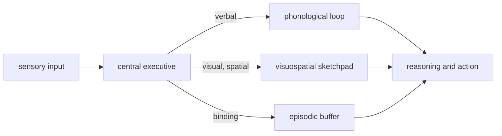
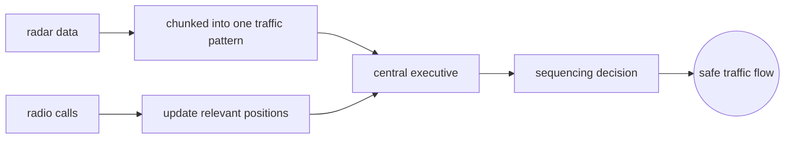
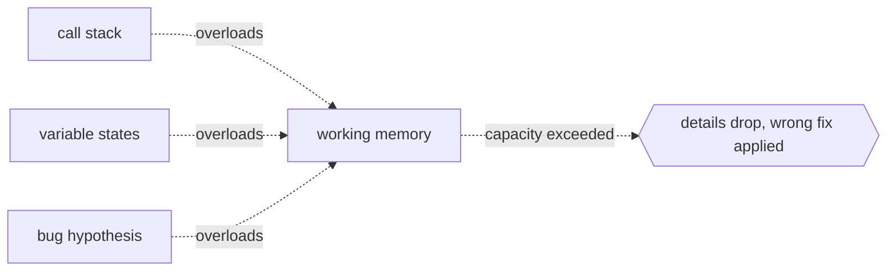

# Working Memory

## Overview

Working memory is the cognitive system that holds a small amount of information in a readily accessible state for active use. It is not passive storage but an active workspace: information is maintained, updated, and manipulated to serve ongoing tasks like reasoning, comprehension, and problem solving. Baddeley and Hitch's influential model (1974) split it into a central executive, a phonological loop for verbal material, a visuospatial sketchpad for visual and spatial information, and later an episodic buffer that binds information across domains into coherent chunks.

Capacity is famously limited. George Miller's "magical number seven, plus or minus two" described the number of chunks a person can hold. Later work by Cowan revised this downward to roughly four chunks. When working memory is overloaded, new information displaces old information, errors multiply, and reasoning breaks down. It is the bottleneck of cognition, and its capacity is one of the strongest single predictors of fluid intelligence.

### Quick Takeaways

- Working memory is the active workspace where information is held and manipulated, not just stored
- Capacity is roughly four chunks, and exceeding it causes displacement and errors
- The central executive allocates attention and coordinates the subordinate subsystems

## Definition

- **Central executive** is the supervisory attentional system that coordinates the subsystems and allocates cognitive resources.
- **Phonological loop** stores and rehearses verbal and acoustic information through subvocal repetition.
- **Visuospatial sketchpad** holds and manipulates visual images and spatial relationships.
- **Episodic buffer** binds information across domains into integrated, multi-dimensional chunks with a time stamp.
- **Chunking** is the process of grouping individual items into meaningful units, expanding effective capacity without expanding raw slots.
- **Cognitive load** is the total demand placed on working memory by a given task at a given moment.

## The Analogy

Think of working memory as a workbench. You pull tools and materials (knowledge, sensory input, goals) onto the bench. You can hold a few items at once to work on them. If you pile on too many, items fall off and are lost. When you finish a task, you clear the bench for the next one. Long-term memory is the tool shed behind you: far larger, but slower to retrieve from.

## When You See It

- Doing mental arithmetic like computing `38 × 47` without writing anything down
- Holding a list of spoken directions while navigating an unfamiliar street
- Understanding a long sentence where the subject and verb are separated by many clauses
- Reading code while tracking variable values and control flow without re-executing
- Following a recipe while substituting ingredients and adjusting proportions on the fly
- Playing chess by holding several possible board states and evaluating the best move

## Examples

**Good:** A trained air traffic controller holding the positions and headings of five approaching aircraft in mind, updating them as new radio calls come in, and issuing sequencing instructions. Years of practice build rich chunks: five aircraft become one pattern, not five independent items.

**Bad:** A novice programmer trying to debug a recursive function without writing anything down. They hold the call stack, variable values at each level, the return condition, and the bug hypothesis all at once. The load exceeds capacity, details slip, and the wrong conclusion is drawn.

**Good:** Taking notes during a lecture. Externalizing information onto paper reduces working memory load, freeing capacity to process the lecturer's current point rather than rehearsing the last one.

**Bad:** Trying to comprehend a dense paragraph while also counting backwards by sevens. The executive is forced to time-share, and both tasks suffer.

## Important Points

- Working memory is fundamentally limited: overloading it degrades all operations that depend on it
- Chunking compresses information into higher-level units, effectively expanding capacity within the same slot count
- Cognitive load theory distinguishes intrinsic load (inherent to the material), extraneous load (poor presentation), and germane load (productive schema building)
- External tools like notes, diagrams, and IDEs offload working memory and improve performance dramatically
- Working memory capacity correlates strongly with fluid intelligence and is largely stable within an individual
- Stress, anxiety, and sleep deprivation shrink effective working memory capacity

## Summary

- Working memory is a limited-capacity workspace for holding and manipulating information in active use.
- Baddeley's multicomponent model divides it into a central executive with domain-specific slave systems.
- Capacity is about four chunks; grouping information into chunks expands what that means in practice.
- Externalizing with notes and tools is the most reliable way to bypass the bottleneck.
- _Your mind is a workbench, not a warehouse: keep only what you are actively working on, and put the rest on paper._
