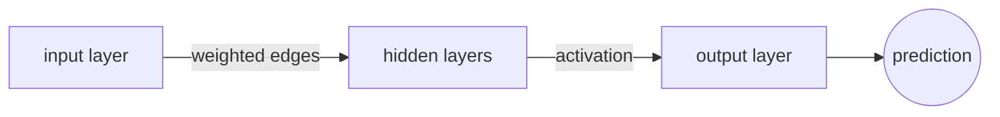
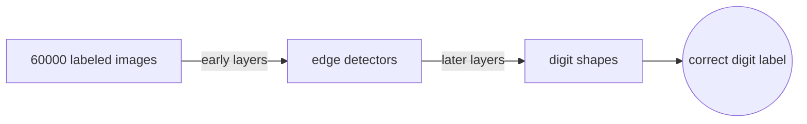
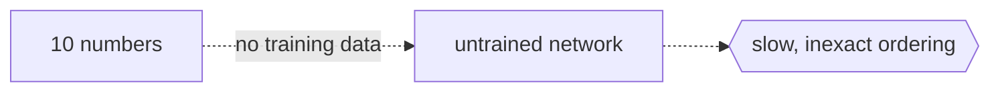

# Artificial Neural Network

## Overview

An artificial neural network is a computational model built from simple units called neurons, organized into layers and connected by weighted edges. Each neuron receives inputs, multiplies them by weights, adds a bias, and passes the result through an activation function to produce its output. Stacking many neurons into layers lets the network learn functions that no single neuron could represent on its own.

The idea comes from biological neurons, but the resemblance is loose. A biological neuron fires or stays silent. An artificial neuron outputs a continuous number. The real power is not in any one neuron but in the collective behavior of thousands of them wired together through learned weights.



### Quick Takeaways

- A neural network is layers of neurons connected by weighted edges
- Each neuron applies a linear combination followed by a nonlinear activation
- Depth (more layers) lets the network learn increasingly abstract features

## Definition

- **Neuron** is a unit that computes `output = activation(w · x + b)` where `w` is a weight vector, `x` is the input vector, and `b` is a scalar bias.
- **Layer** is a group of neurons that process the same input in parallel. The three types are input, hidden, and output.
- **Weight** is a learnable parameter that scales the connection strength between two neurons.
- **Bias** is a learnable parameter that shifts the activation threshold of a neuron.
- **Activation function** is a nonlinear function applied after the linear combination, such as ReLU, sigmoid, or tanh.
- **Forward pass** is the process of computing the output of the network from input to output layer, one layer at a time.

## The Analogy

Think of a neural network as an assembly line in a factory. Raw material enters at one end (the input layer). At each station (hidden layer), workers (neurons) inspect the material, make a small modification based on their instructions (weights and biases), and pass it to the next station. The final station (output layer) stamps the finished product with a label. No single worker understands the whole product, but together they turn raw material into something useful.

## When You See It

- Any time you hear "deep learning," a neural network is underneath
- Image classifiers, language models, and speech recognizers all use them
- When a problem has enough data and a hand-written formula is too hard to design

## Examples

**Good:** use a neural network to classify handwritten digits when you have 60,000 labeled images. The network learns edge detectors in early layers and digit shapes in later layers.



**Bad:** use a neural network to sort a list of 10 numbers. A simple algorithm like quicksort is exact, fast, and needs no training data.



**A single neuron in math:**

```
z = w₁x₁ + w₂x₂ + ... + wₙxₙ + b
output = ReLU(z) = max(0, z)
```

## Important Points

- Width (neurons per layer) controls capacity at one level of abstraction
- Depth (number of layers) controls how many levels of abstraction the network can build
- Without activation functions, stacking layers collapses to a single linear transformation
- Universal approximation says a single hidden layer can approximate any continuous function, but depth makes it practical
- The network learns nothing until you train it, and the architecture is just the skeleton

## Summary

- A neural network is layers of neurons connected by learnable weights and biases.
- Each neuron applies a linear function then a nonlinear activation.
- The forward pass flows data from input to output, layer by layer.
- Depth gives the network the ability to build hierarchical features.
- _The neuron is simple, and the power comes from connecting many of them together._
