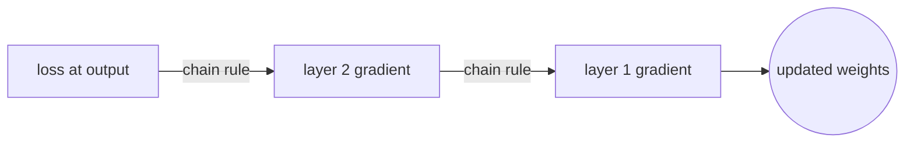
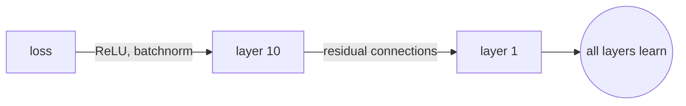
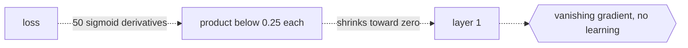

# Backpropagation

## Overview

Backpropagation is the algorithm that computes the gradient of the loss function with respect to every weight in a neural network. It works by applying the chain rule of calculus layer by layer, starting from the output and moving backward toward the input. Without backpropagation, gradient descent would have no gradients to descend.

The forward pass computes the output. The backward pass computes how much each weight contributed to the error. Every modern deep learning framework (PyTorch, TensorFlow, JAX) builds a computational graph during the forward pass and then walks it in reverse to compute gradients automatically. You rarely implement backpropagation by hand, but understanding it is essential for debugging training failures.



### Quick Takeaways

- Backpropagation is the chain rule applied systematically to a computational graph
- The forward pass computes predictions and the backward pass computes gradients
- Vanishing and exploding gradients are the main failure modes

## Definition

- **Chain rule** is the calculus rule that says the derivative of a composed function is the product of the derivatives of each step: `d(f∘g)/dx = (df/dg) · (dg/dx)`.
- **Computational graph** is a directed acyclic graph where each node is an operation and each edge carries a tensor, recording the sequence of computations in the forward pass.
- **Forward pass** is the evaluation of the network from input to loss, storing intermediate values needed for the backward pass.
- **Backward pass** is the traversal of the computational graph in reverse, applying the chain rule at each node to accumulate gradients.
- **Gradient flow** is the path gradients take through the network during the backward pass, and its health determines whether training succeeds.

## The Analogy

Imagine a row of dominoes standing on a table. You push the first one (the input), and each domino knocks over the next until the last one falls (the output). That is the forward pass. Now you want to know which domino was most responsible for how far the last one flew. You walk backward from the last domino, checking how much each one amplified or dampened the force. That backward walk is backpropagation, and the force at each domino is the gradient.

## When You See It

- Every call to `loss.backward()` in PyTorch triggers backpropagation
- When gradients vanish (go to zero) in deep networks, causing early layers to stop learning
- When gradients explode (grow unbounded), causing weights to become NaN
- When choosing activation functions, because ReLU avoids vanishing gradients better than sigmoid
- When using gradient clipping to cap exploding gradients

## Examples

**Good:** build a 10-layer network with ReLU activations, batch normalization, and residual connections. Gradients flow smoothly from the loss to the first layer, and all layers learn at a reasonable pace.



**Bad:** build a 50-layer network with sigmoid activations and no skip connections. The gradient at layer 1 is the product of 50 derivatives, each less than 0.25 (sigmoid's max derivative). The gradient shrinks to effectively zero, and the early layers never update.



**Chain rule through two layers:**

```
Loss = L(y, ŷ)
ŷ = σ(W₂ · h)          # output layer
h = ReLU(W₁ · x)        # hidden layer

∂L/∂W₁ = (∂L/∂ŷ) · (∂ŷ/∂h) · (∂h/∂W₁)
         ↑ loss grad   ↑ layer 2   ↑ layer 1
```

## Important Points

- Backpropagation is efficient because it reuses intermediate results from the forward pass, computing all gradients in one backward pass
- The time complexity of the backward pass is roughly twice the forward pass
- Vanishing gradients happen when many small derivatives multiply together, starving early layers
- Exploding gradients happen when many large derivatives multiply together, destabilizing training
- Solutions include ReLU activations, batch normalization, residual connections, gradient clipping, and careful weight initialization
- Automatic differentiation in frameworks like PyTorch builds and traverses the graph for you, but the underlying algorithm is still backpropagation

## Summary

- Backpropagation computes gradients by applying the chain rule backward through the computational graph.
- The forward pass stores intermediate values and the backward pass uses them to compute how each weight affects the loss.
- Vanishing and exploding gradients are the main enemies, and architecture choices like ReLU and skip connections exist to fight them.
- Modern frameworks handle backpropagation automatically, but understanding the gradient flow is key to debugging.
- _The chain rule is simple, and the hard part is keeping the gradients alive across many layers._
