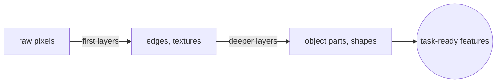
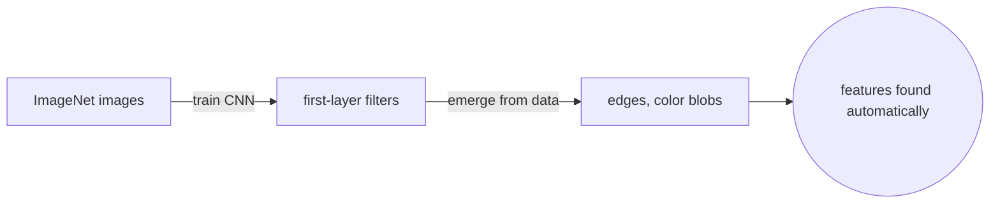
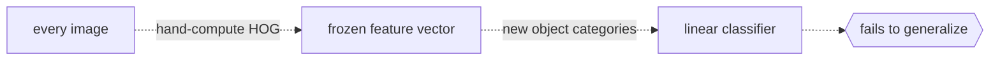

# Feature Learning

## Overview

Feature learning is the process where a model automatically discovers the features it needs from raw data. In traditional machine learning, a human engineer designs features by hand: edge histograms for images, n-grams for text, spectral coefficients for audio. Feature learning replaces that manual step with layers of computation that extract progressively more abstract features on their own.

Deep networks are the most successful feature learners. A convolutional network trained on images learns edge detectors in the first layer, texture patterns in the second, object parts in the third, and full object shapes near the top. No human told the network what an edge is. The training signal and the architecture together force the network to invent features that make the final task easier.



### Quick Takeaways

- Feature engineering is manual and feature learning is automatic
- Deep networks learn hierarchical features, from simple to abstract
- Convolutional feature maps are a concrete example of learned features in vision

## Definition

- **Feature engineering** is the manual process of designing input transformations that expose useful patterns to a model.
- **Feature learning** is the automatic process where the model discovers useful transformations during training.
- **Hierarchical features** are features organized in layers of increasing abstraction, where each layer builds on the outputs of the layer below.
- **Feature map** is the output of a convolutional filter applied to an input, representing where and how strongly a learned pattern appears.

## The Analogy

Feature engineering is like a chef who preps every ingredient by hand before cooking. The chef peels, chops, and measures because the oven cannot do that work. Feature learning is like a modern food processor that takes whole vegetables and outputs the exact cuts the recipe needs. The chef still decides the recipe (the task), but the machine handles the prep work (the features). A deep network is a stack of food processors, each one refining the output of the previous one.

## When You See It

- Convolutional neural networks learning edge, texture, and shape detectors from pixels
- Word embeddings capturing syntactic and semantic features from raw text
- Autoencoders learning compressed representations that preserve the information needed for reconstruction
- When a model trained on one task (like ImageNet classification) transfers its features to a different task (like medical image segmentation)

## Examples

**Good:** train a deep convolutional network on ImageNet. Visualize the first-layer filters and find oriented edge detectors, color blobs, and frequency patterns. These features emerged from data without being programmed.



**Bad:** hand-compute Histogram of Oriented Gradients (HOG) for every image and feed the fixed feature vector to a linear classifier. This works for pedestrian detection but fails to generalize to new object categories because the features are frozen.



**Hierarchical feature structure in a CNN:**

```
Layer 1:  edges, corners, color gradients
Layer 2:  textures, small patterns
Layer 3:  object parts (wheels, eyes, windows)
Layer 4:  object shapes (faces, cars, buildings)
```

## Important Points

- Hand-crafted features encode human assumptions, which can help when data is scarce but hurt when those assumptions are wrong
- Learned features adapt to the data and the task jointly
- Deeper networks learn more abstract features, but they also need more data and compute
- Feature maps in convolutional networks are spatially structured, meaning they preserve location information
- Transfer learning works because early-layer features (edges, textures) are universal across many vision tasks

## Summary

- Feature learning replaces manual feature engineering with automatic discovery during training.
- Deep networks learn a hierarchy: low-level features feed into mid-level features that feed into high-level features.
- Convolutional feature maps are the clearest example of learned spatial features.
- Learned features generalize better than hand-crafted ones when data is sufficient.
- _The best features are the ones the network finds on its own._
