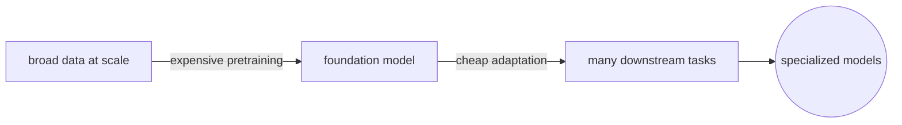
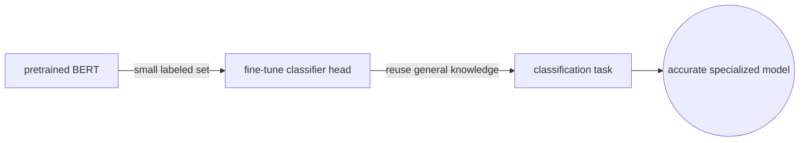
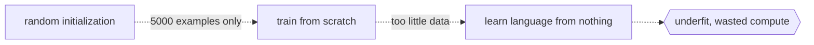

# Foundation Model

## Overview

A foundation model is a model trained on a massive and diverse dataset at scale, designed to be adapted to a wide range of downstream tasks. The term was coined by the Stanford HAI center in 2021 to describe models like GPT, BERT, and CLIP that serve as a shared base for many applications. The key idea is that one expensive pretraining run produces a general-purpose model, and many cheap adaptation steps produce specialized models.

This changes the economics of machine learning. Instead of training a separate model for each task from scratch, you start from a foundation model and adapt it. The foundation captures general knowledge. The adaptation injects task-specific knowledge. This is why a single GPT model can be fine-tuned for summarization, translation, code generation, and medical diagnosis.



### Quick Takeaways

- Foundation models are pretrained once on broad data and adapted many times for specific tasks
- Scale in parameters, data, and compute is what separates a foundation model from a regular pretrained model
- Adaptation methods include fine-tuning, prompting, and in-context learning

## Definition

- **Foundation model** is a model trained on broad data at scale such that it can be adapted to a wide range of downstream tasks.
- **Pretraining** is the initial training phase on a large, general-purpose dataset, typically using self-supervised objectives like next-token prediction or masked language modeling.
- **Fine-tuning** is the adaptation phase where the pretrained model is further trained on a smaller, task-specific dataset.
- **Prompting** is the technique of providing task instructions in natural language at inference time, without modifying model weights.
- **Emergent capabilities** are abilities that appear in large models but are absent in smaller ones, such as multi-step reasoning or zero-shot translation.

## The Analogy

A foundation model is like a university education. The university teaches you broad knowledge across many subjects over several years at great expense. After graduation, you specialize quickly. A medical graduate does a short residency and becomes a doctor. A law graduate passes the bar and becomes a lawyer. The university education is the pretraining. The residency or bar prep is the fine-tuning. The broad education makes the specialization fast and effective, because the graduate already understands how to learn and already knows the fundamentals.

## When You See It

- Choosing between training from scratch versus fine-tuning a pretrained model
- Evaluating whether GPT-4, LLaMA, or BERT is the right base for a task
- Observing a model performing well on a task it was never explicitly trained for
- Discussing the cost of pretraining versus the cost of adaptation

## Examples

**Good:** fine-tuning a foundation model on a small labeled dataset for a specific task.



```python
from transformers import AutoModelForSequenceClassification, Trainer

model = AutoModelForSequenceClassification.from_pretrained(
    'bert-base-uncased',
    num_labels=3
)
trainer = Trainer(model=model, train_dataset=my_dataset)
trainer.train()  # adapts BERT to your classification task
```

**Bad:** training a transformer from random initialization on 5,000 labeled examples, ignoring available foundation models.



```python
model = TransformerFromScratch(vocab_size=30000, layers=12)
# 5,000 examples is not enough to learn language from nothing
train(model, small_dataset)
```

## Important Points

- The power of a foundation model comes from the diversity and scale of its pretraining data, not just its size
- Emergent capabilities are not guaranteed and are poorly understood, so do not rely on them without testing
- Foundation models inherit the biases present in their training data, and these biases transfer to downstream tasks
- Fine-tuning is not the only adaptation method, and prompting or retrieval-augmented generation can work without changing weights
- The cost of pretraining a frontier foundation model is measured in tens of millions of dollars
- Smaller open foundation models like LLaMA and Mistral make the paradigm accessible without frontier budgets
- Homogenization is a risk, because many systems built on the same foundation model share the same failure modes

## Summary

- A foundation model is pretrained once at scale and adapted many times at low cost.
- Adaptation can be fine-tuning, prompting, or retrieval, depending on the task and budget.
- _The degree is expensive, but every job after it starts from that same diploma._
