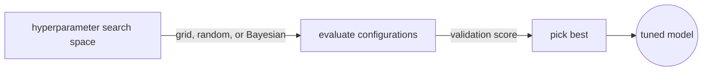
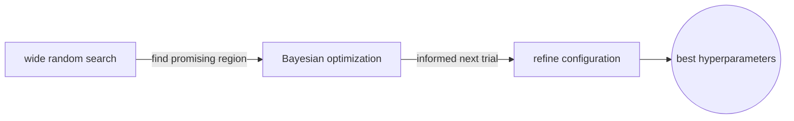

# Hyperparameter Optimization

## Overview

Hyperparameter optimization is the search for the combination of hyperparameters that produces the best model performance. Because hyperparameters are not learned during training, you need a separate process to evaluate different configurations and pick the winner. This outer loop wraps the inner training loop.

The search space grows exponentially with the number of hyperparameters. Three hyperparameters with ten candidate values each produce a thousand combinations. Exhaustive search becomes impractical fast, so smarter strategies exist to find good configurations without trying every one.



### Quick Takeaways

- Grid search is exhaustive and expensive but guarantees coverage of the defined grid
- Random search is surprisingly effective and often beats grid search in high dimensions
- Bayesian optimization uses past results to pick the next configuration intelligently

## Definition

- **Grid search** evaluates every combination in a predefined set of hyperparameter values, forming a complete Cartesian product over the search space.
- **Random search** samples hyperparameter values from specified distributions, which covers the space more efficiently when only a few hyperparameters matter.
- **Bayesian optimization** builds a probabilistic model of the objective function and uses an acquisition function to decide which configuration to try next, balancing exploration and exploitation.
- **Early stopping in search** terminates unpromising training runs before completion, saving compute by cutting losses on configurations that clearly underperform.

## The Analogy

Finding the right hyperparameters is like searching for the best restaurant in a city you have never visited. Grid search means walking every street and trying every restaurant, which is thorough but exhausting. Random search means picking restaurants at random, which surprisingly finds good ones faster because most streets have nothing special. Bayesian optimization means asking locals after each meal where to go next, so each choice is informed by what you have already learned.

## When You See It

- Training a model for the first time on a new dataset and choosing hyperparameters
- Running a sweep in Weights and Biases or Optuna
- Allocating a GPU budget across many experimental configurations
- Deciding whether to invest in a longer search or ship with current results

## Examples

**Good:** using random search over a wide range, then narrowing with Bayesian optimization.



```python
import optuna

def objective(trial):
    lr = trial.suggest_float('lr', 1e-5, 1e-2, log=True)
    batch_size = trial.suggest_categorical('batch_size', [16, 32, 64, 128])
    dropout = trial.suggest_float('dropout', 0.1, 0.5)
    model = build_model(dropout=dropout)
    val_loss = train_and_evaluate(model, lr=lr, batch_size=batch_size)
    return val_loss

study = optuna.create_study(direction='minimize')
study.optimize(objective, n_trials=100)
```

**Bad:** running a full grid search over five hyperparameters with ten values each, producing 100,000 training runs.


```python
# 10 * 10 * 10 * 10 * 10 = 100,000 runs
for lr in [1e-5, 3e-5, 1e-4, 3e-4, 1e-3, 3e-3, 1e-2, 3e-2, 1e-1, 3e-1]:
    for bs in [8, 16, 32, 64, 128, 256, 512, 1024, 2048, 4096]:
        for dr in [0.0, 0.05, 0.1, 0.15, 0.2, 0.25, 0.3, 0.35, 0.4, 0.5]:
            # ... two more nested loops
            train(lr, bs, dr, ...)  # impractical
```

## Important Points

- Random search outperforms grid search when only a subset of hyperparameters are important, which is the common case
- Bayesian optimization is most useful when each evaluation is expensive and the budget is small
- Log-uniform sampling for learning rate is almost always better than uniform sampling
- Early stopping within the search loop saves the most compute, because bad runs are killed early
- Use a held-out validation set for the search, never the test set
- Tools like Optuna, Ray Tune, and Weights and Biases Sweeps automate the search loop
- Start coarse and narrow down, rather than starting with a fine grid

## Summary

- Grid search is safe but expensive, random search is cheap and effective, and Bayesian optimization is smart but complex.
- Start with random search, then refine with Bayesian methods if the budget allows.
- _Ask the locals after each meal, and you will find the best restaurant without walking every street._
