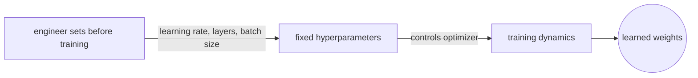
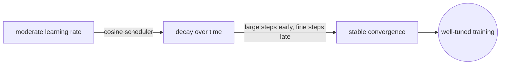
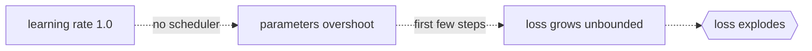

# Hyperparameter

## Overview

A hyperparameter is any value that you set before training begins. It is not learned from the data. The model parameters, like weights and biases, are updated by the optimizer during training, but the hyperparameters that control that optimizer are fixed by the engineer. This distinction matters because the quality of learned parameters depends entirely on the hyperparameters you chose.

Hyperparameters govern the structure of the model and the dynamics of training. Some define the architecture, like the number of layers or units per layer. Others define the optimization, like the learning rate or batch size. Getting them wrong means the model either cannot learn or learns the wrong thing.



### Quick Takeaways

- Hyperparameters are set before training and never updated by the optimizer
- Model parameters are learned from data, hyperparameters are chosen by the engineer
- The learning rate is the single most sensitive hyperparameter in most deep learning setups

## Definition

- **Hyperparameter** is a configuration variable that is external to the model and whose value is set before the learning process begins.
- **Parameter** is a variable internal to the model that is estimated from data during training, such as a weight or bias.
- **Learning rate** controls the step size during gradient descent, written as `η` in the update rule `w = w - η * ∂L/∂w`.
- **Batch size** is the number of samples processed before the model updates its parameters in one step.
- **Epochs** is the number of complete passes through the entire training dataset.

## The Analogy

Training a model is like tuning a guitar. The strings are the parameters, and you turn the tuning pegs during practice until the sound is right. But the type of strings you put on, how tight you wind them initially, and how fast you turn the pegs are all decisions you make before you start playing. Those decisions are the hyperparameters. If you turn the pegs too fast you overshoot the right pitch. If you turn them too slowly you never get there before the concert starts.

## When You See It

- Setting up a training script and choosing values for the optimizer
- Deciding the model architecture before writing the training loop
- Debugging why a model diverges or converges too slowly
- Comparing different training runs in an experiment tracker

## Examples

**Good:** setting a moderate learning rate with a scheduler that decays it over time.



```python
optimizer = Adam(lr=3e-4)
scheduler = CosineAnnealingLR(optimizer, T_max=100)
```

**Bad:** using a learning rate of 1.0 with no scheduler, causing the loss to explode on the first few steps.



```python
optimizer = SGD(lr=1.0)  # far too high for most tasks
```

**Common hyperparameters and their typical ranges:**

| Hyperparameter   | Typical Range | Sensitivity   |
| ---------------- | ------------- | ------------- |
| Learning rate    | 1e-5 to 1e-2  | Very high     |
| Batch size       | 16 to 512     | Medium        |
| Epochs           | 10 to 300     | Low to medium |
| Dropout rate     | 0.1 to 0.5    | Medium        |
| Weight decay     | 1e-5 to 1e-2  | Medium        |
| Number of layers | 2 to 100+     | High          |

## Important Points

- The learning rate is almost always the first hyperparameter to tune
- Batch size affects both convergence speed and generalization, not just memory usage
- Hyperparameters interact with each other, so changing one may require adjusting another
- A good default for Adam is `lr=3e-4`, which works as a starting point for many tasks
- Too many epochs leads to overfitting, too few leads to underfitting
- Hyperparameters are problem-specific, and values that work on one dataset may fail on another

## Summary

- Hyperparameters are the knobs you set before training, and parameters are what training produces.
- The learning rate dominates sensitivity, so tune it first and tune it carefully.
- _The musician chooses the strings before the concert, and the music depends on that choice._
