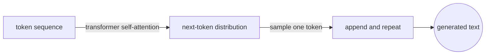
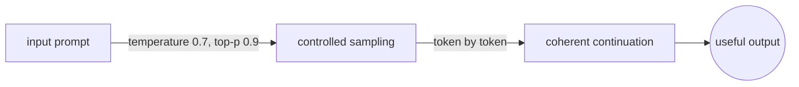
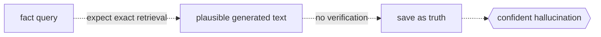

# Large Language Model

## Overview

A large language model is a neural network, almost always based on the transformer architecture, trained on a massive corpus of text to predict the next token in a sequence. The scale of parameters, training data, and compute is what makes it large. Models like GPT-4, Claude, and LLaMA have hundreds of billions of parameters and are trained on trillions of tokens.

LLMs work by learning statistical patterns in language. During training, the model sees a sequence of tokens and learns to predict what comes next. At inference time, it generates text one token at a time by sampling from the predicted probability distribution. This autoregressive process is simple in principle but produces remarkably coherent and useful output at sufficient scale.



### Quick Takeaways

- LLMs are transformer-based models trained to predict the next token in a sequence
- Scale in three dimensions, parameters, data, and compute, is what unlocks their capabilities
- Generation is autoregressive, meaning each new token depends on all previous tokens

## Definition

- **Large language model (LLM)** is a language model with a large number of parameters, typically billions, trained on broad text data using self-supervised learning.
- **Transformer** is the neural network architecture underlying modern LLMs, introduced in the 2017 paper "Attention Is All You Need," built on self-attention mechanisms.
- **Tokenization** is the process of splitting raw text into discrete units called tokens, which are the input and output vocabulary of the model.
- **Autoregressive generation** means the model produces output one token at a time, where each token is conditioned on all previously generated tokens: `P(x_t | x_1, x_2, ..., x_{t-1})`.
- **Context window** is the maximum number of tokens the model can process in a single forward pass, defining its working memory.

## The Analogy

An LLM is like an extremely well-read author who has read every book, article, and forum post ever written, but has no memory of specific conversations. When you give this author the beginning of a paragraph, they can continue writing in a way that is consistent, coherent, and informed by everything they have read. They are not retrieving a stored answer. They are generating text that statistically fits what should come next, based on patterns absorbed across all their reading. The quality of the writing depends on how much they read and how large their brain is.

## When You See It

- Building a chatbot, coding assistant, or text generation system
- Choosing between model sizes and the trade-off between quality and latency
- Debugging tokenization issues where the model splits words unexpectedly
- Evaluating whether a task requires fine-tuning or can be solved with prompting alone

## Examples

**Good:** using an LLM for autoregressive generation with proper temperature control.



```python
from transformers import AutoModelForCausalLM, AutoTokenizer

tokenizer = AutoTokenizer.from_pretrained('meta-llama/Llama-3-8B')
model = AutoModelForCausalLM.from_pretrained('meta-llama/Llama-3-8B')

inputs = tokenizer("The transformer architecture works by", return_tensors="pt")
outputs = model.generate(
    **inputs,
    max_new_tokens=100,
    temperature=0.7,  # controls randomness
    top_p=0.9         # nucleus sampling
)
print(tokenizer.decode(outputs[0]))
```

**Bad:** treating an LLM as a database that stores and retrieves exact facts, then trusting its output without verification.



```python
# LLMs generate plausible text, not verified facts
answer = llm("What is the exact population of Tokyo in 2025?")
# This may be confidently wrong — hallucination
save_to_database(answer)  # dangerous without verification
```

## Important Points

- The transformer's self-attention mechanism allows each token to attend to every other token in the context, which is what makes long-range coherence possible
- Tokenization is not the same as word splitting, and common words may be one token while rare words are split into multiple subword pieces
- Scaling laws show predictable relationships between model size, dataset size, compute budget, and performance
- LLMs hallucinate, meaning they generate plausible but false statements, and this is a fundamental property of autoregressive generation rather than a bug to be fixed
- The context window is a hard limit, and information beyond it is invisible to the model
- Inference cost scales with the number of parameters and the sequence length, making deployment expensive at scale
- Instruction tuning and RLHF are post-training steps that align a base LLM with human preferences and make it useful as an assistant

## Summary

- An LLM is a transformer trained at scale to predict the next token, and it generates text by repeating that prediction.
- Scale unlocks capabilities, but also unlocks hallucination, cost, and the illusion of understanding.
- _The author has read everything and remembers nothing, and the next word is always a guess informed by all the words before it._
