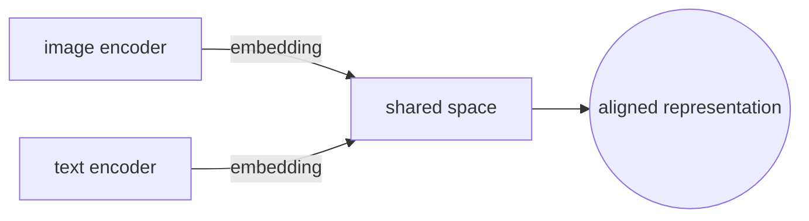
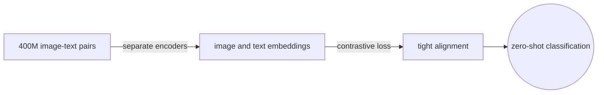
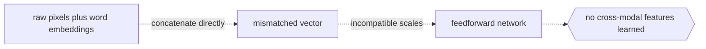

# Multimodal Learning

## Overview

Multimodal learning combines information from different data types into a single model. Each data type is a modality: text, image, audio, video, or structured data. The goal is to build a representation where information from one modality complements or disambiguates the other. A caption alone might be vague, but paired with the image it becomes precise.

The core design decision is how and when to fuse the modalities. Early fusion concatenates raw inputs or low-level features. Late fusion processes each modality independently and merges the final representations. Cross-attention lets one modality attend to the other at intermediate layers. The right strategy depends on how tightly the modalities interact in the target task.

The field has accelerated since contrastive pretraining showed that aligned embeddings across modalities enable zero-shot transfer. Models like CLIP and its successors proved that you can build strong vision-language representations without task-specific labels.

### Quick Takeaways

- Each modality has its own encoder before any fusion happens
- Fusion strategy determines when and how modalities exchange information
- Alignment means mapping different modalities into a shared embedding space

## Definition

- **Modality** is a distinct type or channel of data, such as text, image, audio, or video.
- **Early fusion** combines modalities at the input or low-level feature stage before most processing happens.
- **Late fusion** processes each modality through its own full encoder and combines only the final output representations.
- **Cross-attention fusion** lets one modality query the intermediate representations of another through attention layers at mid-network depth.
- **Contrastive alignment** trains paired examples from different modalities to have similar embeddings while unpaired examples are pushed apart, as in CLIP.

## The Analogy

A detective investigates a crime scene using photographs, witness statements, and audio recordings. Each source tells part of the story. The photographs show positions and objects. The statements describe motives and timing. The audio captures tone and background noise. No single source solves the case alone. The detective fuses them by cross-referencing details, checking the audio timestamp against the photograph angle, and matching the witness account to visible evidence. The fusion is what produces the conclusion. A detective who only reads witness statements will miss what the camera saw, and one who only looks at photos will miss what was said.

## When You See It

- Image captioning where a vision encoder and a language decoder work together
- Visual question answering where the model reads both the image and the question
- Video understanding that combines visual frames with spoken audio
- CLIP-style models that align images and text for zero-shot classification
- Text-to-image generation where a language model guides a diffusion model through cross-attention

## Examples

**Good:** CLIP trains an image encoder and a text encoder separately, then aligns their outputs with a contrastive loss on 400 million image-text pairs. At inference, you compare a text embedding against image embeddings without any fine-tuning. The alignment is tight enough for zero-shot image classification across hundreds of categories the model never explicitly trained on.

**Bad:** Concatenating raw pixel values and word embeddings into a single vector and feeding it into a feedforward network. The dimensions are incompatible, the scales are mismatched, and the network cannot learn meaningful cross-modal features. Each modality needs its own encoder to extract meaningful features before any fusion happens.

## Important Points

- Always use a separate pretrained encoder per modality before fusing
- Early fusion is cheap but works only when modalities are naturally aligned like audio and video frames
- Late fusion is safe but misses fine-grained cross-modal interactions
- Cross-attention fusion is powerful but expensive in memory and compute
- Contrastive learning aligns modalities without needing explicit labels for every sample
- Missing modalities at inference require graceful degradation, not a crash
- The quality of paired data matters more than quantity because noisy pairs teach wrong alignments
- Tokenizing all modalities into a shared vocabulary is an emerging approach that simplifies the architecture
- Modality dropout during training, randomly masking one modality, improves robustness when a modality is missing at inference
- Scale differences between modalities require careful normalization so one modality does not dominate the fused representation

## Summary

- Different modalities carry complementary signals that a single modality misses.
- Fusion strategy controls when the modalities start talking to each other.
- Contrastive alignment like CLIP maps modalities into a shared space without task-specific labels.
- Each modality needs its own encoder because raw concatenation does not work.
- Paired data quality matters more than paired data quantity for alignment.
- _The detective solves the case only after the photograph, the statement, and the recording land on the same desk._
