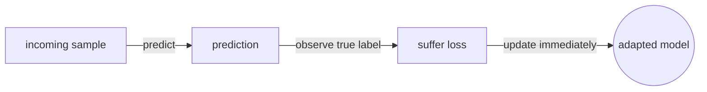
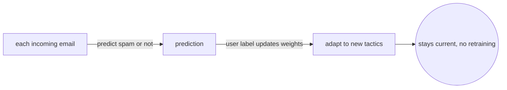
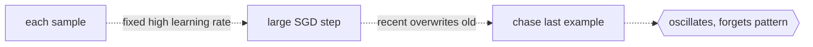

# Online Machine Learning

## Overview

Batch learning trains on the entire dataset, then deploys a static model. Online learning updates the model after each new sample or small batch. The model never waits for the full dataset to arrive. This matters when data is a continuous stream and you cannot store it all, or when the data distribution shifts over time and a static model grows stale.

The theoretical framework is regret minimization. The learner makes a prediction, observes the true label, suffers a loss, and updates. Regret is the gap between the learner cumulative loss and the loss of the best fixed model in hindsight. A good online algorithm keeps regret sublinear, meaning the average per-round gap shrinks toward zero.

In practice, most production systems blend batch and online. They retrain from scratch periodically and run online updates between retrains. Pure online learning from a cold start is rare because initial performance is poor until enough samples arrive.

### Quick Takeaways

- The model updates after each sample instead of waiting for a full pass over all data
- Regret measures how much worse the online learner does compared to the best fixed strategy
- Online learning handles non-stationary distributions that break batch models

## Definition

- **Batch learning** trains on the entire dataset at once and produces a fixed model for deployment.
- **Online learning** processes one example at a time, updating the model parameters after each observation.
- **Regret** is the total loss of the online learner minus the total loss of the best single model chosen in hindsight over the same sequence.
- **Concept drift** is a change in the underlying data distribution over time, which degrades a static model that cannot adapt.
- **Stochastic gradient descent** in its pure one-sample form is the simplest online learning algorithm for neural networks.

## The Analogy

A weather forecaster who reads the full year of data and builds one prediction model is doing batch learning. A forecaster who checks the morning readings, makes today's prediction, sees what actually happened, and adjusts the model before tomorrow is doing online learning. The second forecaster adapts to a shifting climate in real time. The first must wait until next year to retrain. If the climate changes mid-year, the batch forecaster is stuck with stale predictions while the online forecaster has already adapted.

## When You See It

- A fraud detection system that must adapt to new attack patterns within hours
- A recommendation engine ingesting a firehose of user clicks in real time
- Sensor streams from IoT devices where storing all history is impractical
- Financial trading models that must react to market regime changes immediately
- Search ranking models that update as user behavior shifts across seasons and trends

## Examples

**Good:** A spam filter processes each incoming email, predicts spam or not, then updates its weights using the true label from the user. After a few thousand emails it matches a batch-trained model, and it keeps adapting as spammers change tactics. No retraining pipeline is needed. The model stays current without ever seeing the full dataset at once.

**Bad:** Running a single stochastic gradient descent step on each sample with a fixed high learning rate and no decay. The model oscillates wildly because recent samples overwrite what was learned before. Online learning still needs a decaying learning rate or adaptive optimizer to converge. Without decay the model chases the last example and forgets the pattern.

## Important Points

- Online learning is essential when data arrives as a stream with no defined end
- A decaying learning rate is critical to prevent the model from forgetting everything on each update
- Mini-batch online learning processes small groups of samples and is more stable than pure single-sample updates
- Concept drift makes online learning superior to batch learning in non-stationary environments
- Evaluation uses prequential accuracy: predict first, then learn, then measure over time
- The perceptron is the oldest online learning algorithm and still a useful baseline
- Batch and online are not mutually exclusive because many systems do periodic batch retraining combined with online updates between retrains
- Reservoir sampling helps maintain a representative buffer of past data when memory is limited
- Label delay is a real problem because in many streaming settings the true label arrives long after the prediction was made
- Online learning shines when the cost of being wrong on the next sample outweighs the cost of updating the model

## Summary

- Batch learning waits for all data while online learning updates on each sample.
- Regret is the scorecard that measures how close the learner gets to the best hindsight model.
- Concept drift is the main reason to prefer online over batch in production streams.
- A decaying learning rate prevents the model from chasing noise.
- Most production systems combine periodic batch retraining with online updates between retrains.
- _The forecaster who adjusts each morning stays closer to the weather than the one who retrains each year._
