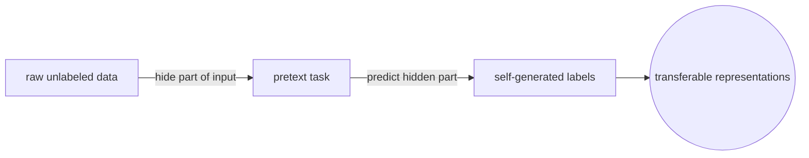
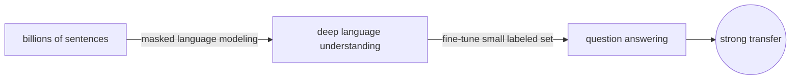
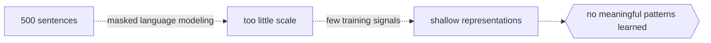

# Self-Supervised Learning

## Overview

Self-supervised learning creates its own labels from the raw data. Instead of relying on human annotation, it designs a pretext task where part of the input is hidden and the model must predict it from the rest. Masked language modeling hides words in a sentence and asks the model to fill them in. Contrastive learning pulls similar views of the same data point together and pushes different data points apart. The learned representations transfer powerfully to downstream tasks.

This paradigm powers the foundation models behind modern NLP and computer vision. BERT learns by predicting masked tokens. GPT learns by predicting the next token. Vision models like DINO learn by matching augmented views of the same image. The key insight is that raw data contains enough structure to generate billions of training signals without a single human label.

### Quick Takeaways

- The model generates its own labels by hiding part of the input and predicting it
- Pretext tasks include masked prediction and contrastive matching
- This paradigm drives BERT, GPT, and modern vision foundation models

## Definition

- **Pretext task** is a training objective automatically derived from the data structure, such as predicting a masked word or the rotation angle of an image.
- **Masked language modeling** hides random tokens in a sentence and trains the model to predict them from surrounding context, as used in BERT.
- **Autoregressive modeling** predicts the next token given all previous tokens, as used in GPT.
- **Contrastive learning** trains the model to produce similar representations for augmented views of the same input and dissimilar representations for different inputs.
- **Representation learning** is the goal of self-supervised learning, where the learned features capture semantic meaning useful for many downstream tasks.

## The Analogy

A detective trainee studies crime scene photos where certain clues have been blacked out. Their job is to infer what was hidden based on the surrounding evidence. Nobody gives them the answer. They get better at reading scenes by practicing on thousands of redacted photos. When a real case arrives, their ability to spot patterns transfers directly. Self-supervised learning is the redacted photo training, and the real case is the downstream task.

## When You See It

- Pre-training a language model on raw text before fine-tuning it for sentiment analysis
- Training a vision model on unlabeled images using augmentation-based contrastive objectives
- Building embeddings that capture semantic similarity without any labeled pairs
- Bootstrapping a model on massive unlabeled corpora where annotation is impossible at scale
- Learning audio representations by predicting masked segments of speech
- Pre-training code models by predicting missing tokens in source code repositories

## Examples

**Good:** Pre-training BERT on billions of sentences with masked language modeling, then fine-tuning on a small labeled dataset for question answering. The pretext task teaches deep language understanding that transfers.

**Bad:** Using masked language modeling on a dataset of 500 sentences. The pretext task needs scale to learn meaningful patterns, and a tiny corpus produces shallow representations.

**Good:** Training a vision encoder with contrastive learning on millions of unlabeled images, where random crops of the same image are positive pairs. The encoder learns features that rival supervised ImageNet pre-training.

**Bad:** Creating contrastive pairs from unrelated images and calling them positives. The supervision signal must reflect real similarity or the model learns meaningless representations.

## Important Points

- Self-supervised learning sits between supervised and unsupervised because it has labels but generates them automatically
- The pretext task must be hard enough to force the model to learn useful features but not so hard that it cannot converge
- Scale is critical because the automatically generated labels are weaker per-example than human labels
- Modern LLMs like GPT are fundamentally self-supervised, trained on next-token prediction over internet-scale text
- Contrastive methods need careful negative sampling and augmentation design to avoid representation collapse
- The quality of learned representations depends on how well the pretext task aligns with downstream tasks
- Data augmentation strategy is the most critical design choice in contrastive vision methods
- Self-supervised pre-training followed by supervised fine-tuning is the dominant recipe for foundation models

## Summary

- Self-supervised learning generates its own training signal by hiding parts of the data and predicting them.
- Pretext tasks like masking and next-token prediction require no human labels at all.
- Contrastive learning pulls similar views together and pushes different inputs apart in representation space.
- This paradigm is the engine behind BERT, GPT, and modern vision foundation models.
- The pretext task defines what the model pays attention to, so choose it to match your downstream goal.
- _The answer was in the sentence all along, and the mask just forced the model to find it._
