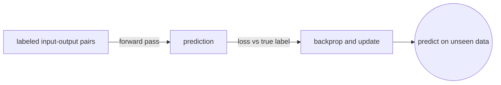
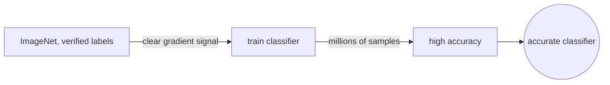
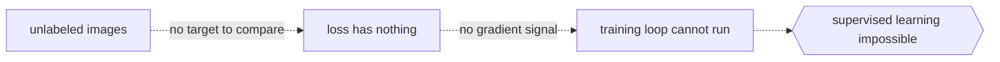

# Supervised Learning

## Overview

Supervised learning trains a model on labeled data where every input has a known correct output. The model adjusts its parameters to minimize the gap between its predictions and the true labels, and after enough rounds it generalizes to inputs it has never seen. This is the most common paradigm in deep learning because labels give the optimizer a clear signal to follow.

The training loop is straightforward. Feed a batch of labeled examples through the network, compute a loss that measures how wrong the predictions are, backpropagate the gradients, and update the weights. Repeat until the validation loss stops improving. The two main flavors are classification, where the output is a discrete category, and regression, where the output is a continuous value.

### Quick Takeaways

- Every training example carries a label that tells the model what the right answer is
- Classification predicts categories and regression predicts continuous values
- The training loop is forward pass, loss, backward pass, weight update, repeat

## Definition

- **Labeled data** is a dataset where each input x is paired with a target y, and the model learns the mapping f(x) → y.
- **Classification** assigns an input to one of a finite set of categories, such as spam or not spam, using a loss like cross-entropy.
- **Regression** maps an input to a real-valued output, such as predicting house price, using a loss like mean squared error.
- **Training loop** is the repeated cycle of forward pass, loss computation, backpropagation, and weight update via an optimizer like SGD or Adam.
- **Generalization** is the ability of the trained model to produce correct outputs on data it was not trained on.

## The Analogy

A student studies a textbook where every problem has an answer key in the back. They work each problem, check the answer, and correct their approach when wrong. After finishing the book, the teacher gives them an exam with new problems. If the student learned the underlying method rather than memorizing specific answers, they pass. The student who just memorized answers fails the exam because the questions are different. Supervised learning is that textbook study, the exam is inference on unseen data, and overfitting is the student who only memorized.

## When You See It

- Image classification where each photo is tagged with a label like cat or dog
- Spam detection where emails are marked as spam or ham by human reviewers
- Predicting stock prices or temperature from historical measurements
- Medical diagnosis where scans are annotated by doctors with the condition present
- Sentiment analysis where reviews are labeled as positive or negative
- Object detection where bounding boxes and class labels are drawn by annotators

## Examples

**Good:** Training an image classifier on ImageNet where every image has a human-verified label. The model gets a clear gradient signal from millions of labeled samples and converges to high accuracy.

**Bad:** Feeding the model unlabeled images and hoping it learns to classify them. Without labels the loss function has nothing to compare against, so the supervised training loop cannot run.

**Good:** Predicting house prices using a dataset of past sales with known prices. The regression loss gives a direct measure of how far each prediction is from reality.

**Bad:** Using noisy or incorrect labels, such as mislabeled categories, because the model will learn the noise as if it were truth and fail on clean test data.

## Important Points

- Label quality matters more than label quantity, because wrong labels teach wrong patterns
- Overfitting happens when the model memorizes training labels instead of learning the underlying function
- Common architectures include CNNs for images, RNNs and Transformers for sequences, and MLPs for tabular data
- Regularization techniques like dropout and weight decay help the model generalize beyond the training set
- Supervised learning requires human effort to produce labels, which is expensive at scale
- The validation set must be separate from training data to give an honest estimate of generalization
- Cross-entropy loss is standard for classification and mean squared error is standard for regression
- Learning rate and batch size are the two most impactful hyperparameters in the training loop

## Summary

- Supervised learning trains on input-output pairs where every example has a known label.
- Classification handles discrete categories and regression handles continuous values.
- The training loop repeats forward pass, loss, backpropagation, and weight update until convergence.
- Label quality and regularization determine whether the model memorizes or generalizes.
- Choose classification for discrete outputs and regression for continuous ones based on the task.
- _The answer key teaches the method, not the memorization, and that is the whole point._
