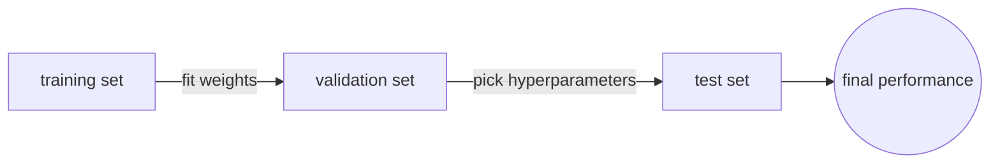
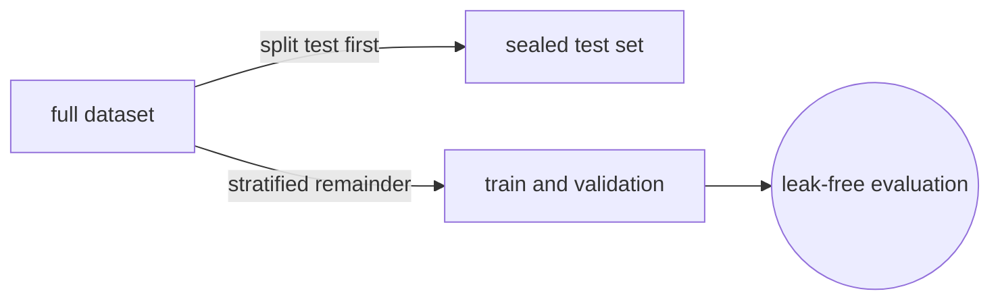
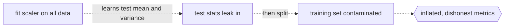

# Training, Validation, and Test Data Sets

## Overview

A model learns from training data, tunes its hyperparameters on validation data, and proves itself on test data. Each split serves a different purpose and mixing them up produces misleading results. The test set must stay sealed until the very end.

The core principle is simple. The data that guides a decision must be separate from the data that evaluates that decision. Violating this causes data leakage and the reported performance becomes a lie.



### Quick Takeaways

- Training data fits the weights, validation data picks the hyperparameters, test data measures final performance
- Typical split ratios are 80/10/10 or 70/15/15 for medium-sized datasets
- Data leakage means information from the evaluation set leaked into the training process

## Definition

- **Training set** is the data the model sees during gradient updates and is used to adjust weights directly.
- **Validation set** is held out during training and used to compare hyperparameter choices, select architectures, and decide when to stop training.
- **Test set** is touched exactly once at the end to report the final performance metric to stakeholders or papers.
- **Data leakage** occurs when information from the validation or test set influences the training process, even indirectly through feature engineering or normalization statistics.
- **Cross-validation** rotates which fold serves as the validation set across K rounds, giving every example a turn, commonly used when data is too small for a fixed split.
- **Stratified splitting** ensures each split preserves the class distribution of the original dataset, critical for imbalanced problems.

## The Analogy

A student studies from a textbook, practices with past exams, and then sits the final exam. The textbook is the training set. The past exams are the validation set, used to decide which study strategy works best. The final exam is the test set. If the student sees the final exam questions while studying, the grade means nothing. That is data leakage.

## When You See It

- Starting a new project and deciding how to split the data
- Noticing that training accuracy is 99% but test accuracy is 70%
- Running K-fold cross-validation because the dataset has only a few hundred examples

## Examples

**Good, clean split with stratification:**



```python
from sklearn.model_selection import train_test_split

# First split: separate test set
train_val, test = train_test_split(data, test_size=0.1, stratify=data['label'], random_state=42)

# Second split: separate validation from training
train, val = train_test_split(train_val, test_size=0.111, stratify=train_val['label'], random_state=42)
# 0.111 of 0.9 ≈ 0.1 of total, giving 80/10/10
```

The test set is created first and never touched again. Stratification preserves class balance.

**Bad:** fitting a scaler on the entire dataset before splitting. The scaler learns the mean and variance from test examples, which leaks statistical information into training.



## Important Points

- Never tune hyperparameters on the test set, that turns the test set into a second validation set
- For time-series data, split by time not by random shuffle, because the future must not leak into the past
- K-fold cross-validation with K=5 or K=10 is standard for small datasets under a few thousand examples
- Normalization and feature engineering must be fit only on the training set and then applied to validation and test
- Large datasets like ImageNet use a fixed validation set because K-fold would be computationally wasteful
- If you repeatedly evaluate on the test set and adjust, you are implicitly overfitting to it

## Summary

- Train fits weights, validation picks hyperparameters, and test reports the final number.
- Split before any preprocessing to prevent leakage.
- Use stratification for imbalanced classes and time-based splits for temporal data.
- Cross-validation helps when data is scarce but costs K times the compute.
- _The final exam only counts if the student never saw the questions beforehand._
