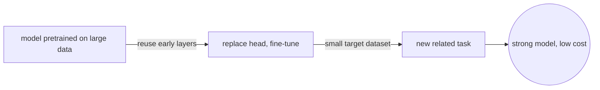
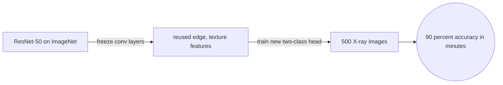
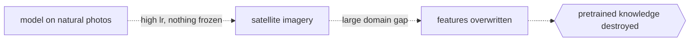

# Transfer Learning

## Overview

Training a deep network from scratch requires large data and long compute time. Transfer learning avoids most of that cost by starting from a model that already learned useful features on a large dataset, then adapting it to a new and often smaller dataset. The key insight is that early layers learn general patterns like edges and textures, and those patterns are useful across many tasks.

The two main strategies are feature extraction and fine-tuning. In feature extraction you freeze the pretrained layers and train only a new head. In fine-tuning you unfreeze some or all layers and update them with a small learning rate. The choice depends on how similar the new domain is to the original one and how much labeled data you have.

Most modern deep learning pipelines use transfer learning by default. ImageNet pretrained models are the standard starting point for vision tasks. BERT and GPT-family models serve the same role for language tasks. Training from random initialization is now the exception rather than the rule.

### Quick Takeaways

- Early layers capture general features that transfer well across domains
- Fine-tuning updates pretrained weights while feature extraction freezes them
- Domain shift between source and target determines how many layers to unfreeze

## Definition

- **Transfer learning** is the practice of applying knowledge gained from one task to a different but related task.
- **Feature extraction** means using the pretrained model as a fixed feature extractor and training only the final classifier layer.
- **Fine-tuning** means unfreezing part or all of the pretrained model and continuing training on the new dataset with a lower learning rate.
- **Domain shift** is the difference between the data distribution the model was trained on and the distribution of the target task.
- **Pretrained model** is a network already trained on a large benchmark dataset such as ImageNet or a large text corpus.
- **Negative transfer** occurs when the source task knowledge degrades performance on the target task instead of helping it.

## The Analogy

A chef who spent years mastering French cuisine moves to a Japanese kitchen. The knife skills, heat control, and timing all carry over. The chef does not start from zero. Only the recipes, plating, and ingredient combinations need relearning. A chef with no prior experience would take years longer to reach the same level. The French training is the pretrained model and the Japanese kitchen is the target domain. If the chef moves to a bakery instead, even more skills transfer because French cuisine is already pastry-heavy. That is a small domain shift. Moving to a molecular gastronomy lab is a large domain shift, and the chef may need to relearn almost everything except the palate.

## When You See It

- You have a small labeled dataset and cannot afford to train a large model from scratch
- The target task shares visual or linguistic structure with a well-known benchmark
- You need fast iteration and a strong baseline before investing in custom architectures
- A production model must be updated for a new but related product category
- A language model pretrained on general text is adapted to legal or medical documents

## Examples

**Good:** Loading a ResNet-50 pretrained on ImageNet, freezing all convolutional layers, replacing the final classification head with a two-class layer, and training on 500 X-ray images to detect pneumonia. The model converges in minutes and reaches 90 percent accuracy because the low-level edge and texture features from ImageNet are directly useful for reading medical scans.

**Bad:** Taking a model pretrained on natural photos and directly fine-tuning it on satellite imagery with a high learning rate and no frozen layers. The pretrained features get destroyed in the first few epochs because the domain gap is large and the learning rate is too aggressive. A better approach would be to freeze early layers, use a learning rate ten times smaller than the default, and unfreeze gradually.

**Good:** Taking a BERT model pretrained on general English text and fine-tuning it on 2000 labeled legal contract clauses. The language understanding transfers directly, and the model outperforms a bag-of-words baseline trained on the same data.

## Important Points

- Freeze more layers when the target dataset is small and the domains are similar
- Unfreeze more layers when the target dataset is large or the domains are very different
- Always use a lower learning rate for pretrained layers than for the new head
- Watch for negative transfer, where the source domain hurts performance on the target
- Gradual unfreezing from top to bottom often works better than unfreezing everything at once
- Data augmentation on the small target set compounds the benefit of transfer learning
- The practical workflow is: pick a pretrained model, replace the head, freeze, train the head, then optionally unfreeze and fine-tune
- Discriminative learning rates assign different rates per layer group, with lower rates for earlier layers and higher rates for later ones

## Summary

- Training from scratch wastes compute when good pretrained models exist.
- Feature extraction freezes the backbone and trains only the head.
- Fine-tuning updates pretrained weights carefully with a small learning rate.
- Domain shift determines how aggressively you should unfreeze layers.
- The practical workflow is load, freeze, train head, then optionally unfreeze and fine-tune.
- _The knife skills travel with the chef, and only the recipes need rewriting._
