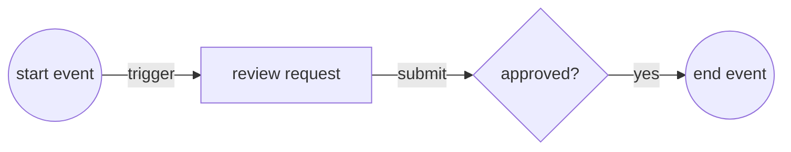
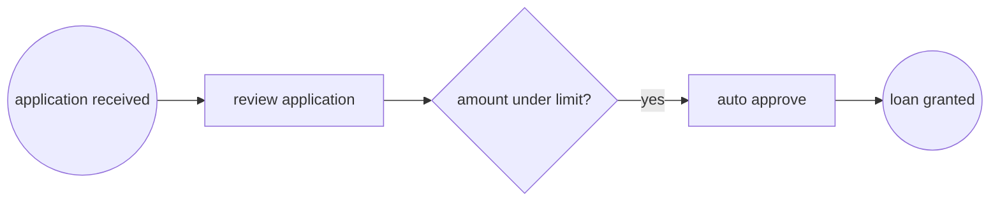
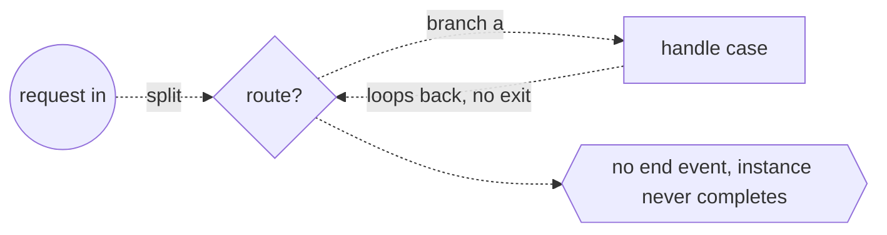

# Business Process Model and Notation

## Overview

Business Process Model and Notation, BPMN, is an OMG standard that gives organizations a single graphical language for drawing business processes. The goal is a notation that both business analysts who design a process and technical developers who implement it can read without translation. A BPMN diagram, called a Business Process Diagram, arranges a small set of core shapes into a flow that reads left to right, so a process becomes a picture anyone in the organization can follow.

The specification defines the shapes and their exact meaning so the same diagram means the same thing everywhere. Circles are events, rounded rectangles are activities, diamonds are gateways, and solid arrows are sequence flows that order the work. BPMN 2.0.2 also defines an execution semantics and an XML serialization, so a well formed model is not only a drawing but something a process engine can run. This bridges the gap between the picture drawn in a workshop and the workflow executed in a system.

### Quick Takeaways

- BPMN gives business and technical people one shared notation for the same process
- Core shapes are events (circles), activities (rounded rectangles), gateways (diamonds), joined by sequence flows
- BPMN 2.0.2 adds execution semantics and XML so models can be run by a process engine, not just drawn

## Definition

- **Event** is something that happens during a process, drawn as a circle, and typed as start, intermediate, or end.
- **Activity** is a unit of work, drawn as a rounded rectangle, and is either an atomic task or a compound sub-process.
- **Gateway** is a diamond that controls how sequence flow branches and merges, covering exclusive, parallel, and inclusive splits.
- **Sequence flow** is a solid arrow that sets the order in which activities and events are performed within a process.
- **Message flow** is a dashed arrow showing communication of a message between two separate participants.
- **Pool** represents a participant in a collaboration, and a **lane** is a sub-partition inside a pool used to organize activities, often by role.
- **Artifact** is supporting information such as a data object, group, or text annotation that adds context without changing the flow.

## The Analogy

Think of BPMN as the wiring diagram for how work moves through an office. Events are the doorbells that start and stop the work, activities are the desks where something actually gets done, and gateways are the intersections where a clerk decides which corridor to send the paperwork down. Sequence flows are the hallways connecting everything in order. Pools and lanes are the departments and the individual roles inside them, so you can see at a glance which desk owns each step and where a document crosses from one department to another.

## When You See It

- Documenting an order to cash process so finance, sales, and fulfillment agree on who does what and when
- Modeling an approval workflow with exclusive gateways that route a request based on amount or risk
- Designing an executable process in a BPMN engine such as Camunda, Flowable, or jBPM
- Mapping a collaboration between a company and an external partner using two pools and message flows
- Capturing a customer onboarding journey during a business analysis workshop before any code is written
- Standardizing procedures for audit and compliance where a precise, shared process picture is required

## Examples

**Good:** A loan approval process modeled with a start event, a review task, an exclusive gateway that routes on the loan amount, and clear end events for approval and rejection. Each path terminates properly and the routing condition is explicit, so the model runs unambiguously on an engine.

**Bad:** A process where an exclusive gateway splits into two branches but neither branch ever reaches an end event, and one branch loops back without a condition. The token never terminates, so the process instance hangs and the engine cannot decide when the work is finished.

**Good:** A collaboration drawn as two pools, a customer and a supplier, connected by message flows for the order and the invoice. Sequence flow stays inside each pool and message flow crosses between them, matching the BPMN rule that pools communicate only through messages.

**Bad:** Drawing a sequence flow that crosses directly from one pool into another pool. BPMN forbids this because separate participants coordinate through message flow, not shared sequence flow, so the diagram is invalid and misleads the reader about how the parties actually interact.

## Important Points

- BPMN separates flow objects (events, activities, gateways) from connecting objects (sequence flow, message flow, association).
- Sequence flow orders work within a single pool, while message flow only ever connects two different pools.
- Exclusive gateways choose exactly one path, parallel gateways activate all paths, and inclusive gateways may take several.
- Sub-processes let a complex activity be collapsed to a single shape, keeping high level diagrams readable and detail on demand.
- Event types include message, timer, error, and signal triggers, each drawn with a marker inside the event circle.
- BPMN 2.0.2 defines both an interchange XML format and execution semantics, so models can move between tools and run on engines.
- A model can be descriptive for humans or executable for engines, and the same notation serves both audiences.

## Summary

- BPMN is an OMG standard graphical notation for modeling business processes in a way both business and IT can read.
- The core vocabulary is events, activities, and gateways joined by sequence flows, organized into pools and lanes.
- Gateways control branching and merging, and message flows carry communication between separate participants.
- BPMN 2.0.2 adds execution semantics and XML serialization so diagrams become runnable process definitions.
- Getting termination and flow rules right is what separates a valid, executable model from a misleading drawing.
- _A good BPMN diagram is one picture that the workshop and the workflow engine both understand the same way._
