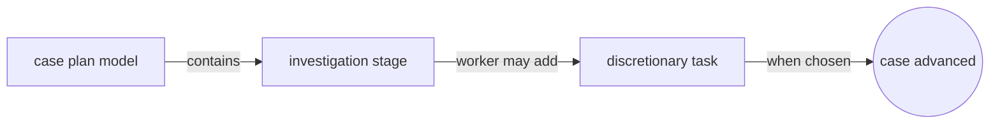
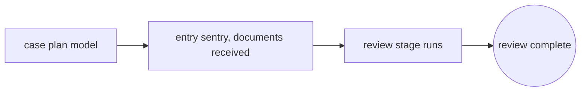
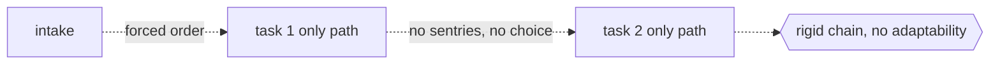

# Case Management Model and Notation

## Overview

Case Management Model and Notation, CMMN, is an OMG standard for modeling cases, work whose path is not fixed in advance but unfolds as events occur and as a knowledge worker decides what to do next. BPMN suits repeatable, predefined flows, but many real situations, such as handling a legal matter or a patient, cannot be drawn as a single fixed sequence. CMMN answers this by describing what may happen and under which conditions, rather than dictating a rigid order of steps.

At the center of a CMMN model is the Case Plan Model, a container that holds the elements of a case. Inside it, stages group related work, tasks represent units of work, and milestones mark achievements. What makes CMMN different is that many elements are optional and event driven. Sentries act as entry and exit criteria that activate or terminate elements when conditions are met, and discretionary items sit in a planning table so a worker can add them at runtime when their judgment calls for it. The result is a declarative model that guides the case while leaving room for human decision.

### Quick Takeaways

- CMMN models adaptive, event driven cases where the path emerges at runtime, unlike BPMN's fixed flow
- The Case Plan Model contains stages, tasks, and milestones, many of them optional and discretionary
- Sentries define entry and exit criteria that activate or stop elements when conditions or events occur

## Definition

- **Case plan model** is the top level container for everything in a case, defining the boundary of the case behavior.
- **Stage** is an episode of a case that groups related tasks and other elements, and can be nested for structure.
- **Task** is a unit of work in a case, such as a human task, a process task, or a case task that starts another case.
- **Milestone** is an achievable target in the case, satisfied when its criteria are met, used to mark progress rather than do work.
- **Sentry** is an entry or exit criterion, drawn as a small diamond, that watches for events and conditions to trigger or terminate an element.
- **Discretionary item** is an element placed in a planning table that a knowledge worker may choose to add to the case at runtime.
- **Case file** holds the information and documents of the case, and changes to it can serve as events that sentries react to.

## The Analogy

A CMMN model is like a doctor treating a patient rather than a factory assembling a product. The factory line, BPMN, runs the same fixed steps every time. The doctor works from a case file, orders tests as a stage of investigation, and only prescribes a particular treatment, a discretionary task, when the symptoms call for it. Milestones are like the patient stabilizing or being cleared for discharge. Sentries are the vital sign alarms that trigger the next action the moment a threshold is crossed. The plan sets out what may be done, and the doctor's judgment decides what actually happens.

## When You See It

- Managing a legal matter where documents, hearings, and filings arrive in an order that cannot be fixed up front
- Handling insurance claims investigations where the next step depends on findings and incoming evidence
- Supporting clinical care pathways that adapt to test results and a clinician's judgment
- Running customer complaint or dispute resolution that branches unpredictably based on responses
- Modeling incident and case work in the public sector where policy allows optional, discretionary actions
- Complementing a BPMN process with a case task when part of the work is structured and part is adaptive

## Examples

**Good:** An investigation case where a review stage is gated by an entry sentry that activates only when the case file receives the required documents, and a discretionary escalation task sits in the planning table for the worker to invoke if the findings warrant it. The model guides the case yet leaves the human in control.

**Bad:** A CMMN model that hard wires every task into one mandatory chain with no sentries and no discretionary items, forcing a fixed order. This defeats the purpose of case management, since a knowledge worker cannot adapt to events and the model would have been better expressed in BPMN.

**Good:** Using a milestone to mark that all required approvals are collected, with an exit sentry on the stage that terminates it once the milestone is achieved. Progress is expressed declaratively through conditions rather than through a forced sequence of steps.

**Bad:** Treating a milestone as if it were a task that performs work, drawing flow arrows into and out of it as though it processed something. A milestone only marks an achievement when its criteria are met, so modeling it as an active step misrepresents how the case actually behaves.

## Important Points

- CMMN is declarative and event driven, describing what may happen under which conditions rather than a fixed sequence.
- The case plan model is the root container, and stages, tasks, and milestones are its main building blocks.
- Sentries are the engine of adaptivity, providing entry and exit criteria that respond to events and case file changes.
- Discretionary items in planning tables let knowledge workers extend a running case with their own judgment.
- Milestones mark achievements and do no work, while tasks are the elements that actually perform work.
- CMMN complements BPMN and DMN, and a case can invoke processes and decisions through case, process, and decision tasks.
- CMMN 1.1 defines a metamodel and XML interchange so adaptive case models are portable across compliant tools.

## Summary

- CMMN is an OMG standard for modeling adaptive, knowledge driven cases whose path emerges as events unfold.
- The case plan model contains stages, tasks, and milestones, many of which are optional and discretionary.
- Sentries provide entry and exit criteria, making the model react to conditions and case file events at runtime.
- Discretionary items keep the human worker in control, letting them add work when their judgment calls for it.
- Knowing when a case is truly adaptive, rather than a fixed flow, is what decides between CMMN and BPMN.
- _CMMN draws the space a case may move through, and leaves the knowledge worker to choose the path._
