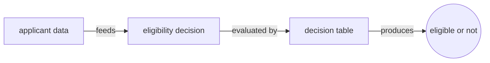
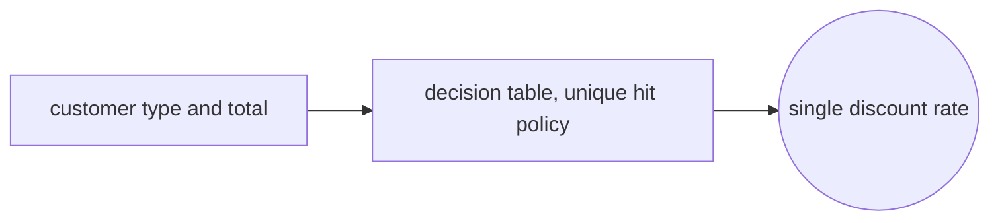
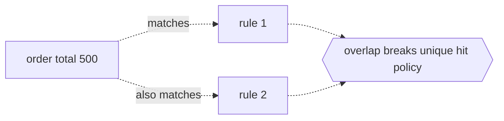

# Decision Model and Notation

## Overview

Decision Model and Notation, DMN, is an OMG standard that provides a common notation for describing and executing operational business decisions. Where BPMN models how work flows, DMN models how choices are made. It lets business people specify the logic behind decisions in a form they can read and manage, while still being precise enough for a decision engine to execute. This removes decision logic from tangled process branches and code, and places it in one clear, maintainable model.

DMN works at two levels. The Decision Requirements level shows a Decision Requirements Diagram, a DRD, that lays out decisions and the data and knowledge they depend on. The decision logic level fills each decision with the actual rules, most often expressed as a decision table, and evaluated with FEEL, the Friendly Enough Expression Language defined by the standard. Together these levels let a reader see both the structure of a decision and the exact rules inside it, and let a compliant engine compute an output from given inputs.

### Quick Takeaways

- DMN models the logic of decisions, complementing BPMN which models the flow of work
- A Decision Requirements Diagram shows decisions and their input data and business knowledge dependencies
- Decision tables plus the FEEL language make the rules both human readable and machine executable

## Definition

- **Decision** is the act of determining an output value from input values using decision logic, drawn as a rectangle in a DRD.
- **Input data** is information used as an input to a decision, drawn as an oval and supplied from outside the model.
- **Business knowledge model** is reusable, encapsulated decision logic, such as a shared function or a decision table, drawn as a shape with clipped corners.
- **Decision Requirements Diagram (DRD)** is the graph that connects decisions, input data, business knowledge models, and knowledge sources by requirement arrows.
- **Decision table** is a tabular representation of rules, with input columns, output columns, rows of rules, and a hit policy.
- **Hit policy** states how matching rules combine, for example Unique, First, Priority, or Collect, so the table result is well defined.
- **FEEL** is the Friendly Enough Expression Language, the standard language for writing the expressions and conditions inside decision logic.

## The Analogy

A DMN model is like a well organized recipe card box for decisions. The Decision Requirements Diagram is the index card that lists which ingredients, the input data, and which base recipes, the business knowledge models, a given dish depends on. Each decision table is the actual recipe card, with conditions on the left and results on the right, so anyone can look up what to do for a given set of ingredients. FEEL is the shared kitchen vocabulary that makes sure every cook reads a measurement or a condition the same way, so the same inputs always yield the same dish.

## When You See It

- Encoding loan eligibility or credit scoring rules that must be auditable and easy for analysts to change
- Externalizing pricing, discount, or fee rules from application code into a decision service
- Driving a BPMN business rule task, where a gateway routes on the output of a DMN decision
- Modeling insurance underwriting or claims validation where many conditions combine into an outcome
- Building a decision service that a microservice calls to get a yes or no from a set of inputs
- Capturing regulatory or compliance rules in decision tables so business owners can review them directly

## Examples

**Good:** A discount decision modeled as a decision table with a Unique hit policy, where customer type and order total map to a single discount rate. Every combination of inputs matches exactly one rule, so the output is unambiguous and the table is easy to audit.

**Bad:** A decision table declared with a Unique hit policy but containing two rules whose conditions overlap, so a single input matches more than one rule. The table violates its own hit policy, and the engine cannot return one well defined result.

**Good:** A DRD that separates a top level eligibility decision from a reusable risk scoring business knowledge model, with input data flowing into both. The structure makes the dependency explicit and lets the risk logic be reused by other decisions.

**Bad:** Cramming all logic into one giant decision with dozens of tangled inputs and no business knowledge models. The DRD becomes a single opaque box, the rules are impossible to reuse, and a reviewer cannot see which inputs actually drive which sub-decision.

## Important Points

- DMN is designed to complement BPMN, cleanly separating decision logic from process flow.
- The two levels are decision requirements, the DRD, and decision logic, most often decision tables written in FEEL.
- A decision table has inputs, outputs, rules as rows, and a hit policy that defines how matching rules resolve.
- Hit policies like Unique, First, Priority, and Collect make the meaning of overlapping or multiple matches explicit.
- FEEL is a side effect free expression language with clear semantics, so the same inputs always give the same result.
- Business knowledge models package reusable logic, keeping decisions modular and avoiding duplicated rules.
- DMN 1.5 keeps models portable and executable across compliant engines through its metamodel and XML interchange.

## Summary

- DMN is an OMG standard for modeling operational decisions so business and IT share one precise definition.
- A Decision Requirements Diagram shows decisions and their input data, knowledge sources, and business knowledge models.
- Decision tables express the rules, and a hit policy resolves how matching rules combine into an output.
- FEEL provides an unambiguous, executable expression language behind the tables and the DRD.
- Choosing the right hit policy and factoring reusable logic is what keeps a decision model correct and maintainable.
- _DMN takes the decision out of the code and the flowchart and writes it down where the business can own it._
