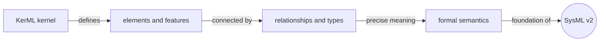
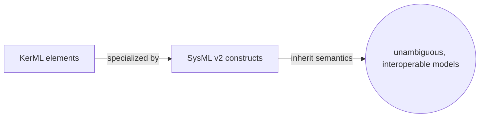
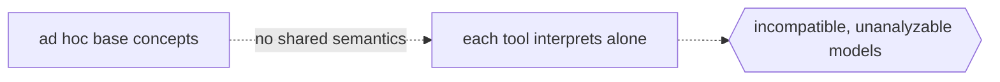

# Kernel Modeling Language

## Overview

The Kernel Modeling Language is a foundational language standardized by the Object Management Group that defines the core semantic building blocks for modeling. It is not aimed at end users drawing system diagrams; instead it provides the precise, formal layer that other modeling languages are defined on top of. KerML establishes a small set of universal concepts, elements, relationships, features, and types, and gives them rigorous semantics grounded in formal logic. This makes models built on it unambiguous and analyzable, closing the interpretation gaps that looser notations leave open.

KerML is the direct foundation of SysML v2. Where earlier systems modeling was expressed as a UML profile, SysML v2 is instead defined as a specialization of KerML, inheriting its kernel semantics and extending them with systems-specific concepts. KerML is organized into layers of standard libraries: a Root library with the most primitive notions, a Core library adding basic classification and featuring, and a Kernel library providing richer reusable semantics. Because the semantics live in this shared kernel, any language built on KerML can interoperate and be reasoned about consistently. It is the quiet layer beneath the diagrams that gives them meaning.

### Quick Takeaways

- KerML is the semantic kernel layer, meant for defining languages rather than drawing systems
- It provides universal elements, features, types, and relationships with formal semantics
- SysML v2 is defined as a specialization of KerML, making it the foundation beneath it

## Definition

- **Element** is the most general KerML concept, the base unit from which everything else in a model derives.
- **Feature** is a kind of element that characterizes other elements, representing values, properties, or roles they carry.
- **Type** is an element that classifies things, the KerML basis for classifiers and other classifying constructs.
- **Classifier** is a type whose instances are things being modeled, providing classification semantics in the kernel.
- **Kernel layer** is the semantic foundation KerML supplies, on top of which higher languages like SysML v2 are defined.
- **Root, Core, and Kernel libraries** are the layered standard model libraries, from the most primitive notions up to richer reusable semantics.

## The Analogy

Think of KerML as the grammar and vocabulary of a language, and SysML v2 as the technical manuals written in that language. Readers of the manual never study the grammar directly, yet every sentence they read is only meaningful because the grammar fixes what words and structures mean. If the grammar were vague, two readers could take the same manual to mean different things. KerML is that shared grammar for modeling: it defines what an element, a feature, or a relationship precisely is, so every model written above it says exactly one thing.

## When You See It

- Under the hood of SysML v2, whose metamodel is defined as a specialization of KerML
- Language engineers defining a new domain-specific modeling language on a formal foundation
- Tool builders implementing reasoning or validation that relies on precise, shared semantics
- Standard model libraries organized into Root, Core, and Kernel semantic layers
- Interoperability efforts where multiple languages must share one consistent meaning
- Formal analysis of models where ambiguity in the base concepts would break the reasoning

## Examples

**Good:** Defining SysML v2 constructs by specializing KerML elements and features, so every systems concept inherits precise, formally defined semantics. Models built above it can be analyzed and interchanged without ambiguity.

**Bad:** Building a modeling language on ad hoc concepts with no shared semantic kernel. Each tool interprets the same model differently, so exchange and formal reasoning quietly fall apart.

**Good:** Organizing reusable semantics into the layered Root, Core, and Kernel libraries so higher languages pull from a stable, well-defined base. New languages reuse the kernel instead of reinventing meaning.

**Bad:** Exposing raw KerML directly to systems engineers as their day-to-day notation. It is a foundation layer, not an end-user language, so using it that way buries them in primitives instead of systems concepts.

## Important Points

- KerML is the semantic foundation of SysML v2, which is defined as a specialization of the kernel.
- It is a language for defining languages, not a notation intended for direct end-user systems modeling.
- Its core concepts are element, feature, type, and relationship, each with formal semantics.
- KerML semantics are grounded in formal logic, making models built on it unambiguous and analyzable.
- The standard libraries are layered as Root, Core, and Kernel, from primitive notions to richer semantics.
- KerML 1.0 was released by the OMG alongside SysML v2 as its enabling foundation.
- Because meaning lives in the shared kernel, languages built on KerML can interoperate consistently.

## Summary

- KerML is an OMG language that defines the core semantic layer of elements, features, types, and relationships.
- It exists to define other languages precisely, not to serve as an end-user modeling notation.
- SysML v2 is built as a specialization of KerML, which makes KerML its foundation.
- Layered Root, Core, and Kernel libraries supply reusable semantics from primitive to rich.
- Formal semantics in the kernel give every model above it a single, analyzable meaning.
- _Fix the grammar once in the kernel, and every model written above it means exactly what it says._
