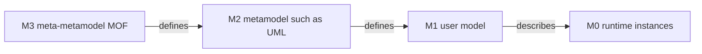
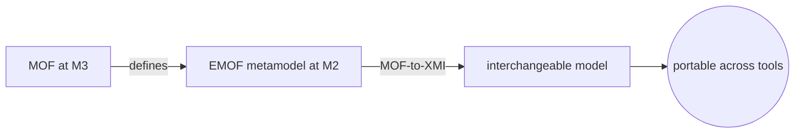
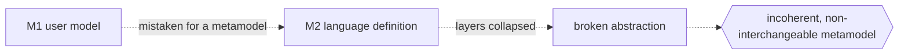

# Meta Object Facility

## Overview

The Meta Object Facility is the foundation the OMG uses to define modeling languages themselves. It is a metamodeling facility, a language for describing other languages. UML, SysML, CWM, and many domain-specific languages are all defined as metamodels expressed in MOF. MOF reuses a subset of UML's class-modeling concepts, classes, properties, associations, and operations, so if you can read a UML class diagram you can read a MOF metamodel. Its job is to give every modeling language a precise, shared structure, which in turn makes model interchange, repositories, and tooling possible across vendors.

MOF organizes modeling into a four-layer stack. At the top, M3 is the meta-metamodel, MOF itself, and it is defined in terms of itself so the tower is self-describing. M2 holds metamodels such as UML, written using MOF. M1 holds user models, for example a specific class diagram of an ordering system, written using UML. M0 holds the real-world instances the M1 model describes, such as a particular order at runtime. MOF comes in two compliance points: EMOF, a lean core aimed at simple metamodels and easy mapping to programming languages, and CMOF, a richer variant for complex metamodels. MOF also defines reflection and the standard MOF-to-XMI mapping, which serializes any MOF-based model to XML for interchange.

### Quick Takeaways

- MOF is a language for defining modeling languages, and it defines itself at the top layer
- The four-layer stack runs M3 meta-metamodel, M2 metamodel, M1 model, and M0 instances
- EMOF and CMOF are two compliance points, and MOF-to-XMI standardizes model serialization

## Definition

- **Meta-metamodel** is a model that defines the constructs used to build metamodels, and it sits at layer M3.
- **Metamodel** is a model that defines a modeling language, such as UML, and it sits at layer M2.
- **EMOF**, Essential MOF, is the minimal core of MOF for straightforward metamodels and clean mapping to code.
- **CMOF**, Complete MOF, extends EMOF with richer constructs for complex metamodels and package merging.
- **M0** is the layer of real instances and runtime data that an M1 model describes.
- **M1** is the layer of user models built with an M2 language, for example a specific class diagram.
- **M2** is the layer of metamodels, the definitions of languages like UML, built with MOF.
- **M3** is the top layer, MOF itself, the self-describing meta-metamodel.
- **Reflection** is MOF's capability to inspect and manipulate model elements generically at runtime.
- **MOF-to-XMI** is the standard mapping that serializes any MOF-based model into XML for interchange.

## The Analogy

Think of a dictionary tower. At the top sits a book that explains the rules for writing any dictionary: what an entry is, what a definition and a part of speech are. That top book is written in its own vocabulary, so it explains itself. That is M3, MOF. Using those rules, you write an English dictionary, which defines every English word. That is M2, a metamodel like UML. Using the English dictionary, an author writes a specific novel with real sentences. That is M1, a user model. Finally, a reader in the real world acts out the story the novel describes. That is M0, the instances. Each layer is written in the language of the layer above it, and the tower is anchored by a top book that describes itself.

## When You See It

- The definition of UML, SysML, or CWM as metamodels rather than fixed drawing tools
- Tools serializing models to XMI so different vendors can exchange them
- Model repositories that store any MOF-based model through a common reflective interface
- Domain-specific languages built by writing a new M2 metamodel in EMOF
- Code generators mapping EMOF metamodels onto Java or other object-oriented classes
- Discussions of the M0 to M3 layers when explaining what counts as a model versus a metamodel

## Examples

**Good:** Defining a small domain language by writing its metamodel in EMOF, then generating XMI and code from it. Because the metamodel sits cleanly at M2 under MOF, tools can interchange and process it through standard mappings.

**Bad:** Confusing the layers by treating a specific user model at M1 as if it defined the language at M2. Mixing instance-level detail into the metamodel breaks the stack and makes the language definition incoherent.

**Good:** Choosing EMOF for a lean metamodel that maps directly to programming-language classes, keeping tooling simple and serialization predictable.

**Bad:** Reaching for the full CMOF feature set, such as package merge, on a trivial metamodel that never needs it, adding complexity with no benefit.

## Important Points

- MOF is self-describing: M3 is defined using MOF's own constructs, closing the tower at the top
- MOF reuses a subset of UML class modeling, so metamodels look like UML class diagrams
- EMOF favors simplicity and code mapping, while CMOF adds power for complex metamodels
- The four-layer stack is relative, an element is a metamodel or a model depending on the layer you view it from
- MOF-to-XMI gives every MOF-based language a standard XML serialization for interchange
- Reflection lets generic tools read and edit any MOF model without hard-coding its metamodel
- MOF underpins UML, SysML, OCL, and XMI, making it the quiet backbone of OMG modeling standards

## Summary

- MOF is the OMG's foundation for defining modeling languages, a language for building languages.
- The four-layer stack runs from M3 meta-metamodel down through M2, M1, and M0 instances.
- EMOF and CMOF are two compliance points balancing simplicity against expressive power.
- Reflection and MOF-to-XMI enable generic tooling and standard model interchange.
- MOF sits beneath UML, SysML, and XMI as the shared metamodeling backbone.
- _Each layer is written in the language above it, anchored by a top book that describes itself._
