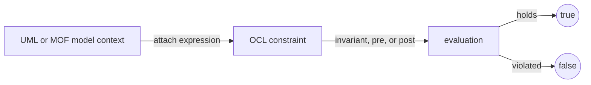
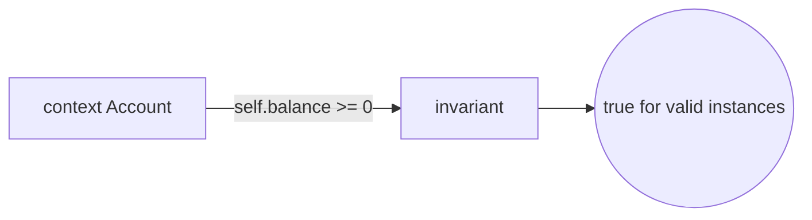
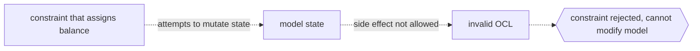

# Object Constraint Language

## Overview

The Object Constraint Language is a formal, declarative language for stating rules over models that a diagram alone cannot capture. A UML or MOF model shows classes, attributes, and associations, but it cannot say a person's age must be non-negative or that a manager cannot be their own supervisor. OCL fills that gap. Every OCL expression is written in a context, an element of the model such as a class or an operation, and it evaluates to a value, most often a boolean true or false. Because OCL is declarative, it describes what must hold, not how to compute it, and it is strictly free of side effects, so evaluating an expression never changes the model.

OCL supports several kinds of expressions tied to their context. An invariant is a condition that must always be true for every instance of a class. A precondition states what must hold before an operation runs, and a postcondition states what must hold after it finishes. Expressions navigate the model by following association ends and attributes, and they work over collections with operations like select, forAll, exists, and size. Standard version 2.4 aligns OCL with UML and MOF so the same language expresses constraints, derived values, and query results across both structural modeling and metamodeling.

### Quick Takeaways

- OCL adds precise, machine-checkable rules to UML and MOF models that diagrams cannot express
- Every expression has a context and evaluates to a value, usually boolean true or false
- OCL is declarative and side-effect free, so evaluating a constraint never changes the model

## Definition

- **Context** is the model element an OCL expression is attached to, such as a class, attribute, or operation.
- **Invariant** is a constraint that must be true for all instances of its context class at all times.
- **Precondition** is a constraint that must hold immediately before an operation is invoked.
- **Postcondition** is a constraint that must hold immediately after an operation completes, and can refer to prior values.
- **Navigation** is following attributes and association ends from the context to reach related values and objects.
- **Collection operation** is a built-in operation over sets, bags, sequences, or ordered sets, such as select, forAll, exists, or size.
- **No side effects** is the rule that evaluating an OCL expression must not modify the state of any object.
- **Query expression** is an OCL expression used to compute a value or derived attribute rather than a boolean check.

## The Analogy

Think of OCL as the fine print on a building's blueprint. The blueprint drawing shows walls, doors, and rooms, which is the UML model. But the drawing alone cannot enforce that every bedroom has a window, that the total floor area stays under a limit, or that a fire exit exists on each floor. The written rules in the margin state those conditions precisely, and an inspector reads them against the plan and answers only pass or fail. The inspector never picks up a hammer to change the building, they only judge whether the drawn design satisfies the rules. OCL is that margin of precise, checkable rules, and evaluation is the inspector's verdict.

## When You See It

- Class diagrams annotated with invariants that instances must always satisfy
- Operation specifications written as precondition and postcondition pairs
- Metamodels defining well-formedness rules so only valid models are allowed
- Derived attributes and query bodies expressed declaratively over associations
- Model validation tools reporting which constraints an instance model violates
- Profiles and DSLs adding domain rules on top of UML without changing its structure

## Examples

**Good:** An invariant on the class Account stating that the balance must never drop below zero, written as `context Account inv: self.balance >= 0`. It reads cleanly, navigates one attribute, and evaluates to a plain true or false for every instance.

**Bad:** Writing a constraint that tries to fix the model, such as an expression that sets the balance to zero when it is negative. OCL forbids side effects, so this is not a valid constraint and confuses checking with modifying.

**Good:** Using a collection operation to require every order line to have a positive quantity, `context Order inv: self.lines->forAll(l | l.quantity > 0)`. The forAll navigates the association and checks each element declaratively.

**Bad:** Overloading one invariant with many unrelated conditions joined by and, so a failure gives no clue which rule broke. Splitting into named invariants keeps each check clear and diagnosable.

## Important Points

- OCL is a specification language, not a programming language, and cannot change model state
- Every expression is typed and its type comes from the UML or MOF model it is written against
- Preconditions and postconditions specify operations without prescribing an implementation
- The `@pre` marker in a postcondition refers to a value as it was before the operation ran
- Collections come in four kinds, Set, Bag, OrderedSet, and Sequence, each with defined operations
- Version 2.4 aligns OCL with UML 2 and MOF 2 so one language serves models and metamodels
- Undefined and null values are handled explicitly, so partial navigation has defined semantics

## Summary

- OCL expresses precise constraints and queries over UML and MOF models that diagrams cannot state.
- Each expression has a context and yields a value, typically boolean true or false.
- Invariants, preconditions, and postconditions cover both classes and operations.
- Navigation and collection operations let constraints reason over related objects declaratively.
- Being side-effect free, OCL checks models without ever modifying them.
- _OCL is the margin of rules the inspector reads, judging the design without touching a single wall._
