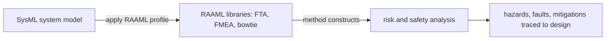
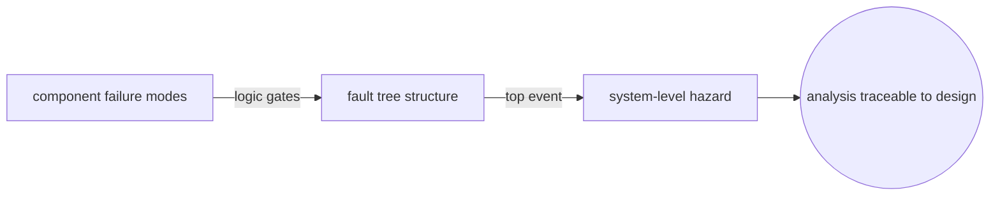
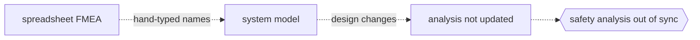

# Risk Analysis and Assessment Modeling Language

## Overview

RAAML is an OMG specification that defines a modeling language for risk analysis and safety assessment. Its purpose is to bring classic safety and reliability techniques, such as Fault Tree Analysis, Failure Mode and Effects Analysis, and bowtie diagrams, into a single model-based framework instead of leaving them scattered across standalone tools and spreadsheets. RAAML is defined as a UML profile and a set of libraries built on top of SysML, so a risk model lives in the same modeling environment as the system architecture it analyzes. That connection is the point. When the design and the analysis share one model, a hazard can be traced directly to the components that cause it.

The language is organized into layers. A general concepts library defines the foundational vocabulary of risk and safety, terms like situation, event, cause, and consequence, that every method builds on. Method-specific libraries and profiles then add the constructs for particular techniques, for example fault trees with their gates and events, FMEA tables, and bowtie structures with barriers. Because RAAML sits on SysML, an analyst can start from an existing system model, attach RAAML stereotypes to describe how parts can fail, and generate the analysis views from the same underlying data. The result is traceable, reusable safety analysis rather than a disconnected document.

### Quick Takeaways

- RAAML is a SysML-based OMG language for risk analysis and safety assessment inside the system model.
- It packages classic methods, FTA, FMEA, and bowtie, as libraries and profiles on a shared concept base.
- Sharing one model with the design makes hazards, faults, and mitigations traceable to real components.

## Definition

- **General concepts library** is the foundation layer that defines shared risk and safety terms, such as situation, event, cause, and consequence, reused across all methods.
- **Methods library** holds the technique-specific constructs, for example Fault Tree Analysis, FMEA, and bowtie, built on the general concepts.
- **Profile** is the set of UML and SysML stereotypes that let analysts tag existing model elements with risk and safety semantics.
- **Fault Tree Analysis (FTA)** is a top-down method that models how basic faults combine through logic gates to produce a top-level failure.
- **FMEA** is a bottom-up method that lists failure modes of components, their effects, and their criticality.
- **Bowtie** is a method that places a hazardous event in the center, with threat paths and preventive barriers on one side and consequences and mitigating barriers on the other.
- **SysML basis** means RAAML extends SysML rather than replacing it, so risk models coexist with the system architecture in one modeling language.

## The Analogy

Think of a building's blueprint with a fire-safety overlay drawn on the same sheet. The blueprint is the system design and the overlay is the risk analysis. Because both live on one drawing, an inspector can point at a specific wall and immediately see the sprinkler, the exit route, and the fire rating tied to it. RAAML is that overlay for engineered systems. Instead of keeping the design in one binder and the fault trees in another, it draws the hazards, the faults, and the barriers on top of the same model, so every risk points back to the exact part it concerns.

## When You See It

- A safety engineer builds a fault tree that traces a top-level hazard down to component faults in an existing SysML model.
- An automotive or aerospace team needs FMEA and FTA that stay synchronized with the system architecture as the design evolves.
- A project must show regulators traceability from identified hazards to the specific design elements and mitigations.
- An analyst reuses a common vocabulary of situations, events, and consequences across several different analysis methods.
- A team builds a bowtie diagram to communicate threat barriers and consequence barriers around a central hazardous event.
- An organization standardizes safety analysis in a model-based systems engineering toolchain rather than in disconnected spreadsheets.

## Examples

**Good:** An analyst applies the RAAML profile to a SysML block that represents a brake controller, models its failure modes, and builds a fault tree where those basic faults feed logic gates up to the top hazard. Every basic event links back to the component, so a design change flags the affected part of the analysis.

**Bad:** A team keeps its FMEA in a standalone spreadsheet with component names typed by hand and no link to the model. When the architecture changes, the spreadsheet silently goes stale, and the analysis no longer matches the system it is supposed to cover.

**Good:** Reusing the general concepts library so that a hazard defined once, with its causes and consequences, is referenced by both the fault tree and the bowtie. One definition drives multiple views, keeping the methods consistent with each other.

**Bad:** Redefining the same hazard separately inside each method with slightly different wording and scope. The fault tree and the bowtie describe the same event differently, and reviewers cannot tell whether they agree.

## Important Points

- RAAML is an OMG specification, and version 1.1 is the current release of the language.
- It is defined as a UML profile plus libraries on top of SysML, so it extends existing modeling rather than replacing it.
- The layered design separates a general concepts foundation from method-specific libraries, which keeps the methods consistent.
- Supported methods include Fault Tree Analysis, FMEA, and bowtie, covering both top-down and bottom-up analysis.
- Keeping the analysis in the system model gives traceability from hazards down to the components that cause them.
- RAAML targets model-based systems engineering workflows, so its value grows when the design is already modeled in SysML.
- It standardizes the modeling constructs, not a specific safety standard or process, so it complements standards like ISO 26262 rather than replacing them.

## Summary

- RAAML is an OMG, SysML-based language for risk analysis and safety assessment in a shared model.
- It provides a general concepts library plus method libraries for FTA, FMEA, and bowtie analysis.
- Because it extends SysML, risk models live with the design and hazards trace back to components.
- The layered structure keeps definitions consistent across multiple analysis methods.
- It supports model-based systems engineering and complements safety standards rather than replacing them.
- _Draw the risks on the same model as the design, so every hazard points back to the part that causes it._
