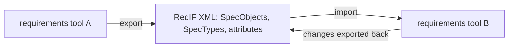
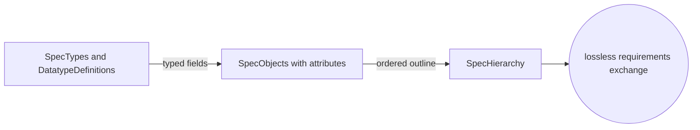
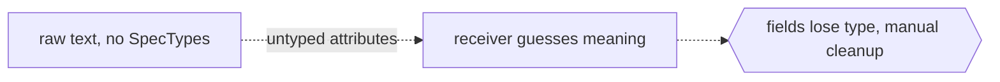

# Requirements Interchange Format

## Overview

ReqIF is an OMG standard that defines a non-proprietary XML format for exchanging requirements between tools. The problem it solves is simple to state and painful to live with. Requirements are authored in many tools, each with its own database and its own file format, so moving requirements from one supplier to another usually meant re-typing, copy-paste, or brittle custom converters. ReqIF gives every tool one common on-the-wire format. A tool exports its requirements as ReqIF, another tool imports that ReqIF, and the requirements arrive with their attributes, types, structure, and links intact.

The format is built around a small, generic core. Requirements become SpecObjects, each SpecObject carries typed attribute values, and the types themselves are defined in the same file through SpecTypes and DatatypeDefinitions. A SpecHierarchy arranges SpecObjects into an ordered, nested outline, which is how a requirements document looks to a reader. Because the type system travels inside the exchange file, the receiving tool does not need to guess what a field means. ReqIF also supports round-trip work, where two parties send the same content back and forth and only the changes need to be merged, which is why it is common in automotive and aerospace supply chains.

### Quick Takeaways

- ReqIF is a tool-neutral XML format for moving requirements between different requirements tools.
- Requirements are SpecObjects with typed attributes, and the types travel inside the same file.
- It supports round-trip exchange, so supplier and customer can iterate on the same requirements.

## Definition

- **SpecObject** is a single requirement, the atomic unit that carries a set of attribute values.
- **SpecType** is the type of a spec element, for example a SpecObjectType that lists which attributes a requirement may have.
- **AttributeDefinition** binds an attribute name to a datatype inside a SpecType, defining one field of a requirement.
- **DatatypeDefinition** declares a reusable data type, such as string, integer, enumeration, date, or XHTML, referenced by attribute definitions.
- **SpecHierarchy** is a node in an ordered, nested tree that places SpecObjects into a document-like outline.
- **Specification** is the root container of a SpecHierarchy, representing one requirements document within the exchange.
- **SpecRelation** is a typed link between two SpecObjects, for example a trace or a refinement between requirements.
- **XML and XSD exchange** means ReqIF content is serialized as XML validated against the OMG-published XML Schema, so any conforming tool can read it.

## The Analogy

Think of ReqIF as the PDF of requirements, but editable and structured. Two companies use different word processors, yet they both agree to hand documents over as one common file format that preserves headings, fields, and cross-references. Neither side has to own the other side's software. The common file is the contract. When the customer marks up the document and sends it back, the supplier opens the same common file, sees exactly what changed, and merges it. ReqIF is that shared envelope for requirements, carrying not just the text but also the labels that say what each field means.

## When You See It

- An automotive OEM sends a requirements package to a Tier 1 supplier who uses a completely different requirements tool.
- Aerospace and defense programs need auditable, tool-independent hand-off of requirements across primes and subcontractors.
- A team migrates from one requirements management tool to another and wants to move data without manual re-entry.
- Two organizations run a round-trip loop, exchanging the same ReqIF file repeatedly and merging only deltas each cycle.
- A tool advertises DOORS, Polarion, or similar interoperability and uses ReqIF under the hood to import and export.
- Requirements need typed attributes, such as priority enumerations or verification status, preserved across the exchange.

## Examples

**Good:** A customer exports requirements as a ReqIF file where every SpecObject references a SpecObjectType, each attribute has an AttributeDefinition pointing to a DatatypeDefinition, and a SpecHierarchy gives the document order. The supplier imports it and every field, type, and link arrives intact, ready for a clean round-trip.

**Bad:** A team dumps requirement text into a bare XML file with no SpecTypes and no DatatypeDefinitions, so attributes have no declared meaning. The receiving tool cannot tell a priority field from a status field, and the import degrades into untyped strings that need manual cleanup.

**Good:** Using SpecRelation to carry trace links between customer requirements and supplier requirements, so that after import the receiving tool can still show which requirement refines which. The relationships survive the hand-off, not just the isolated requirements.

**Bad:** Exchanging only the requirement text as a spreadsheet and rebuilding trace links by hand on the other side. The links are lost in transit, and the two sides drift out of sync on every iteration.

## Important Points

- ReqIF is an OMG specification, and version 1.2 is the current maintained release of the standard.
- The data model is deliberately generic, so it can represent requirements from many tools rather than one vendor's schema.
- Types travel with the data, which is the key reason imports are lossless rather than best-effort string matching.
- XHTML is a supported datatype, so rich text, tables, and embedded formatting in requirements can be preserved.
- ReqIF handles a single package, while ReqIF Z bundles the ReqIF with attachments and images into one archive.
- Round-trip exchange is a first-class use case, which is why identity and change tracking of SpecObjects matter.
- ReqIF standardizes the format, not a process, so how teams review and merge is left to their own workflow.

## Summary

- ReqIF is an OMG XML standard for exchanging requirements between different tools without loss.
- Requirements are SpecObjects with typed attributes, and the type system ships inside the same file.
- SpecHierarchy gives document structure, and SpecRelation preserves trace links across the hand-off.
- Its main value is tool-neutral, round-trip exchange across a supply chain, common in automotive and aerospace.
- The standard fixes the format, leaving the review and merge process to the teams using it.
- _Ship the requirements and their meaning together, so nothing is lost between one tool and the next._
