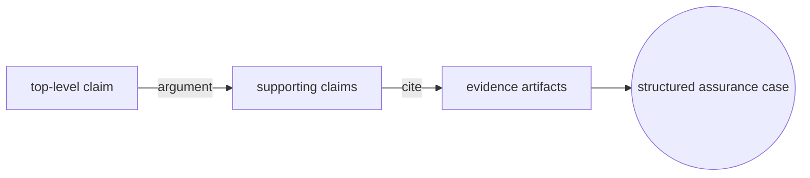
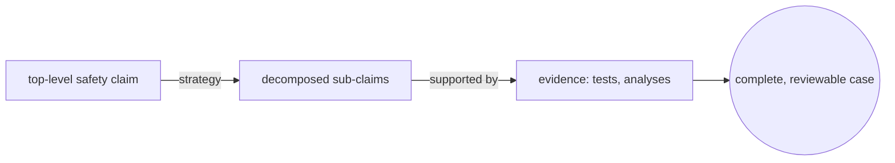
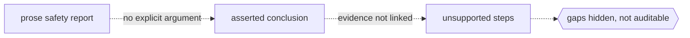

# Structured Assurance Case Metamodel

## Overview

SACM is an OMG specification that defines a metamodel for structured assurance cases. An assurance case is a reasoned, documented argument that a system satisfies a property such as safety, security, or reliability. The core move is to make the reasoning explicit. Instead of a prose report that asserts a system is safe, an assurance case states a top-level claim, breaks it into supporting sub-claims through an argument, and grounds each claim in evidence. SACM standardizes the underlying structure of that argument so it can be built, reviewed, exchanged between tools, and checked for gaps, rather than living only in a document that a human must read end to end.

The metamodel is organized into complementary parts. An argumentation metamodel captures the logical skeleton, the claims, the reasoning that connects them, and the way evidence is cited. An artifact metamodel captures the things the argument points at, the documents, test results, analyses, and their relationships, so the argument is anchored to real, versioned material. SACM is notation-neutral by design, which means established graphical notations such as GSN and CAE can be expressed on top of it. This lets an organization keep its preferred way of drawing an argument while gaining a common, machine-readable foundation underneath.

### Quick Takeaways

- SACM is an OMG metamodel for structured assurance cases that link claims to evidence through explicit argument.
- It splits into an argumentation metamodel for the reasoning and an artifact metamodel for the evidence.
- It is notation-neutral, so graphical notations like GSN and CAE can be expressed on top of it.

## Definition

- **Assurance case** is a structured argument, backed by evidence, that a system satisfies a stated property such as safety or security.
- **Argumentation metamodel** is the part of SACM that models the reasoning, the claims and the links between them.
- **Artifact metamodel** is the part that models the evidence items and documents the argument refers to, along with their relationships.
- **Claim** is an assertion the case is trying to establish, for example that a hazard is adequately controlled.
- **Assertion** is the general notion of a stated proposition, of which a claim is the central kind, and which the argument connects.
- **Evidence** is the material, such as test results or analysis, cited to support a claim through an artifact reference.
- **ArgumentReasoning** captures the rationale or strategy that explains why the sub-claims support a claim.
- **GSN and CAE relation** means Goal Structuring Notation and Claims Arguments Evidence are graphical notations that map onto SACM, which acts as their common underlying metamodel.

## The Analogy

Think of a legal case in court. A lawyer states a conclusion, the claim, then supports it with a chain of arguments, and grounds each argument in exhibits, the evidence. A judge does not accept the conclusion because it sounds confident, they follow the reasoning and inspect the exhibits. An assurance case works the same way for an engineered system, and SACM is the standard filing format for that case. It fixes how claims, arguments, and evidence are recorded, so a reviewer can walk the argument link by link and see exactly which exhibit backs which claim, and where an argument stands unsupported.

## When You See It

- A safety-critical project must convince a regulator that a system is acceptably safe, with an argument that can be audited.
- Engineers use GSN or CAE to draw an argument and want a common, tool-neutral model underneath the diagrams.
- An organization needs to exchange an assurance case between tools without losing the structure of the argument.
- A reviewer looks for gaps, checking that every claim is either decomposed further or backed by concrete evidence.
- A security assurance case links a claim about a control to the test results and analyses that demonstrate it works.
- A program maintains a living assurance case that must be updated as evidence and the system change over time.

## Examples

**Good:** An assurance case where a top-level safety claim is decomposed by an explicit argument strategy into sub-claims, and each leaf claim references specific evidence artifacts such as a test report or a hazard analysis. A reviewer can trace every claim down to the exhibit that supports it.

**Bad:** A prose safety report that concludes the system is safe but never lays out the argument or cites the evidence behind each step. A reviewer cannot tell which claim is grounded and which is merely asserted, so gaps hide in the narrative.

**Good:** Using the artifact metamodel to tie each cited evidence item to a specific, versioned document, so when the evidence is updated the case shows exactly which claims are affected. The argument stays anchored to real, current material.

**Bad:** Citing evidence by loose name only, with no link to an actual artifact or version. When a test is rerun, nobody can tell whether the case still relies on the old result or the new one, and the case quietly goes stale.

## Important Points

- SACM is an OMG specification, and version 2.3 is the current release of the metamodel.
- It combines an argumentation metamodel for reasoning with an artifact metamodel for evidence, covering both sides of a case.
- It is notation-neutral, so GSN and CAE can be represented on top of it as views of the same underlying model.
- Making the argument explicit lets reviewers find unsupported claims and missing evidence that prose reports hide.
- Anchoring claims to versioned artifacts keeps the case honest as evidence and the system change over time.
- SACM standardizes structure and exchange, not a specific safety standard, so it supports domains like safety and security alike.
- An assurance case is a living document, and SACM's structure is what makes incremental review and update practical.

## Summary

- SACM is an OMG metamodel for structured assurance cases that connect claims to evidence through explicit argument.
- It separates an argumentation metamodel for reasoning from an artifact metamodel for the supporting evidence.
- Being notation-neutral, it underpins graphical notations such as GSN and CAE with a common, exchangeable model.
- Explicit structure lets reviewers audit the argument and spot claims that lack support.
- It standardizes how cases are built and shared, complementing safety and security standards rather than replacing them.
- _State the claim, show the argument, cite the evidence, so anyone can follow why the system is trusted._
