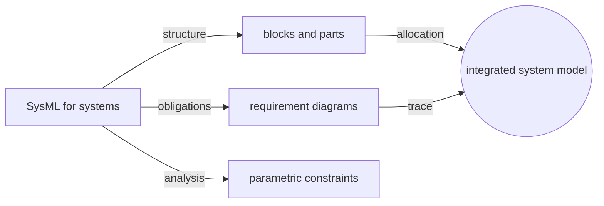
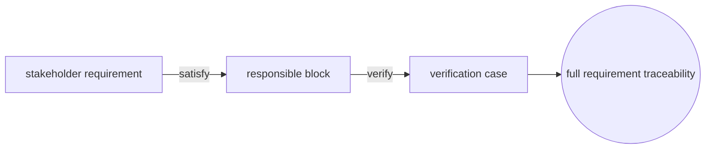
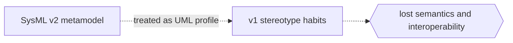

# Systems Modeling Language

## Overview

The Systems Modeling Language is a general-purpose graphical modeling language for systems engineering, standardized by the Object Management Group. It supports the specification, analysis, design, verification, and validation of a broad range of systems that may include hardware, software, data, people, procedures, and facilities. SysML v1 was defined as a profile of UML, reusing a subset of UML and extending it with constructs tailored for systems, such as blocks for describing structure and requirements for capturing what the system must satisfy. It lets multidisciplinary teams share one model instead of scattering intent across disconnected documents.

SysML v2 is a major redefinition rather than a profile of UML. It introduces a new, precise metamodel built on the Kernel Modeling Language, along with a textual notation alongside the graphical one and a standard API for tool interoperability. The language centers on a handful of systems concepts: blocks (parts in v2) describe structure, requirement diagrams capture and trace obligations, parametric diagrams bind values through equations and constraints for engineering analysis, and allocation links behavior, structure, and requirements across the model. The result is a semantically rigorous, tool-neutral foundation for model-based systems engineering.

### Quick Takeaways

- SysML is an OMG language for model-based systems engineering across hardware, software, and people
- Its core additions are blocks, requirement diagrams, parametric diagrams, and allocation
- SysML v1 is a UML profile, while SysML v2 is a new metamodel built on KerML

## Definition

- **Block** is the fundamental structural unit that describes a system element with properties, ports, and behavior; in v2 the equivalent is a part definition.
- **Block definition diagram (BDD)** shows blocks, their features, and relationships such as composition, generalization, and association.
- **Internal block diagram (IBD)** shows the internal parts of a block and how they connect through ports and connectors.
- **Requirement diagram** captures text-based requirements and their relationships like derive, satisfy, verify, and trace.
- **Parametric diagram** binds block properties to constraint equations so engineering analyses like performance or reliability can be expressed.
- **Allocation** is a relationship that maps elements to each other, for example behavior to structure or logical to physical.

## The Analogy

Think of SysML as the master blueprint set for an entire vehicle, not just its software. A civil blueprint might cover only walls, but a systems blueprint has to tie together the chassis, the engine, the wiring, the control software, and the human driver, and prove they all satisfy the same goals. Blocks are the labeled parts, requirement diagrams are the contract clauses each part must meet, and parametric diagrams are the physics equations that check whether the assembled whole will actually perform. One coordinated set of drawings keeps every engineering discipline working from the same source of truth.

## When You See It

- Aerospace and automotive teams building a single system model spanning mechanical, electrical, and software
- Requirement diagrams tracing stakeholder needs down to the components that satisfy and verify them
- Block definition and internal block diagrams describing system structure and its internal connections
- Parametric diagrams linking mass, power, or cost properties to equations for trade-off analysis
- Allocation tables mapping functions to components or logical designs to physical hardware
- Model-based systems engineering programs replacing document-centric specifications with a live model

## Examples

**Good:** Capturing every stakeholder need as a requirement, then using satisfy and verify relationships to link each one to the block that meets it and the test that checks it. Traceability is complete and machine-checkable.

**Bad:** Treating SysML v2 as if it were still a UML profile and forcing v1 stereotype thinking onto its new metamodel. The mismatch loses the precise semantics and textual and API benefits that v2 was designed to provide.

**Good:** Using a parametric diagram to bind mass and thrust properties to a constraint equation so a performance analysis runs directly against the model. Design changes update the analysis automatically.

**Bad:** Modeling structure in block diagrams but keeping requirements in a separate spreadsheet with no links. The disconnect defeats the point of a single model, and traceability breaks the moment either side changes.

## Important Points

- SysML v1 is defined as a UML profile that reuses a UML subset and adds systems-specific extensions.
- SysML v2 is a ground-up redefinition built on the Kernel Modeling Language, not a UML profile.
- v2 adds a standard textual notation and a Systems Modeling API and Services for tool interoperability.
- The four pillars of SysML are structure, behavior, requirements, and parametrics.
- Blocks (v1) and parts (v2) are the primary structural building units of a system model.
- Allocation is central to systems engineering, tying behavior, structure, and requirements together.
- SysML underpins model-based systems engineering, shifting teams from documents to a shared model.

## Summary

- SysML is an OMG language for systems engineering that models hardware, software, data, and people together.
- Its distinctive constructs are blocks, requirement diagrams, parametric diagrams, and allocation.
- SysML v1 is a UML profile, whereas SysML v2 is a new metamodel founded on KerML.
- v2 brings precise semantics, a textual notation, and a standard API for interoperability.
- Used well it becomes the single source of truth across every engineering discipline.
- _One model, tying structure, behavior, and requirements together, keeps the whole system honest._
