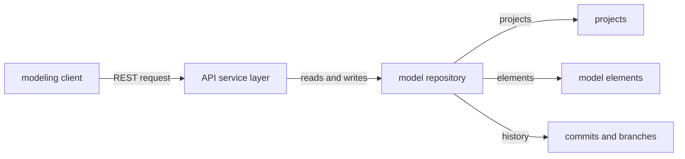
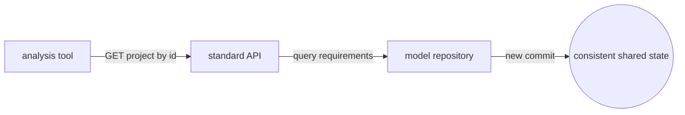
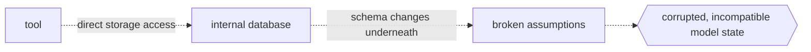

# Systems Modeling API and Services

## Overview

The Systems Modeling API and Services specification defines a standard programming interface for creating, reading, updating, and querying systems models built with the SysML v2 language. Instead of every tool inventing its own way to store and share model data, the API describes a common set of services and resources so a client can talk to any conforming model repository. It separates the model content, the SysML v2 abstract syntax, from the transport, giving a platform-independent model plus concrete bindings such as REST and HTTP. This lets model editors, analysis tools, dashboards, and automation scripts all reach the same models through one agreed contract.

At its core the API organizes model data into resources with stable identities. A client works against a service layer that exposes projects, the elements inside them, and the commit history that records changes over time. Commits give the repository a versioned, branchable structure similar to source control, so different tools can collaborate without overwriting each other. Query services let a client ask for specific slices of a model rather than downloading everything. The specification defines the resource model, the operations, and the REST binding so that access to SysML v2 models becomes standardized and interoperable across the whole tool chain.

### Quick Takeaways

- The API standardizes programmatic access to SysML v2 models through a common service contract
- Models are exposed as resources with stable identities: projects, elements, and versioned commits
- A platform-independent model is paired with concrete bindings such as REST over HTTP

## Definition

- **API endpoint** is a named, addressable operation on the service layer that a client calls to act on model resources.
- **Service** is a group of related operations, for example project management, element access, or query, exposed by a conforming server.
- **Resource** is an addressable model artifact with a stable identity, the unit the API reads and writes.
- **Project** is the top-level container that holds a coherent set of model elements and their commit history.
- **Element** is a single SysML v2 model construct, such as a part, port, requirement, or connection, addressable on its own.
- **Commit** is an immutable record of a change to a project, giving the repository versioning and branching over time.
- **REST binding** is the concrete mapping of the platform-independent API onto HTTP verbs, URLs, and JSON payloads.
- **Query** is a service request that returns a filtered or computed view of the model instead of the full contents.

## The Analogy

Think of a large shared library of blueprints. Before the API, every architect kept blueprints in a private drawer with a personal filing scheme, so sharing meant photocopying and re-filing by hand. The Systems Modeling API is like a public catalog desk with a fixed request form. You hand in a slip naming the collection, the drawer, and the exact sheet you want, and the desk returns just that sheet along with its revision stamp. Everyone uses the same form, so any architect or automated clerk can fetch, update, or trace the history of a blueprint without knowing how the shelves are physically arranged behind the desk.

## When You See It

- A SysML v2 editor loading and saving models to a shared server instead of local files
- Continuous integration scripts pulling a model version by commit to run automated analysis
- A web dashboard querying live requirements or verification status from a model repository
- Two engineering tools exchanging model data through the same REST endpoints
- Automation that creates elements or updates properties in bulk through API calls
- Branch-and-merge workflows on models mirroring how teams collaborate on source code

## Examples

**Good:** A tool reads a project through the standard API, requests only the requirement elements it needs by query, and writes updates as a new commit. Any other conforming client sees the same versioned state, so collaboration stays consistent.

**Bad:** A tool bypasses the API and pokes at the repository's internal storage format directly, assuming a private schema. When the backend changes or another client commits concurrently, the direct access breaks and corrupts the shared history.

**Good:** Fetching a specific commit by identifier so an automated pipeline analyzes an exact, reproducible model snapshot rather than whatever happens to be current.

**Bad:** Downloading the entire model on every call when only a handful of elements are needed, wasting bandwidth and ignoring the query services the API provides.

## Important Points

- The specification defines a platform-independent model plus concrete bindings, so REST is one realization, not the whole API
- Stable resource identities let clients reference the same element or project across sessions and tools
- Commits make model history versioned and branchable, enabling source-control-style collaboration on models
- Query services return targeted views, which keeps large models usable over a network
- The API targets SysML v2, which is built on KerML, so the resources reflect that language's abstract syntax
- Conformance is defined against services and operations, letting servers implement a coherent subset
- Standardizing access is what turns isolated modeling tools into an interoperable ecosystem

## Summary

- The Systems Modeling API defines a standard, tool-independent way to access SysML v2 models as services.
- Model data is exposed as resources with stable identities: projects, elements, and versioned commits.
- A platform-independent model is bound to concrete transports such as REST over HTTP.
- Query and commit services support targeted reads and source-control-style collaboration.
- Standardized access is what makes a diverse systems-engineering tool chain interoperable.
- _One shared contract at the desk lets every tool fetch the same sheet and read its history._
