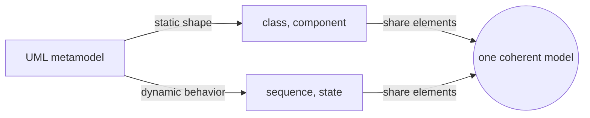
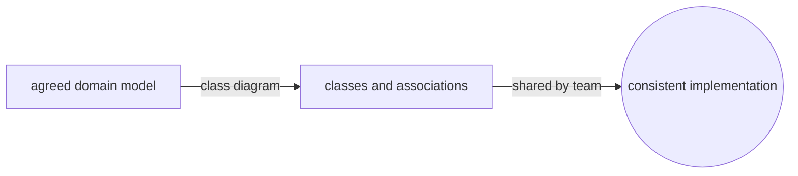
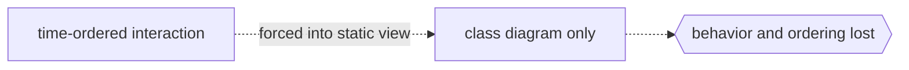

# Unified Modeling Language

## Overview

The Unified Modeling Language is a general-purpose graphical language for specifying, constructing, and documenting the artifacts of software-intensive systems. Standardized by the Object Management Group, UML 2.5.1 defines a metamodel plus a notation so that a class, an interaction, or a state can be drawn the same way by any tool or team. It grew from the merger of earlier object-oriented methods, and its goal is a shared visual vocabulary that spans analysis, design, and documentation. The language does not prescribe a process; it gives you the diagrams and lets you apply them however your method requires.

UML organizes its notation into two broad families of diagrams. Structural diagrams show the static parts of a system, the classes, components, and their relationships that hold regardless of time. Behavioral diagrams show how the system acts over time, the sequences, states, and activities that unfold during execution. UML 2.5.1 defines fourteen diagram types split across these two families, all backed by a single metamodel so a class in a class diagram and a lifeline in a sequence diagram refer to the same underlying elements. This separation of static shape from dynamic behavior is the core idea that lets one language describe a whole system.

### Quick Takeaways

- UML is an OMG standard with a metamodel and notation, not a development process
- Its fourteen diagram types split into structural (static shape) and behavioral (dynamic behavior)
- Every diagram draws from one shared metamodel so elements stay consistent across views

## Definition

- **Classifier** is the abstract metamodel concept for anything that classifies instances, such as a class, interface, or component.
- **Class diagram** is a structural diagram showing classes, their attributes, operations, and relationships like association, generalization, and dependency.
- **Sequence diagram** is a behavioral interaction diagram showing messages exchanged between lifelines ordered over time.
- **State machine diagram** is a behavioral diagram showing the states of an object and the transitions triggered by events.
- **Use case diagram** is a behavioral diagram showing actors and the use cases that capture system functionality from an external view.
- **Structural diagrams** are the seven static-view types: class, object, component, composite structure, deployment, package, and profile.
- **Behavioral diagrams** are the seven dynamic-view types: use case, activity, state machine, sequence, communication, interaction overview, and timing.

## The Analogy

Think of UML as a set of architectural drawings for a building. A floor plan shows fixed structure, where the walls, rooms, and doors sit, much like a class or component diagram shows the static parts. A plumbing or electrical flow drawing shows how water or current moves through the building over time, much like a sequence or state diagram shows behavior. No single sheet captures the whole building, but together the structural and behavioral sheets let any builder understand and construct it. UML gives software the same layered set of coordinated views.

## When You See It

- Class diagrams pinned to a design document to capture the object model of a system
- Sequence diagrams tracing how a request flows through services and objects during a call
- State machine diagrams describing the lifecycle of an order, connection, or device
- Use case diagrams scoping what a system must do for each type of user before build
- Component and deployment diagrams mapping software modules onto servers and nodes
- Reverse-engineering tools that render existing code as UML class diagrams for review

## Examples

**Good:** Drawing a class diagram to fix the domain model before coding, with clear classes, associations, and multiplicities. The static structure is agreed once and every developer builds against the same shared shape.

**Bad:** Trying to capture a complex runtime interaction using only a class diagram, with no sequence or state view. The static picture cannot show ordering or timing, so the real behavior stays hidden and misunderstood.

**Good:** Pairing a sequence diagram with a state machine to specify a protocol, one showing message order and the other showing valid states and transitions. The two behavioral views reinforce each other.

**Bad:** Producing dozens of overlapping diagrams for a trivial feature so the model becomes heavier than the code. UML is meant to clarify, and over-modeling buries the intent it should reveal.

## Important Points

- UML 2.5.1 is the current maintenance release, unifying and simplifying the earlier UML 2.x specifications.
- The specification defines an abstract syntax (the metamodel), concrete syntax (notation), and semantics.
- Structural and behavioral are the two top-level diagram families, with fourteen diagram types in total.
- UML is built on the Meta Object Facility, so its metamodel is itself an instance of MOF.
- Profiles let you extend UML with stereotypes and tagged values, which is how SysML is defined on top of it.
- The Object Constraint Language complements UML by expressing precise constraints the diagrams cannot show alone.
- UML is method-agnostic; frameworks like the Unified Process choose which diagrams to use and when.

## Summary

- UML is an OMG standard visual language for modeling the structure and behavior of software systems.
- Its notation splits into structural diagrams for static shape and behavioral diagrams for dynamic behavior.
- Fourteen diagram types sit over one shared metamodel, keeping every view consistent.
- Profiles extend the language, which is exactly how SysML builds systems modeling on UML.
- Used well it clarifies design, used excessively it drowns intent in diagrams.
- _Draw the shape and the motion in separate views, and the whole system becomes legible._
