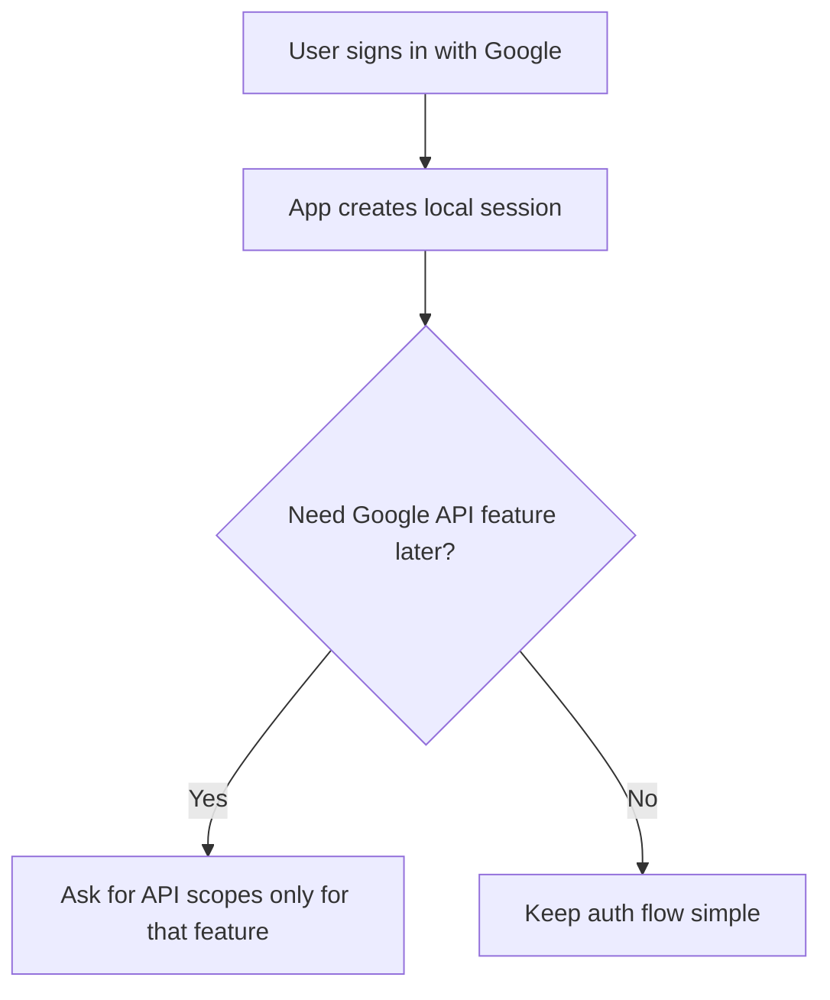
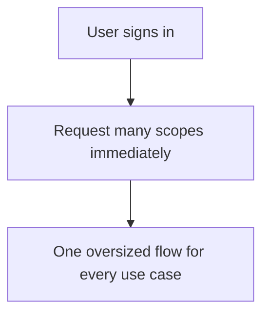

# Google API vs Google Identity

## Overview

Many people collapse these into one idea. They are related, but not the same thing. **Google
Identity** is about proving who the user is. **Google API access** is about asking permission to
use Google's services on that user's behalf.

The practical difference matters. If you only need login, adding API authorization too early adds
scope management, consent complexity, and more failure cases.

## Definition

- **Google Identity**: sign-in flow that establishes user identity, often returning an ID token
- **Google API access**: OAuth 2.0 authorization flow that grants scoped access to products like
  Drive, Gmail, or Calendar

The first solves authentication. The second solves delegated authorization.

## The Analogy

Think of visiting a company office:

- identity answers: who are you
- API authorization answers: which departments will let you access their files

Getting a visitor badge is not the same as getting archive-room permission.

## When You See It

This distinction appears when:

- a product says `Sign in with Google`
- a team later wants to read Google Drive files
- someone asks for Google OAuth even though only email and name are needed
- consent screen scope design becomes part of product planning

## Examples

**Good:**

- Use GIS for app login
- Ask for Google Drive scopes only when the user actually connects Drive
- Keep sign-in and API permissions as separate product decisions

**Bad:**

- Request Calendar or Gmail scopes during first sign-in without product need
- Assume basic sign-in includes permission to call Google APIs
- Use a broad OAuth flow for a simple profile-only use case

**Good Snippet (Separate Concerns):**

**Bad Snippet (Everything at Once):**

## Important Points

- Sign-in and API access are connected but distinct
- API access is scope-based and permission-based
- Basic identity usually needs less friction than API integration
- Ask for API scopes as late as possible and only when needed

## Summary

- Google Identity answers who the user is.
- Google API access answers what your app may use.
- _Auth gets clearer when identity and permissions stop sharing one mental bucket._
