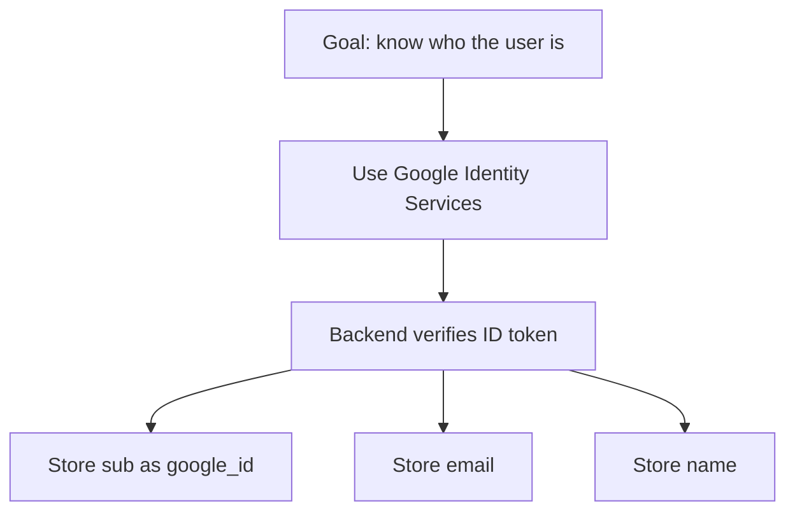
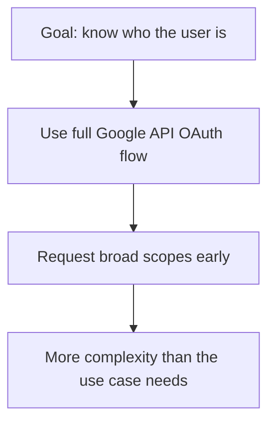

# Google Identity Services

## Overview

Google Identity Services, or **GIS**, is Google's modern sign-in system for getting a user's Google
identity into your app. It is designed for authentication. It is not the main tool for calling
Google APIs like Drive or Calendar.

If your app only needs to know who the user is, GIS is usually the simplest path. It reduces auth
surface area and keeps the flow focused on identity first.

## Definition

Google Identity Services is a client-side sign-in library and flow built on top of Google identity
standards such as **OpenID Connect**. Its job is to help users sign in with Google and return
identity information in a secure format, typically through an **ID token**.

## The Analogy

Think of GIS like a receptionist checking a government ID card:

- it confirms who the person is
- it tells you basic identity details
- it does not hand over keys to private rooms

Those private-room keys are closer to what an **access token** does for Google APIs.

## When You See It

You usually want GIS when:

- your app has a `Continue with Google` button
- you only need the user's identity
- you want `email`, `name`, and a stable Google user ID
- you do not need Drive, Gmail, or Calendar access

## Examples

**Good:**

- A SaaS app that lets users create an account with Google
- An admin dashboard that only needs company email and display name
- A mobile or web app that stores `sub`, `email`, and `name` in its own user table

**Bad:**

- Expecting GIS alone to read files from Google Drive
- Treating Google sign-in as if it automatically grants API access
- Requesting broad API access when all you need is identity

**Good Snippet (Identity-Focused Thinking):**

Flow: Use GIS for identity-only sign-in, no API permissions needed

**Bad Snippet (Mixed Responsibilities):**

Flow: Using full OAuth for identity adds unnecessary complexity

## Important Points

- GIS is mainly for sign-in and identity
- The core output is usually an ID token, not a Google API permission grant
- If you only need basic profile identity, GIS is often enough
- You still need backend verification if your server trusts the login

## Summary

- GIS solves user sign-in with Google in a focused way.
- It is best when identity is the main requirement.
- _Use the smallest auth surface that matches the product need._
