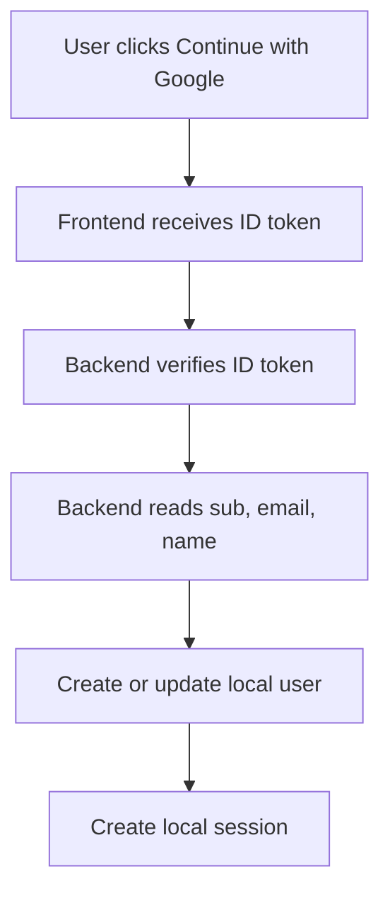

# Google Sign-In for Basic Profile

## Overview

If your app only needs `email`, `full name`, and a stable Google account ID, keep the design
small. Sign the user in with Google, verify the returned identity token on the backend, then store
the claims you trust.

This is the sweet spot for many internal tools, SaaS dashboards, and consumer apps that want easy
account creation without password management.

## Definition

Basic-profile sign-in means using Google as an identity provider for your app without asking for
extra Google service permissions. The core data usually comes from the verified ID token:

- `sub` as the stable Google user ID
- `email`
- `name`

## The Analogy

Think of a guest list at an event:

- Google checks the guest's identity
- your app reads the verified identity card
- your own system decides what that guest can do next

You are borrowing identity proof, not outsourcing your entire user model.

## When You See It

This pattern fits when:

- you want passwordless account creation
- your app has no need for Gmail, Drive, or Calendar data
- you want a stable external identity key from Google
- you manage app roles and permissions in your own database

## Examples

**Good:**

- Save `sub` as `google_id`
- Create a local user record after backend token verification
- Map app roles from your own database after sign-in

**Bad:**

- Use raw frontend profile data without backend verification
- Store only `email` and ignore the stable external ID
- Add broad API scopes for a profile-only use case

**Good Snippet (Minimal Backend Flow):**

## Important Points

- `sub` is the safest Google account key to store
- Backend verification matters if your server trusts the login
- Your app should still manage its own authorization rules
- Keep the first version small unless product features require more

## Summary

- Basic-profile sign-in is a narrow and effective pattern.
- It covers many products without the weight of full API authorization.
- _When the requirement is only identity, a smaller flow is usually the stronger design._
