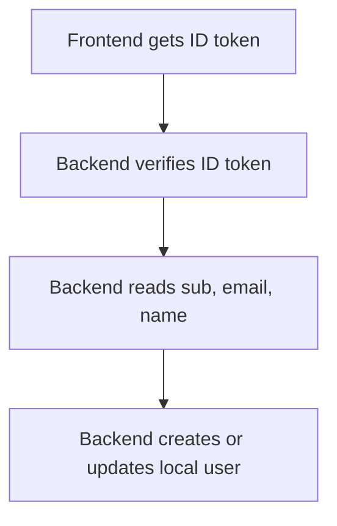
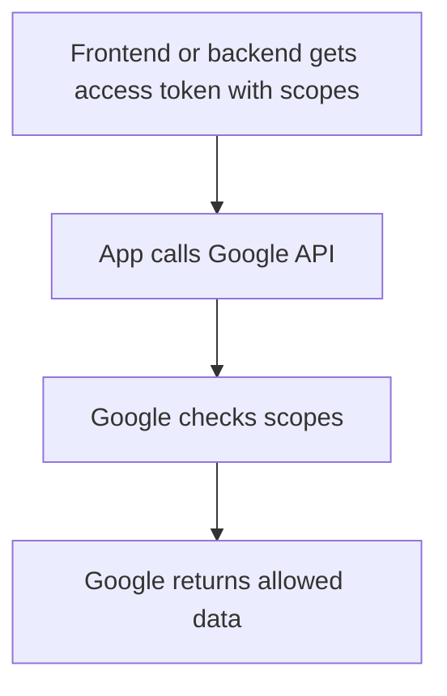

# ID Token vs Access Token

## Overview

This is the split that removes most Google auth confusion. An **ID token** tells your app who the
user is. An **access token** tells a Google API what the app is allowed to access on the user's
behalf.

If you mix these two roles, the implementation becomes fragile. You can end up using the wrong
token in the wrong place and misunderstand what the user has actually granted.

## Definition

- **ID token**: a token, usually a JWT, that contains identity claims such as `sub`, `email`, and
  `name`
- **Access token**: a token used to call protected Google APIs according to approved scopes

The important boundary is simple:

- ID token answers: **Who is this user?**
- Access token answers: **What can this app access?**

## The Analogy

Think of entering an office building:

- an **ID token** is your employee badge with your name and employee number
- an **access token** is a temporary door pass to specific rooms

Knowing your identity is not the same as being allowed into the finance room.

## When You See It

You see this split when:

- a backend verifies Google sign-in
- a frontend asks for Google API scopes
- a product needs both sign-in and API integration
- teams confuse login with authorization

## Examples

**Good:**

- Verify an ID token on the backend, then create a local session
- Use an access token to call Google Drive API
- Store `sub` as the stable Google user ID in your database

**Bad:**

- Send an access token to your backend and assume it is the best identity proof
- Try to call Google Drive using only an ID token
- Assume `email` alone is a stable external account identifier

**Good Snippet (Basic Sign-In):**

Flow: ID token verification for identity-only authentication

**Good Snippet (Google API Access):**

Flow: Access token usage for Google API authorization

## Important Points

- ID token is for identity
- Access token is for authorization
- `sub` is the stable Google user identifier you usually want to store
- Extra Google API access requires scopes and the right flow

## Summary

- The token type defines the job.
- Using the right token keeps auth design clean.
- _Identity and authorization should stay separate in your head and in your code._
