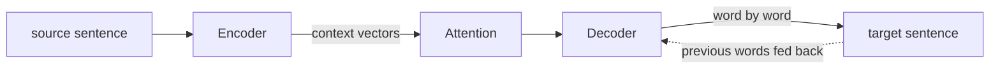
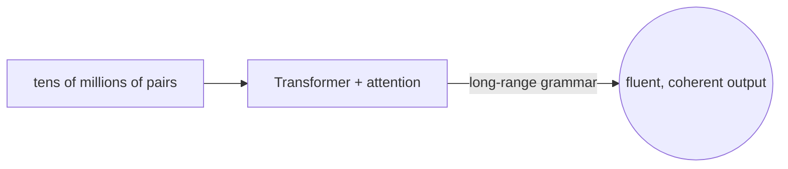
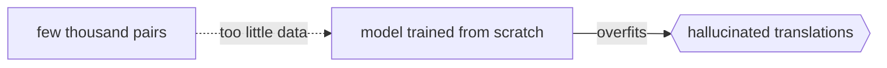

# Neural Machine Translation

## Overview

Neural machine translation, or NMT, uses a single large neural network trained end to end to turn a source sentence into a target sentence. Unlike statistical systems built from many separate components, NMT learns one model that reads the whole source, forms an internal representation of its meaning, and generates the translation word by word. The classic design is an encoder-decoder: the encoder compresses the source into a sequence of vectors, and the decoder produces the target while attending back to those vectors. Attention lets the decoder focus on the most relevant source words at each step, which was the breakthrough that made NMT fluent over long sentences.

Modern NMT is built on the Transformer architecture, which replaced recurrent networks with self-attention and made training far more parallel and effective. NMT overtook statistical translation around 2016 and now powers the major online translators. It produces markedly more natural, fluent output and handles long-range grammar better, at the cost of needing large data, heavy compute, and being harder to inspect when it makes mistakes.

### Quick Takeaways

- One network learns translation end to end, replacing many separate statistical components
- The encoder-decoder design with attention lets the model focus on relevant source words per step
- The Transformer architecture, built on self-attention, is the modern foundation of NMT

## Definition

- **Encoder** is the part of the network that reads the source sentence into internal vectors.
- **Decoder** is the part that generates the target sentence one token at a time.
- **Attention** is the mechanism letting the decoder weigh which source positions matter at each step.
- **Transformer** is the self-attention architecture that is the standard backbone of modern NMT.
- **End-to-end training** means the whole model is optimized jointly from source-target pairs.
- **Embedding** is the dense vector representation of a word or subword unit the network operates on.

## The Analogy

Think of a skilled interpreter who listens to a full sentence, holds its whole meaning in mind, and then speaks the translation while glancing back at the key words that matter most for each phrase they produce. They do not swap words one at a time from a table. They understand the sentence as a whole and render it fluently, keeping the important source words in focus. NMT works the same way, with attention playing the role of that focused glancing back.

## When You See It

- Google Translate, DeepL, and other major translators from 2016 onward
- Real-time subtitle and caption translation on video platforms
- Multilingual chat and customer support tools that translate on the fly
- Document translation where fluency and long-range coherence matter
- Massively multilingual models translating between many language pairs in one network
- Foundations of large language models, which share the same Transformer machinery

## Examples

**Good:** Training a Transformer on tens of millions of sentence pairs to translate news articles. It produces fluent, coherent output that respects long-range grammar and word order.

**Bad:** Training NMT from scratch on a few thousand sentences for a low-resource language. Without enough data or transfer from a larger model, it overfits and hallucinates.

**Good:** Using subword tokenization so the model can translate rare and compound words it never saw whole, by composing them from smaller learned units.

**Bad:** Trusting NMT output blindly on high-stakes legal text. It can produce fluent but subtly wrong translations that are hard to catch precisely because they read so naturally.

## Important Points

- Attention was the key advance that let NMT stay accurate over long sentences
- The Transformer replaced recurrent and convolutional encoders and is now standard
- Subword tokenization, such as BPE, handles rare and unseen words gracefully
- Fluency is a major strength, but confident hallucinations are a real risk
- NMT needs large parallel data and heavy compute compared to earlier methods
- Transfer learning and multilingual models help low-resource language pairs
- The same architecture underlies modern large language models

## Summary

- NMT translates with one neural network trained end to end on source-target pairs.
- An encoder-decoder with attention reads the source and generates the target word by word.
- The Transformer, built on self-attention, is the modern backbone.
- It overtook statistical translation around 2016 and powers today's major translators.
- Its output is far more fluent, at the cost of data, compute, and inspectability.
- _It does not swap words from a table, it understands the whole sentence and speaks it anew._
