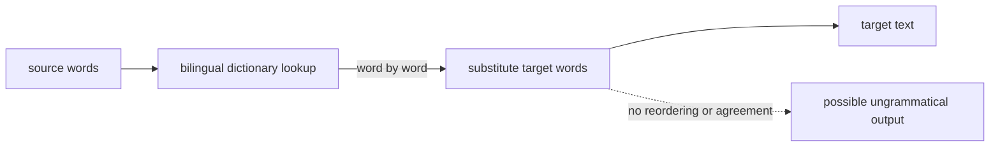
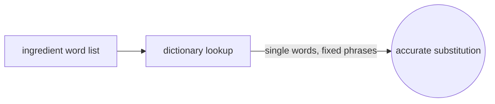

# Dictionary-based Machine Translation

## Overview

Dictionary-based machine translation is the simplest translation method: it looks up each word in a bilingual dictionary and replaces it with its target-language equivalent. There is little or no grammatical analysis, no parse tree, and usually no reordering. The system walks through the source text word by word, or sometimes phrase by phrase for fixed expressions, and substitutes entries from the dictionary. Because it does so little, it is fast, transparent, and trivial to build once a dictionary exists, but the output is often ungrammatical and misses meaning that depends on context.

Its main strength is coverage of terminology and fixed phrases, so it is useful for tasks like translating word lists, product catalogs, or giving a rough gist of a text. It struggles with the parts of language that need grammar and context: word order differences, agreement, and words with multiple senses. It sits at the shallow end of the rule-based spectrum, in contrast with transfer-based and interlingual systems that reason about structure and meaning. It is often used as a component inside larger systems rather than alone.

### Quick Takeaways

- Each word is looked up in a bilingual dictionary and replaced, with little grammar
- It is fast, transparent, and easy to build, but output is often ungrammatical
- It is strong on terminology and fixed phrases, weak on word order and word sense

## Definition

- **Bilingual dictionary** is the lookup table mapping source words to target words.
- **Word-by-word translation** is substituting each source word with a dictionary equivalent.
- **Phrase entry** is a fixed multi-word expression stored as a single dictionary entry.
- **Word sense** is which meaning of an ambiguous word applies in context.
- **No reordering** means the target keeps source word order, ignoring target grammar.
- **Gisting** is producing a rough, understandable-but-imperfect translation to grasp meaning.

## The Analogy

Picture a tourist with a pocket phrasebook, flipping to each word and reading out its foreign equivalent one at a time. The individual words come out right, but the sentence sounds broken because the tourist ignores grammar and word order. A local can usually guess the meaning, yet nobody would call it fluent. That word-at-a-time swap, ignoring how the target language actually strings words together, is dictionary-based translation.

## When You See It

- Translating word lists, glossaries, and terminology databases
- Product catalogs and specification tables where entries are short and fixed
- Quick gisting to understand roughly what a foreign text says
- Preprocessing that fills in known terms before a richer system takes over
- Very low-resource pairs where only a dictionary, not a corpus, exists
- Controlled vocabularies where reordering is rarely needed

## Examples

**Good:** Translating a list of ingredient names on a product label. The entries are single words or fixed phrases, so direct dictionary substitution is accurate and sufficient.

**Bad:** Translating a full narrative paragraph word by word. The output ignores grammar and word order, producing broken sentences a reader has to decode.

**Good:** Storing common fixed phrases as whole dictionary entries so idioms translate correctly as a unit rather than word by word.

**Bad:** Relying on it for a word with several meanings, like a term that can be a noun or a verb. With no context handling, it picks one entry and often the wrong one.

## Important Points

- It performs little or no grammatical analysis, the key contrast with other rule-based methods
- Fixed phrases can be stored as single entries to improve accuracy on idioms
- Word-sense ambiguity is a core weakness, since context is not considered
- Output typically keeps source word order, causing ungrammatical results
- It is fast, transparent, and cheap to build once a dictionary exists
- It is best for terminology, lists, and rough gisting, not fluent prose
- It is frequently a building block inside larger translation systems

## Summary

- Dictionary-based MT replaces each word using a bilingual dictionary, with little grammar.
- It does almost no analysis, so it is fast, transparent, and easy to build.
- It handles terminology and fixed phrases well.
- It fails on word order, agreement, and ambiguous word senses.
- It is the shallow end of rule-based translation, often used as a component.
- _Swap each word for its entry and you get the words right but rarely the sentence._
