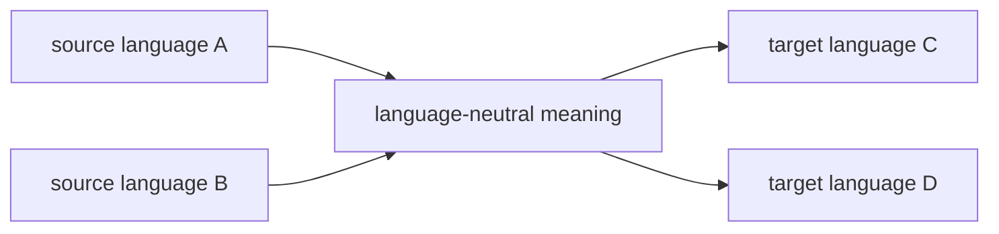
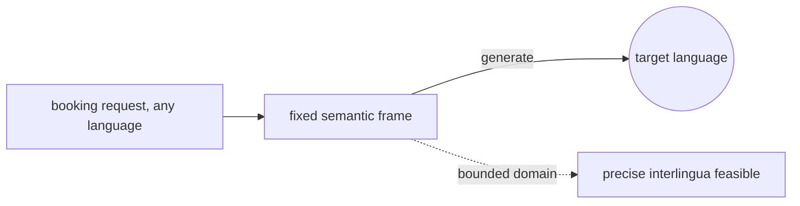
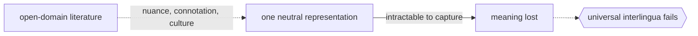

# Interlingual Machine Translation

## Overview

Interlingual machine translation converts a source sentence into an interlingua, an abstract, language-neutral representation of its meaning, and then generates the target sentence purely from that meaning. The crucial idea is that the intermediate form does not belong to any specific language. Once the source has been mapped to the interlingua, the original language is forgotten entirely, and generation into any target language proceeds from the shared representation. This is the deepest of the rule-based approaches, aiming to capture what a sentence means rather than how one language phrases it.

The big payoff is scaling across many languages. With N languages, you need only N analyzers into the interlingua and N generators out of it, rather than a separate rule set for every pair as transfer-based systems require. The catch is that designing an interlingua rich and precise enough to represent all meaning across many languages is extremely hard, and full analysis into it is difficult. Interlingual systems have been more influential as a research ideal and in narrow domains than as broad practical systems.

### Quick Takeaways

- The source is converted into a language-neutral meaning, and the target is generated from it
- The intermediate representation belongs to no single language, unlike transfer-based systems
- Scaling needs only N analyzers and N generators, not a rule set per language pair

## Definition

- **Interlingua** is an abstract, language-independent representation of a sentence's meaning.
- **Analysis** is mapping a source sentence into the interlingua.
- **Generation** is producing a target sentence from the interlingua alone.
- **Language-neutral** means the representation does not encode any specific language's structure.
- **Semantic representation** is meaning captured explicitly, beyond surface grammar.
- **N-to-N scaling** is the property that N languages need only N analyzers plus N generators.

## The Analogy

Imagine everyone first translating their sentence into a precise set of pictures and logical relations that carry pure meaning, no words at all. A speaker of any language draws these meaning-pictures, and a speaker of any other language reads them and speaks in their own tongue. Nobody needs to learn every other language directly. They only need to translate to and from the shared picture language. That shared, wordless meaning space is the interlingua.

## When You See It

- Research systems exploring language-independent meaning representations
- Multilingual projects where many languages must all interconnect efficiently
- Narrow, controlled domains like weather reports where meaning is bounded and formalizable
- Knowledge-based translation tied to ontologies and semantic frames
- Conceptual ancestor of ideas in modern multilingual and interlingua-style neural models
- Systems where a single semantic hub is preferred over pairwise rule sets

## Examples

**Good:** A controlled-domain system translating airline booking requests across many languages by mapping each request to a fixed semantic frame, then generating from it. The bounded domain makes a precise interlingua feasible.

**Bad:** Attempting a universal interlingua for open-domain literature. Capturing nuance, connotation, and culture in one neutral representation is intractable, and meaning is lost.

**Good:** Using an ontology-backed interlingua for technical manuals, where concepts are well defined and shared across all target languages.

**Bad:** Assuming the interlingua removes ambiguity for free. Analysis still has to resolve every ambiguity to map into it, which is exactly the hard part.

## Important Points

- The defining feature is a truly language-neutral intermediate representation
- It scales as N analyzers plus N generators, the key advantage over transfer-based systems
- Designing a complete, precise interlingua is the central and unsolved difficulty
- It works best in narrow, well-defined domains where meaning can be formalized
- All disambiguation must happen during analysis into the interlingua
- It is the deepest rule-based approach, contrasted with shallow dictionary methods
- Its ambition influenced later semantic and multilingual translation research

## Summary

- Interlingual MT maps the source into a language-neutral meaning, then generates the target from it.
- The intermediate representation belongs to no specific language.
- It scales across many languages with only N analyzers and N generators.
- Building a rich, precise interlingua is extremely hard, limiting broad use.
- It shines in narrow, formalizable domains and as a research ideal.
- _Translate meaning into a wordless shared space, and any language can read it back._
