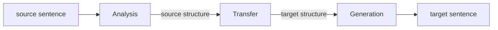
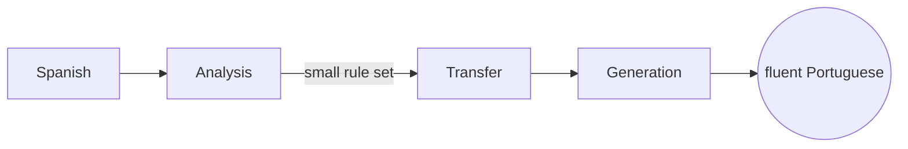
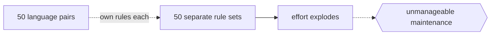

# Transfer-based Machine Translation

## Overview

Transfer-based machine translation is a rule-based approach that works in three stages: analysis, transfer, and generation. First it analyzes the source sentence into an abstract structure, often a parse tree with grammatical roles. Then a set of transfer rules converts that source structure into a corresponding target-language structure, handling differences in word order, grammar, and vocabulary. Finally a generation step turns the target structure into a fluent target sentence. Unlike a pure dictionary lookup, it reasons about grammar, so it can reorder words and adjust morphology to fit the target language.

The defining trait is that the intermediate representation is not language-neutral. It stays tied to the specific source and target pair, so the transfer rules are written for that one direction. This makes each language pair its own engineering project. Adding a new pair means writing new analysis, transfer, and generation rules. Transfer-based systems sit between the simplicity of dictionary methods and the abstraction of interlingual systems, and they were the workhorse of commercial rule-based translation for decades.

### Quick Takeaways

- Three stages: analyze the source, transfer to a target structure, then generate text
- The intermediate structure is tied to the specific language pair, not language-neutral
- Every new language pair needs its own hand-written transfer rules

## Definition

- **Analysis** is parsing the source sentence into a structured representation such as a syntax tree.
- **Transfer** is applying rules that map the source structure to an equivalent target structure.
- **Generation** is producing a fluent target sentence from the target structure.
- **Transfer rules** are hand-written mappings that handle grammar, word order, and lexical differences.
- **Language pair** is the specific source-to-target direction the rules are written for.
- **Intermediate representation** is the structured form between source and target, here pair-specific.

## The Analogy

Think of translating a floor plan drawn to one country's building code into another country's code. You first read the original plan and understand its rooms and structure. Then you apply a rulebook that says how each element maps to the new code, resizing and rearranging as required. Finally you redraw a clean plan in the new standard. The rulebook only works for that one pair of codes, and translating to a third country needs a whole new rulebook.

## When You See It

- Classic commercial rule-based translators such as older Systran systems
- Translation between closely related languages where transfer rules stay manageable
- Government and enterprise systems built before statistical and neural methods matured
- Controlled-language settings where grammar is predictable and rules can be exhaustive
- Situations demanding transparent, editable rules rather than opaque learned models
- Hybrid systems that pair linguistic transfer with statistical components

## Examples

**Good:** Building a Spanish to Portuguese translator where the two grammars are close. Transfer rules stay small, and the analyze-transfer-generate flow yields fluent, grammatical output.

**Bad:** Scaling one transfer engine to fifty language pairs. Each pair needs its own rule set, so the effort explodes and maintenance becomes unmanageable.

**Good:** Using explicit transfer rules in a legal domain where translations must be predictable and auditable, and every rule can be reviewed by a linguist.

**Bad:** Expecting a transfer system to handle open-domain slang and idioms it has no rules for. Anything outside the rule set produces stiff or wrong output.

## Important Points

- The intermediate representation is language-pair specific, the key contrast with interlingual systems
- Effort grows with the number of language pairs, not just the number of languages
- It handles grammar and reordering, so it beats plain dictionary translation
- Rules are transparent and editable, unlike learned statistical or neural models
- Quality depends on the coverage and quality of hand-written rules
- It was the dominant commercial paradigm before statistical machine translation
- Deep transfer uses richer semantic structures, shallow transfer stays closer to syntax

## Summary

- Transfer-based MT runs analysis, transfer, then generation.
- Its intermediate structure is tied to a specific language pair.
- Each new pair requires its own hand-written transfer rules.
- It handles grammar and word order, unlike dictionary-based methods.
- It was the commercial workhorse of rule-based translation for decades.
- _It redraws the sentence to a new code using a rulebook written for that one pair._
