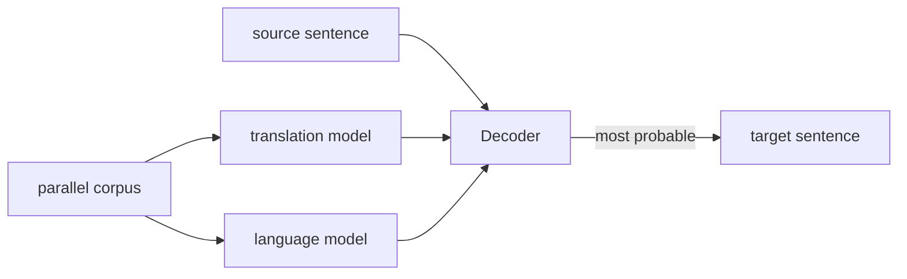
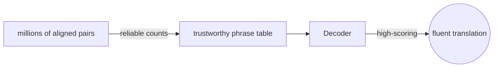
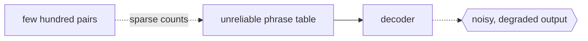

# Statistical Machine Translation

## Overview

Statistical machine translation, or SMT, learns how to translate by counting patterns in large collections of already-translated text. Instead of a linguist writing rules, the system estimates probabilities from a parallel corpus, a body of the same content in two languages. Given a source sentence, it searches for the target sentence that is most probable according to these learned probabilities. The dominant framing splits the job into a translation model, which scores how well words and phrases correspond across languages, and a language model, which scores how fluent the output is in the target language.

Early SMT worked word by word, but phrase-based SMT became the standard because translating chunks of several words at once captures idioms and local reordering far better. A decoder combines the models and searches the huge space of possible translations to output the best-scoring one. SMT dominated the field for two decades and powered early online translators before neural methods overtook it. It still matters as the conceptual bridge between rigid rule-based systems and modern end-to-end neural translation.

### Quick Takeaways

- Translation is learned from counts in parallel text, not from hand-written rules
- The output is the target sentence with the highest combined translation and fluency score
- Phrase-based SMT translates multi-word chunks, handling idioms and reordering better than word-based

## Definition

- **Parallel corpus** is a large set of sentence pairs, the same content in a source and a target language.
- **Translation model** scores how likely a source phrase corresponds to a target phrase.
- **Language model** scores how fluent and natural a candidate sentence is in the target language.
- **Alignment** is the mapping of which source words or phrases produced which target words.
- **Decoder** is the search algorithm that finds the highest-scoring target sentence.
- **Phrase-based SMT** is the variant that translates contiguous multi-word units rather than single words.

## The Analogy

Imagine learning to translate by reading thousands of bilingual menus side by side. You never learn grammar rules, you just notice that whenever one column says a phrase, the other column tends to say a matching phrase. When a new dish appears, you stitch together the target phrases you have seen most often, then pick the wording that sounds most natural on a real menu. That habit of counting correspondences and favoring fluent output is exactly what SMT does.

## When You See It

- Early online translators like Google Translate before its 2016 switch to neural models
- Translation between language pairs that have large parallel corpora available
- Research baselines that neural systems were measured against for years
- Low-resource pipelines where a simple, inspectable phrase table is preferred
- Systems where alignment output itself is needed, for example in bilingual dictionary extraction
- Hybrid setups that combine statistical phrase tables with other components

## Examples

**Good:** Building a French to English translator from millions of aligned sentence pairs from parliamentary proceedings. The domain is consistent and the corpus is huge, so phrase probabilities are reliable.

**Bad:** Training SMT for a rare dialect with only a few hundred sentence pairs. The counts are too sparse to estimate trustworthy probabilities, and the output degrades badly.

**Good:** Using phrase-based SMT to capture a fixed idiom that always maps to the same target phrase, learned directly from repeated co-occurrence in the corpus.

**Bad:** Expecting SMT to handle long-range grammatical agreement across a whole sentence. Its local phrase focus and limited reordering lose coherence over long distances.

## Important Points

- SMT is often framed with the noisy channel model, maximizing translation likelihood times language model fluency
- Word alignment tools like the IBM Models and GIZA++ underpin phrase extraction
- Phrase-based SMT replaced word-based SMT as the practical standard
- A language model trained on monolingual target text greatly improves fluency
- Reordering is handled by explicit distortion models, and remains a known weakness
- Quality scales with corpus size and how well the corpus matches the target domain
- SMT was largely superseded by neural machine translation from around 2016 onward

## Summary

- SMT learns translation from probabilities counted in large parallel corpora.
- It scores candidates with a translation model for correspondence and a language model for fluency.
- A decoder searches for the highest-scoring target sentence.
- Phrase-based SMT, translating chunks at once, became the practical standard.
- It ruled the field for years and set the stage for neural machine translation.
- _You do not need grammar rules when you have counted enough examples of what maps to what._
