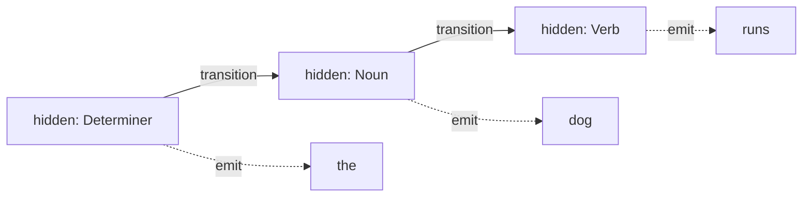
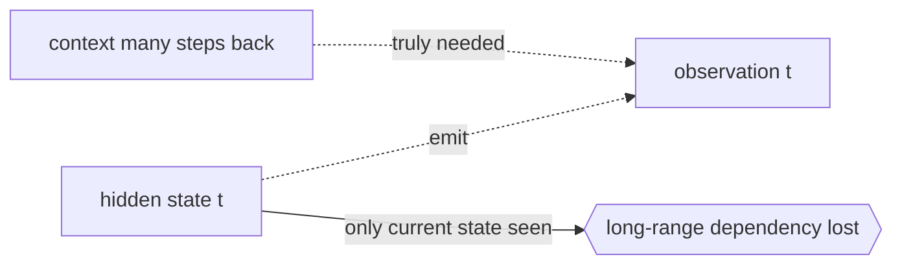

# Hidden Markov Model

## Overview

A hidden Markov model, or HMM, extends a Markov chain by hiding the state. The system still moves between states following the Markov property, but you never see the state directly. Instead each state emits an observable signal according to its own emission probabilities. Your job is to reason about the hidden state sequence from the visible emissions alone. This is powerful because the real world is often like this: the true cause is hidden and you only see its noisy effects.

An HMM is defined by three things. Transition probabilities govern how hidden states change over time. Emission probabilities govern what each hidden state produces as an observation. An initial distribution says where the chain starts. Three classic problems drive HMM use. Evaluation asks how likely a sequence of observations is, solved by the forward algorithm. Decoding asks for the most likely hidden state sequence, solved by Viterbi. Learning asks how to fit the parameters from data, solved by Baum-Welch. HMMs powered speech recognition and part-of-speech tagging for decades.

### Quick Takeaways

- The states are hidden and you only observe signals emitted by those states
- An HMM adds emission probabilities on top of the transition probabilities of a plain chain
- Viterbi finds the most likely hidden path, the forward algorithm scores an observation sequence

## Definition

- **Hidden state** is the true underlying state you cannot observe directly at any step.
- **Observation** is the visible signal emitted by the current hidden state.
- **Emission probability** is the chance a given hidden state produces a specific observation.
- **Transition probability** is the chance of moving from one hidden state to another between steps.
- **Forward algorithm** computes the probability of an observation sequence by summing over all hidden paths efficiently.
- **Viterbi algorithm** computes the single most likely hidden state sequence given the observations.

## The Analogy

You are locked in a windowless room and want to guess the weather outside. You cannot see the sky, but a friend walks in each day carrying either an umbrella or sunglasses. The weather is the hidden state, the item they carry is the observation. Rainy days usually mean umbrellas, sunny days usually mean sunglasses, but not always. From the daily stream of items you infer the most likely weather sequence. That inference from indirect clues is exactly what an HMM does.

## When You See It

- Speech recognition mapping acoustic signals to hidden phoneme or word states
- Part-of-speech tagging where hidden grammatical tags emit observed words
- Bioinformatics finding hidden gene regions from an observed DNA sequence
- Gesture and activity recognition inferring hidden actions from sensor readings
- Financial regime detection where hidden market regimes emit observed returns
- Handwriting recognition decoding hidden letters from observed pen strokes

## Examples

**Good:** Using an HMM for part-of-speech tagging, where hidden tags like noun and verb emit observed words. The Markov structure over tags captures grammar well enough to disambiguate many words.

**Bad:** Applying an HMM where observations depend on long-range context far beyond the current hidden state. The local emission assumption cannot represent dependencies that span many steps.

**Good:** Detecting hidden market regimes, calm versus volatile, where each regime emits daily returns with different variance. Viterbi recovers a plausible regime timeline from returns alone.

**Bad:** Assuming a fixed small number of hidden states when the true system has many subtly different modes. The model lumps distinct behaviors together and decodes them poorly.

## Important Points

- The hidden state follows the Markov property, observations depend only on the current hidden state
- Evaluation, decoding, and learning are the three canonical HMM problems with named algorithms
- The forward-backward algorithm underlies both evaluation and the Baum-Welch learning step
- Baum-Welch is an expectation-maximization procedure that can get stuck in local optima
- Choosing the number of hidden states is a modeling decision that strongly affects results
- HMMs assume observations are conditionally independent given the hidden state, which is often only approximate
- Modern sequence models like RNNs and transformers have replaced HMMs in many tasks but the ideas remain foundational

## Summary

- An HMM hides the Markov states and reveals them only through emitted observations.
- Transition, emission, and initial probabilities fully define the model.
- Forward scores sequences, Viterbi decodes the best hidden path, Baum-Welch learns parameters.
- It fits any setting where a hidden cause produces noisy, observable effects over time.
- Its assumptions are strong but its algorithms are exact and efficient.
- _You never see the weather, only the umbrella, and from umbrellas you infer the sky._
