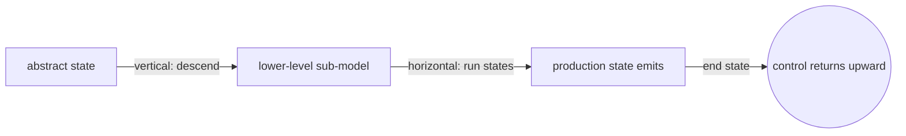
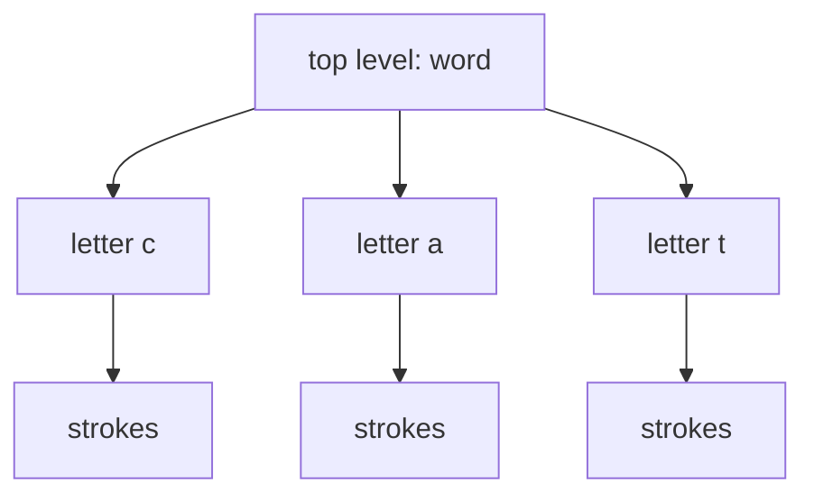
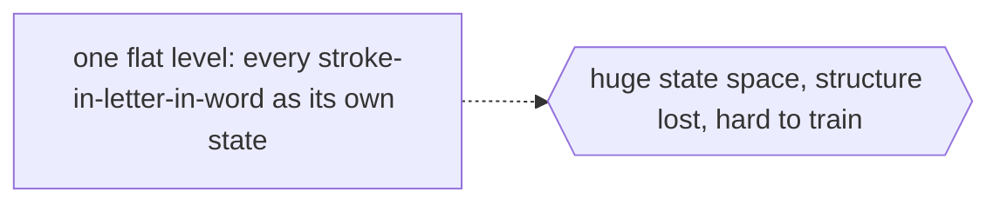

# Hierarchical Markov Models

## Overview

Hierarchical Markov models stack Markov structure in layers to capture behavior at multiple scales. A flat Markov model has one level of states, which struggles to represent structure that spans both short and long ranges. A hierarchical model lets a high-level state stand for a whole sub-process. When entered, that high-level state runs its own lower-level Markov model until it finishes, then control returns to the level above. The hierarchical hidden Markov model, or HHMM, is the best known example.

This layering matches how many real sequences are organized. Language has documents made of paragraphs made of sentences made of words. Behavior has activities made of sub-activities made of primitive motions. A single flat chain cannot cleanly express these nested time scales, but a hierarchy can, with each level having its own transitions. The cost is added complexity in both the model and its inference, since you now reason across levels. In return you get compact models that share sub-structures and represent long-range organization far better than a flat chain.

### Quick Takeaways

- States are organized in layers, and a high-level state expands into a lower-level sub-model
- This captures nested structure across multiple time scales, like documents to words
- The gain in expressiveness comes at the cost of more complex model and inference

## Definition

- **Level** is one layer of the hierarchy, with its own set of states and transitions.
- **Abstract state** is a high-level state that represents an entire sub-process at a lower level.
- **Production state** is a bottom-level state that actually emits observations.
- **Vertical transition** is entering an abstract state and descending into its child sub-model.
- **Horizontal transition** is moving between states within the same level.
- **End state** is a special state that signals a sub-model has finished and control returns upward.

## The Analogy

Think of a company org chart giving a project. The CEO picks a high-level goal and hands it to a department. The department breaks it into tasks and hands each to a team. The team carries out concrete steps, then reports completion back up the chain. Each level operates with its own routine and only escalates when its part is done. A hierarchical Markov model works the same way: abstract states delegate downward, production states do the concrete work, and end states report back up.

## When You See It

- Speech and language modeling with nested structure from phonemes to words to phrases
- Human activity recognition where activities decompose into sub-activities and motions
- Robot task planning organizing high-level goals into low-level control sequences
- Music modeling capturing structure across notes, phrases, and sections
- Video understanding segmenting long footage into events, scenes, and shots
- Behavioral modeling of complex routines built from simpler repeated patterns

## Examples

**Good:** Modeling handwriting where a top level chooses words, a middle level sequences letters, and a bottom level emits pen strokes. Each scale gets its own clean transition structure.

**Bad:** Flattening that same handwriting model into a single-level HMM with a huge state space. It loses the natural word and letter structure and becomes hard to train and interpret.

**Good:** Recognizing kitchen activities where "make coffee" expands into sub-steps like grind, pour, and brew. The hierarchy shares low-level motions across many high-level activities.

**Bad:** Adding hierarchy to a genuinely simple, single-scale sequence. The extra levels add parameters and inference cost without capturing any real structure.

## Important Points

- Hierarchy expresses multi-scale structure that a flat Markov model cannot represent compactly
- An HHMM can be flattened into an equivalent standard HMM, but usually with a much larger state space
- Vertical transitions descend into sub-models, horizontal transitions move within a level
- End states mark completion of a sub-process and hand control back to the parent level
- Shared sub-models let different high-level states reuse the same lower-level structure
- Inference is more involved because it must account for entering and exiting sub-models
- The hierarchy encodes prior knowledge about how the sequence is organized across scales

## Summary

- Hierarchical Markov models stack Markov structure so high-level states expand into sub-models.
- This captures nested organization across multiple time scales in one model.
- Abstract states delegate, production states emit, and end states return control upward.
- They model long-range structure that a flat chain cannot represent cleanly.
- The tradeoff is greater model and inference complexity for greater expressiveness.
- _Each level does its own small job and reports up, and together they tell a long story._
