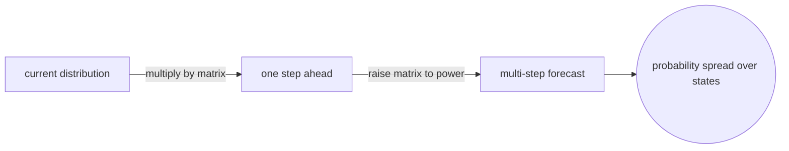
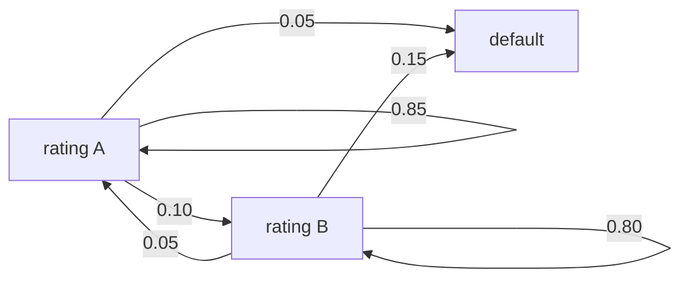
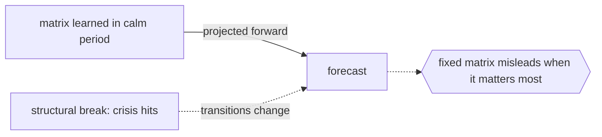

# Markov-Chain Forecasting Models

## Overview

Markov-chain forecasting models use the transition structure of a Markov chain to predict future distributions over states. You classify the system into a set of discrete states, estimate how it moves between them, and then project that movement forward. Given the current state or a current distribution over states, you multiply by the transition matrix to get the distribution one step ahead. Multiplying repeatedly forecasts several steps into the future. The forecast is not a single value but a probability spread over the possible states.

This approach shines when a system can be described by discrete conditions with stable transition tendencies, such as market regimes, credit ratings, or customer lifecycle stages. It is simple, interpretable, and directly usable for planning. Its accuracy rests on two assumptions: that the Markov property holds, so only the current state matters, and that the transition probabilities are stationary, so they do not drift over time. When those assumptions hold the forecasts are reliable and cheap. When they break, especially over long horizons, the forecast blurs toward the stationary distribution and loses sharpness.

### Quick Takeaways

- Forecasting projects the current state distribution forward by multiplying by the transition matrix
- Multi-step forecasts raise the transition matrix to a power to reach further horizons
- Accuracy depends on the Markov property holding and transition probabilities staying stable

## Definition

- **State classification** is grouping the system into a finite set of discrete conditions to forecast.
- **Transition matrix** is the estimated table of probabilities of moving between those states.
- **Current distribution** is the present probability spread over states, the starting point of the forecast.
- **Multi-step forecast** is the state distribution several steps ahead, from powers of the transition matrix.
- **Stationarity assumption** is the assumption that transition probabilities stay constant over the forecast horizon.
- **Forecast horizon** is how many steps into the future the projection extends.

## The Analogy

Think of predicting how a crowd will spread across rooms in a museum. You know that from the entrance hall, most people drift to the main gallery, some to the cafe, a few to the gift shop. Starting with everyone at the entrance, you apply those tendencies to estimate where the crowd sits after one move, then again for the next. You never predict one person exactly, only the overall spread. That rolling projection of a distribution using fixed movement tendencies is Markov-chain forecasting.

## When You See It

- Financial regime forecasting predicting shifts between bull, bear, and flat markets
- Credit rating migration estimating how borrowers move between rating grades over time
- Customer lifecycle modeling forecasting movement between active, dormant, and churned states
- Weather and climate category forecasting over discrete condition states
- Inventory and demand state forecasting across stock or demand levels
- Market share evolution predicting how customers switch between brands

## Examples

**Good:** Forecasting credit rating migrations with a transition matrix estimated from historical rating changes. Projecting it forward gives the expected distribution of ratings next year, useful for risk planning.

**Bad:** Using a fixed transition matrix to forecast market regimes across a structural break like a crisis. The stationarity assumption fails and the forecast misleads exactly when it matters most.

**Good:** Modeling customer states as active, dormant, and churned, then forecasting how a cohort spreads across these states over coming months to plan retention effort.

**Bad:** Pushing a Markov-chain forecast far past the horizon where transitions stay stable. The distribution converges to the stationary spread and stops reflecting near-term dynamics.

## Important Points

- Forecasts are distributions over states, not single point predictions
- Multi-step forecasts come from raising the transition matrix to the number of steps ahead
- Long-horizon forecasts tend toward the stationary distribution and lose short-term detail
- Accuracy depends on the Markov property and on transition probabilities remaining stationary
- Transition probabilities are estimated from historical transition counts, so data quality matters
- Non-stationarity can be handled with time-varying or regime-switching transition matrices
- The method is prized for interpretability, since each transition probability is meaningful

## Summary

- Markov-chain forecasting projects a state distribution forward using the transition matrix.
- Multi-step forecasts use powers of the matrix and yield probabilities over states.
- It fits systems described by discrete states with stable transition tendencies.
- It rests on the Markov property and stationary transition probabilities holding.
- Long horizons blur toward the stationary distribution and lose predictive sharpness.
- _You never forecast one path, only how the whole crowd is likely to spread next._
