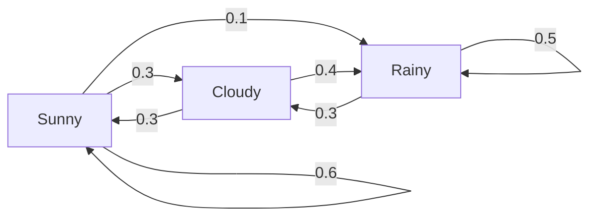
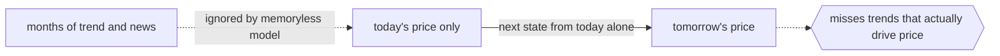

# Markov Chain

## Overview

A Markov chain is a sequence of random states where the probability of the next state depends only on the current state. The full history before the current step does not matter. This is called the Markov property, or memorylessness. Instead of tracking every past event, the model only needs to know where it is right now to decide where it might go next. This makes the math tractable and the model easy to reason about.

The chain is defined by a set of states and a transition matrix. Each entry in the matrix gives the probability of moving from one state to another. Rows sum to one because you must land somewhere. Given a starting distribution over states, you multiply by the transition matrix to get the distribution at the next step. Repeat this many times and many chains settle into a stationary distribution, a fixed spread over states that no longer changes. Markov chains power PageRank, text generation, queueing models, and much more.

### Quick Takeaways

- The next state depends only on the current state, never on the path taken to reach it
- A transition matrix holds every state-to-state probability, with each row summing to one
- Many chains converge to a stationary distribution that stays fixed under further steps

## Definition

- **State** is one of the possible situations the system can occupy at a given step.
- **Markov property** is the rule that the next state depends only on the current state, not on earlier states.
- **Transition probability** is the chance of moving from one specific state to another in a single step.
- **Transition matrix** is the square table holding all transition probabilities, one row per current state.
- **Stationary distribution** is a distribution over states that stays unchanged after applying the transition matrix.
- **Ergodicity** is the property that the chain can reach every state and settles into a unique stationary distribution regardless of the start.

## The Analogy

Think of a frog hopping between lily pads. From whichever pad it sits on now, it picks the next pad using fixed jump odds written on that pad. The frog does not remember which pads it visited earlier. It only reads the odds on its current pad and jumps. Over a long afternoon the fraction of time it spends on each pad settles into a steady pattern. That steady pattern is the stationary distribution, and the odds written on each pad form the transition matrix.

## When You See It

- Google PageRank modeling a random web surfer clicking links between pages
- Text generation where the next word is drawn from probabilities based on the current word
- Board games like Monopoly where the next square depends only on the current square and dice
- Queueing systems modeling how many customers wait given the current queue length
- Weather models that predict tomorrow from today using fixed transition odds
- Population and economic models tracking movement between discrete categories over time

## Examples

**Good:** Modeling weather as three states, sunny, cloudy, rainy, with a transition matrix estimated from historical daily data. Predicting tomorrow from today alone is a reasonable and useful simplification.

**Bad:** Using a first-order Markov chain to predict stock prices where long-range trends and outside events clearly matter. The memoryless assumption throws away the very history that drives the outcome.

**Good:** Building a simple text generator where each word is sampled from the distribution of words that followed the current word in a corpus. The chain captures local word patterns cheaply.

**Bad:** Expecting that same word-level chain to produce coherent paragraphs. With no memory beyond the current word, it drifts and loses any long-range meaning.

## Important Points

- The Markov property is an assumption, and its usefulness depends on whether the system really is memoryless
- A first-order chain looks one step back, higher-order chains condition on several recent states
- Transition probabilities are usually estimated by counting observed transitions in data
- A stationary distribution exists and is unique when the chain is irreducible and aperiodic
- Absorbing states are states you can enter but never leave, useful for modeling terminal outcomes
- Continuous-time Markov chains replace discrete steps with rates of moving between states
- Convergence speed to the stationary distribution is governed by the second-largest eigenvalue of the matrix

## Summary

- A Markov chain models a sequence where the next state depends only on the present state.
- The transition matrix encodes every state-to-state probability and drives the dynamics.
- Iterating the matrix from a start distribution often converges to a stationary distribution.
- The memoryless assumption is what makes it simple, and also what limits it.
- It is the foundation for richer Markov models like HMMs and MDPs built on top of it.
- _Where you go next is written on the pad you sit on now, not the ones you left behind._
